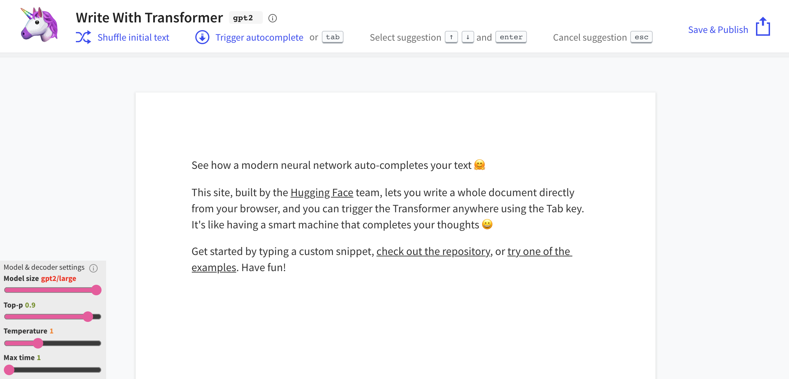
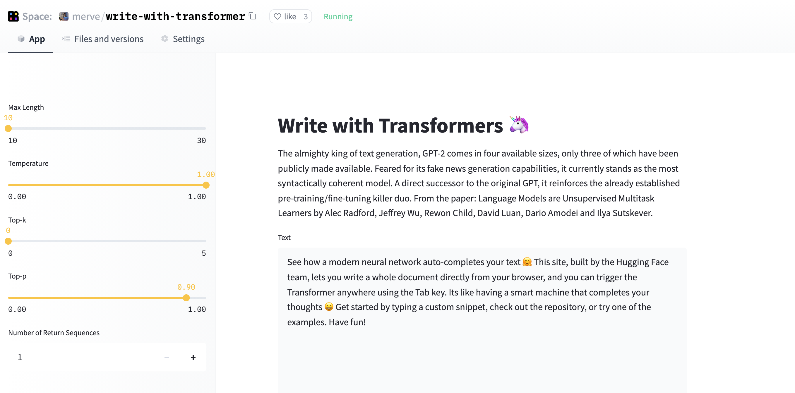

<h1>
    Hosting your Models and Datasets on Hugging Face Spaces using Streamlit
</h1>

{blog_metadata}

{authors}


## Showcase your Datasets and Models using Streamlit on Hugging Face Spaces

[Streamlit](https://streamlit.io/) allows you to visualize datasets and build demos of Machine Learning models in a neat way. In this blog post we will walk you through hosting models and datasets and serving your Streamlit applications in Hugging Face Spaces. 

## Building demos for your models

You can load any Hugging Face model and build cool UIs using Streamlit. In this particular example we will recreate ["Write with Transformer"](https://transformer.huggingface.co/doc/gpt2-large) together. It's an application that lets you write anything using transformers like GPT-2 and XLNet. 
 


We will not dive deep into how the inference works. You only need to know that you need to specify some hyperparameter values for this particular application. Streamlit provides many [components](https://docs.streamlit.io/en/stable/api.html) for you to easily implement custom applications. We will use some of them to receive necessary hyperparameters inside the inference code.

- The ```.text_area``` component creates a nice area to input sentences to be completed.
- The Streamlit ```.sidebar``` method enables you to accept variables in a sidebar. 
- The ```slider``` is used to take continuous values. Don't forget to give ```slider``` a step, otherwise it will treat the values as integers. 
- You can let the end-user input integer vaues with ```number_input``` .


``` python
import streamlit as st

# adding the text that will show in the text box as default
default_value = "See how a modern neural network auto-completes your text 🤗 This site, built by the    Hugging Face team, lets you write a whole document directly from your browser, and you can trigger the Transformer anywhere using the Tab key. Its like having a smart machine that completes your thoughts 😀 Get started by typing a custom snippet, check out the repository, or try one of the examples. Have fun!"

sent = st.text_area("Text", default_value, height = 275)
max_length = st.sidebar.slider("Max Length", min_value = 10, max_value=30)
temperature = st.sidebar.slider("Temperature", value = 1.0, min_value = 0.0, max_value=1.0, step=0.05)
top_k = st.sidebar.slider("Top-k", min_value = 0, max_value=5, value = 0)
top_p = st.sidebar.slider("Top-p", min_value = 0.0, max_value=1.0, step = 0.05, value = 0.9)
num_return_sequences = st.sidebar.number_input('Number of Return Sequences', min_value=1, max_value=5, value=1, step=1)
```

The inference code returns the generated output, you can print the output using simple ```st.write```.
```st.write(generated_sequences[-1])```

Here's what our replicated version looks like.


You can checkout the full code [here](https://huggingface.co/spaces/merve/write-with-transformer).

## Showcase your Datasets and Data Visualizations

Streamlit provides many components to help you visualize datasets. It works seamlessly with 🤗 [Datasets](https://huggingface.co/docs/datasets/), [pandas](https://pandas.pydata.org/docs/index.html), and visualization libraries such as [matplotlib](https://matplotlib.org/stable/index.html), [seaborn](https://seaborn.pydata.org/) and [bokeh](https://bokeh.org/). 

Let's start by loading a dataset. A new feature in `Datasets`, called [streaming](https://huggingface.co/docs/datasets/dataset_streaming.html), allows you to work immediately with very large datasets, eliminating the need to download all of the examples and load them into memory.

``` python
from datasets import load_dataset
import streamlit as st

dataset = load_dataset("merve/poetry", streaming=True)
df = pd.DataFrame.from_dict(dataset["train"])
```

 If you have structured data like mine, you can simply use  ```st.dataframe(df) ``` to show your dataset. There are many Streamlit components to plot data interactively. One such component is ```st.barchart() ```, which I used to visualize the most used words in the poem contents. 

``` python
st.write("Most appearing words including stopwords")
st.bar_chart(words[0:50])
```

 If you'd like to use libraries like matplotlib, seaborn or bokeh, all you have to do is to put  ```st.pyplot() ``` at the end of your plotting script.
 
``` python
st.write("Number of poems for each author")
sns.catplot(x="author", data=df, kind="count", aspect = 4)
plt.xticks(rotation=90)
st.pyplot()
```

You can see the interactive bar chart, dataframe component and hosted matplotlib and seaborn visualizations below. You  can check out the code [here](https://huggingface.co/spaces/merve/streamlit-dataset-demo).


## Hosting your Projects in Hugging Face Spaces

You can simply drag and drop your files as shown below. Note that you need to include your additional dependencies in the requirements.txt. Also note that the version of Streamlit you have on your local is the same. For seamless usage, refer to [Spaces API reference](https://huggingface.co/docs/hub/spaces-config-reference). 


There are so many components and [packages](https://streamlit.io/components) you can use to demonstrate your models, datasets, and visualizations. You can get started [here](https://huggingface.co/spaces).