# Summer At Hugging Face 😎

<div class="blog-metadata">
    <small>Published September 22, 2021.</small>
    <a target="_blank" class="btn no-underline text-sm mb-5 font-sans" href="https://github.com/huggingface/blog/blob/master/summer-at-huggingface.md">
        Update on GitHub
    </a>
</div>

<div class="author-card">
    <a href="/huggingface">
        
        <div class="bfc">
            <code>huggingface</code>
            <span class="fullname">Hugging Face</span>
        </div>
    </a>
</div>

Summer is now officially over and these last few months have been quite busy at Hugging Face. From new features in the Hub to research and Open Source development, our team has been working hard to empower the community through open and collaborative technology. 

In this blog post you'll catch up on everything that happened at Hugging Face in June, July and August!


This post covers a wide range of areas our team has been working on, so don't hesitate to skip to the parts that interest you the most 🤗

1. [New Features](#new-features)
2. [Community](#community)
3. [Open Source](#open-source)
4. [Solutions](#solutions)
5. [Research](#research)

## New Features

In the last few months, the Hub went from 10,000 public model repositories to over 16,000 models! Kudos to our community for sharing so many amazing models with the world. And beyond the numbers, we have a ton of cool new features to share with you!

### Spaces Beta ([hf.co/spaces](/spaces)) 

Spaces is a simple and free solution to host Machine Learning demo applications directly on your user profile or your organization [hf.co](http://hf.co/) profile. We support two awesome SDKs that let you build cool apps easily in Python: [Gradio](https://gradio.app/) and [Streamlit](https://streamlit.io/). In a matter of minutes you can deploy an app and share it with the community! 🚀

Spaces lets you [set up secrets](/docs/hub/spaces#secret-management), permits [custom requirements](/docs/hub/spaces#how-can-i-install-other-dependencies), and can even be managed [directly from GitHub repos](/docs/hub/spaces#how-can-i-manage-my-app-through-github). You can sign up for the beta at [hf.co/spaces](/spaces). Here are some of our favorites!

- Create recipes with the help of [Chef Transformer](/spaces/flax-community/chef-transformer)
- Transcribe speech to text with [HuBERT](https://huggingface.co/spaces/osanseviero/HUBERT)
- Do segmentation in a video with the [DINO model](/spaces/nateraw/dino-clips)
- Use [Paint Transformer](/spaces/akhaliq/PaintTransformer) to make paintings from a given picture
- Or you can just explore any of the over [100 existing Spaces](/spaces)!

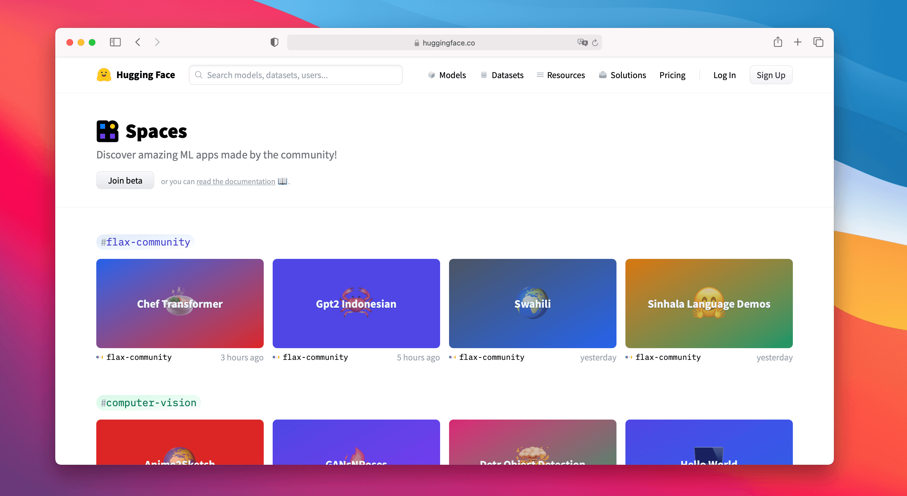

### Share Some Love

You can now like any model, dataset, or Space on [http://huggingface.co](http://huggingface.co/), meaning you can share some love with the community ❤️. You can also keep an eye on who's liking what by clicking on the likes box 👀. Go ahead and like your own repos, we're not judging 😉.

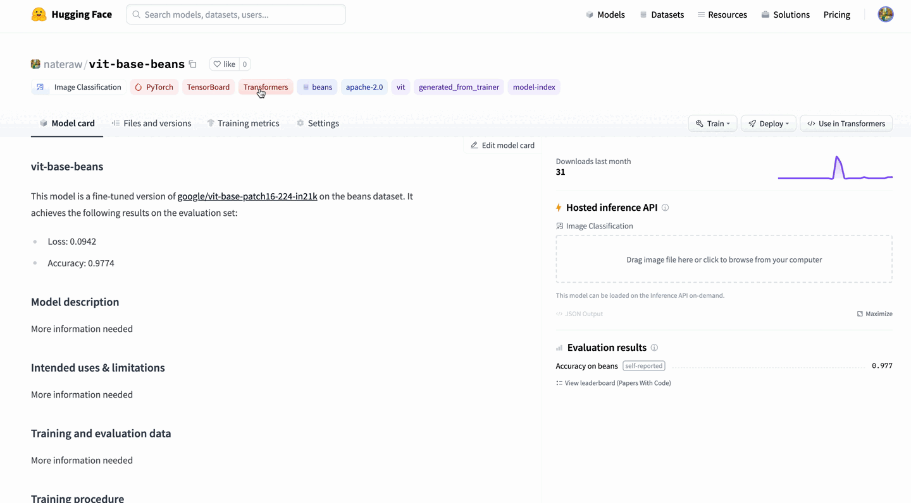

### TensorBoard Integration

In late June, we launched a TensorBoard integration for all our models. If there are TensorBoard traces in the repo, an automatic, free TensorBoard instance is launched for you. This works with both public and private repositories and for any library that has TensorBoard traces!

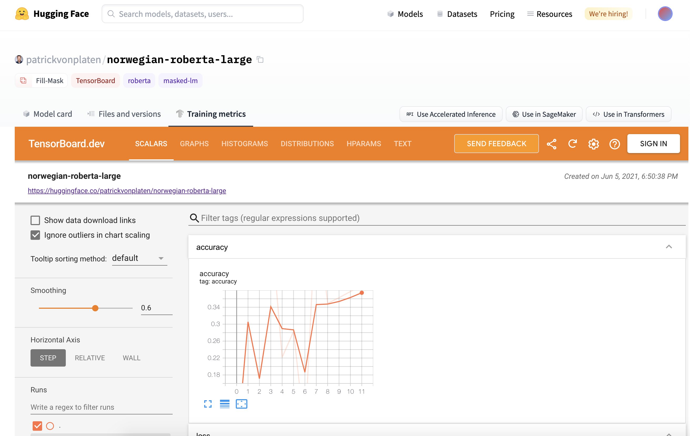

### Metrics

In July, we added the ability to list evaluation metrics in model repos by adding them to their model card📈. If you add an evaluation metric under the `model-index` section of your model card, it will be displayed proudly in your model repo.

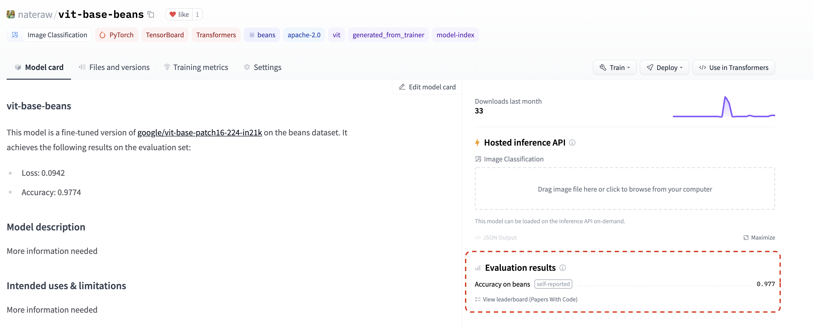

If that wasn't enough, these metrics will be automatically linked to the corresponding [Papers With Code](https://paperswithcode.com/) leaderboard. That means as soon as you share your model on the Hub, you can compare your results side-by-side with others in the community. 💪

Check out [this repo](https://huggingface.co/nateraw/vit-base-beans-demo) as an example, paying close attention to `model-index` section of its [model card](https://huggingface.co/nateraw/vit-base-beans-demo/blob/main/README.md#L12-L25) to see how you can do this yourself and find the metrics in Papers with Code [automatically](https://paperswithcode.com/sota/image-classification-on-beans).

### New Widgets

The Hub has 18 widgets that allow users to try out models directly in the browser.

With our latest integrations to Sentence Transformers, we also introduced two new widgets: feature extraction and sentence similarity. 

The latest **audio classification** widget enables many cool use cases: language identification,  [street sound detection](https://huggingface.co/speechbrain/urbansound8k_ecapa) 🚨, [command recognition](https://huggingface.co/speechbrain/google_speech_command_xvector), [speaker identification](https://huggingface.co/speechbrain/spkrec-xvect-voxceleb), and more! You can try this out with `transformers` and `speechbrain` models today! 🔊 (Beware, when you try some of the models, you might need to bark out loud)

You can try our early demo of [structured data classification](https://huggingface.co/julien-c/wine-quality) with Scikit-learn. And finally, we also introduced new widgets for image-related models: **text to image**, **image classification**, and **object detection**. Try image classification with Google's ViT model [here](https://huggingface.co/google/vit-base-patch16-224) and object detection with Facebook AI's DETR model [here](https://huggingface.co/facebook/detr-resnet-50)!

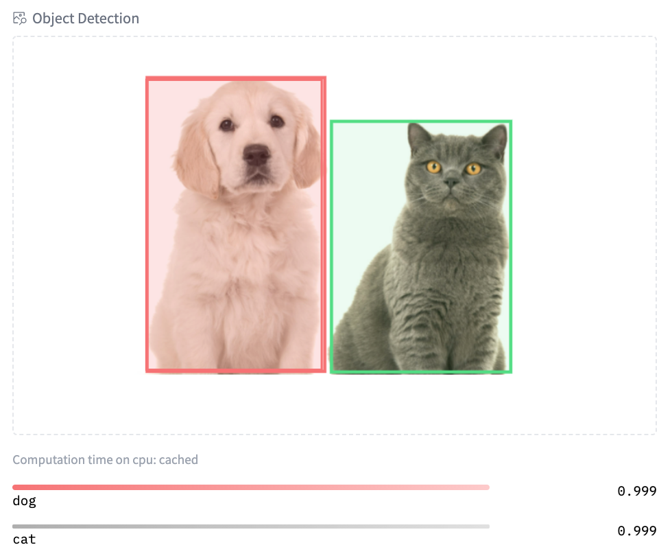


### More Features

That's not everything that has happened in the Hub. We've introduced new and improved [documentation](https://huggingface.co/docs/hub/main) of the Hub. We also introduced two widely requested features: users can now transfer/rename repositories and directly upload new files to the Hub.

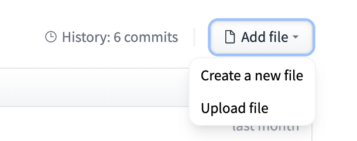

## Community

### Hugging Face Course

In June, we launched the first part of our [free online course](https://huggingface.co/course/chapter1)! The course teaches you everything about the 🤗 Ecosystem: Transformers, Tokenizers, Datasets, Accelerate, and the Hub. You can also find links to the course lessons in the official documentation of our libraries. The live sessions for all chapters can be found on our [YouTube channel](https://www.youtube.com/playlist?list=PLo2EIpI_JMQuQ8StH9RwKXwJVqLTDxwwy). Stay tuned for the next part of the course which we'll be launching later this year!

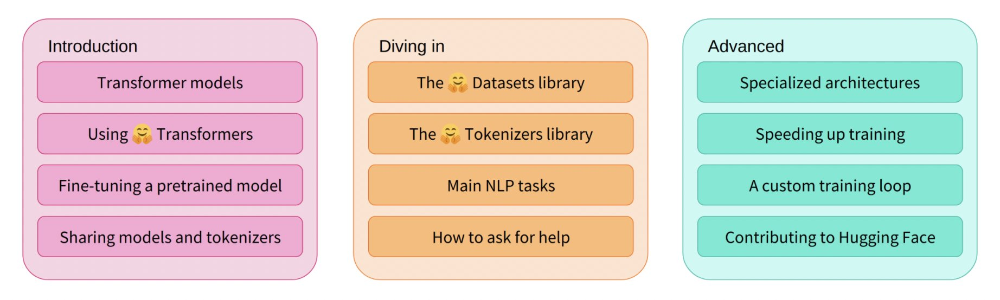

### JAX/FLAX Sprint

In July we hosted our biggest [community event](https://discuss.huggingface.co/t/open-to-the-community-community-week-using-jax-flax-for-nlp-cv/7104) ever with almost 800 participants! In this event co-organized with the JAX/Flax and Google Cloud teams, compute-intensive NLP, Computer Vision, and Speech projects were made accessible to a wider audience of engineers and researchers by providing free TPUv3s. The participants created over 170 models, 22 datasets, and 38 Spaces demos 🤯. You can explore all the amazing demos and projects [here](https://huggingface.co/flax-community).

There were talks around JAX/Flax, Transformers, large-scale language modeling, and more! You can find all recordings [here](https://github.com/huggingface/transformers/tree/master/examples/research_projects/jax-projects#talks). 

We're really excited to share the work of the 3 winning teams!

1. [Dall-e mini](https://huggingface.co/spaces/flax-community/dalle-mini). DALL·E mini is a model that generates images from any prompt you give! DALL·E mini is 27 times smaller than the original DALL·E and still has impressive results.

    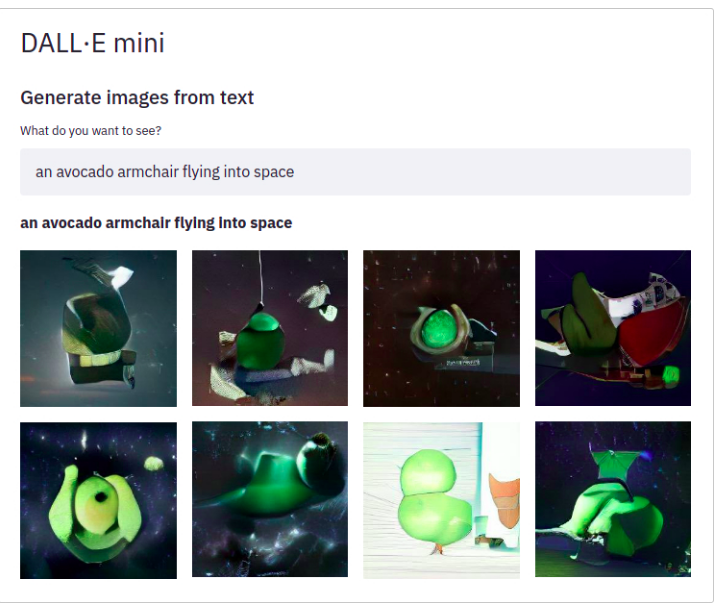

2. [DietNerf](https://huggingface.co/spaces/flax-community/DietNerf-Demo). DietNerf is a 3D neural view synthesis model designed for few-shot learning of 3D scene reconstruction using 2D views. This is the first Open Source implementation of the "[Putting Nerf on a Diet](https://arxiv.org/abs/2104.00677)" paper.

    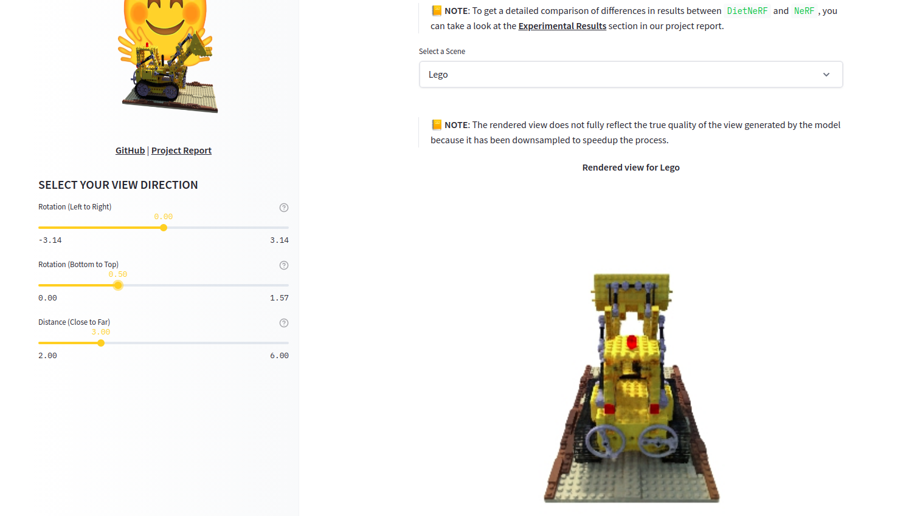

3. [CLIP RSIC](https://huggingface.co/spaces/sujitpal/clip-rsicd-demo). CLIP RSIC is a CLIP model fine-tuned on remote sensing image data to enable zero-shot satellite image classification and captioning. This project demonstrates how effective fine-tuned CLIP models can be for specialized domains.

    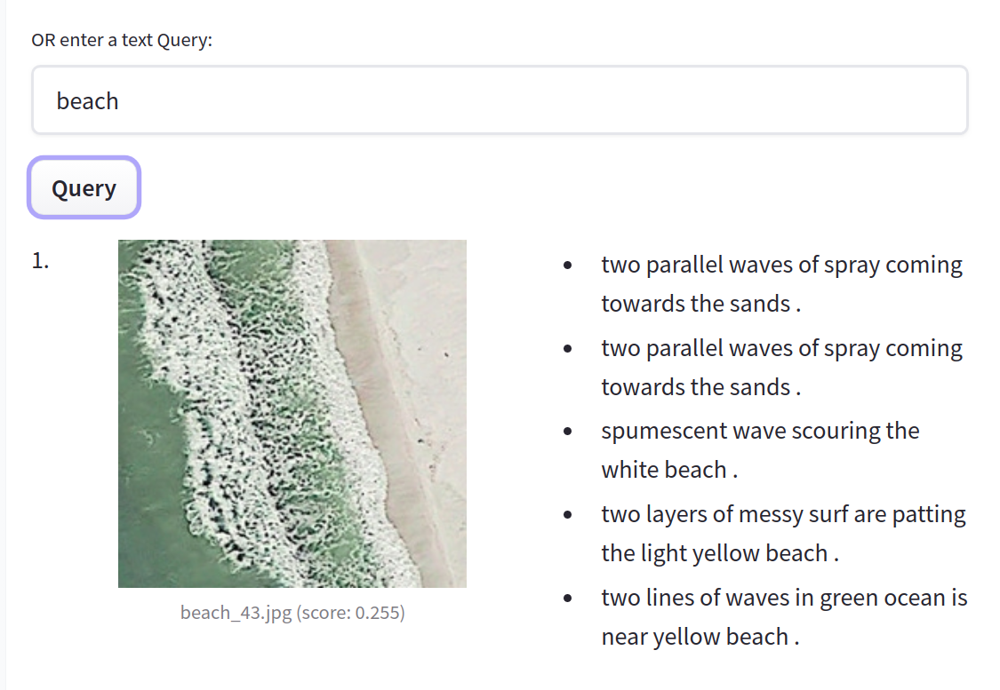

Apart from these very cool projects, we're excited about how these community events enable training large and multi-modal models for multiple languages. For example, we saw the first ever Open Source big LMs for some low-resource languages like [Swahili](https://huggingface.co/models?language=sw), [Polish](https://huggingface.co/flax-community/papuGaPT2) and [Marathi](https://huggingface.co/spaces/flax-community/roberta-base-mr).

## Bonus

On top of everything we just shared, our team has been doing lots of other things. Here are just some of them:

- 📖 This 3-part [video series](https://www.youtube.com/watch?time_continue=6&v=qmN1fJ7Fdmo&feature=emb_title&ab_channel=NilsR) shows the theory on how to train state-of-the-art sentence embedding models. 
- We presented at PyTorch Community Voices and participated in a QA ([video](https://www.youtube.com/watch?v=wE3bk7JaH4E&ab_channel=PyTorch)).
- Hugging Face has collaborated with [NLP in Spanish](https://twitter.com/NLP_en_ES) and [SpainAI](https://twitter.com/Spain_AI_) in a Spanish [course](https://www.youtube.com/playlist?list=PLBILcz47fTtPspj9QDm2E0oHLe1p67tMz) that teaches concepts and state-of-the art architectures as well as their applications through use cases.
- We presented at [MLOps World Demo Days](https://www.youtube.com/watch?v=lWahHp5vpVg).

## Open Source

### New in Transformers

Summer has been an exciting time for 🤗 Transformers! The library reached 50,000 stars, 30 million total downloads, and almost 1000 contributors! 🤩

So what's new? JAX/Flax is now the 3rd supported framework with over [5000](https://huggingface.co/models?library=jax&sort=downloads) models in the Hub! You can find actively maintained [examples](https://github.com/huggingface/transformers/tree/master/examples/flax) for different tasks such as text classification. We're also working hard on improving our TensorFlow support: all our [examples](https://github.com/huggingface/transformers/tree/master/examples/tensorflow) have been reworked to be more robust, TensorFlow idiomatic, and clearer. This includes examples such as summarization, translation, and named entity recognition.

You can now easily publish your model to the Hub, including automatically authored model cards, evaluation metrics, and TensorBoard instances. There is also increased support for exporting models to ONNX with the new [`transformers.onnx` module](https://huggingface.co/transformers/serialization.html?highlight=onnx). 

```bash
python -m transformers.onnx --model=bert-base-cased onnx/bert-base-cased/
```

The last 4 releases introduced many new cool models!

- [DETR](https://huggingface.co/transformers/model_doc/detr.html) can do fast end-to-end object detection and image segmentation. Check out some of our community [tutorials](https://github.com/NielsRogge/Transformers-Tutorials/tree/master/DETR)!

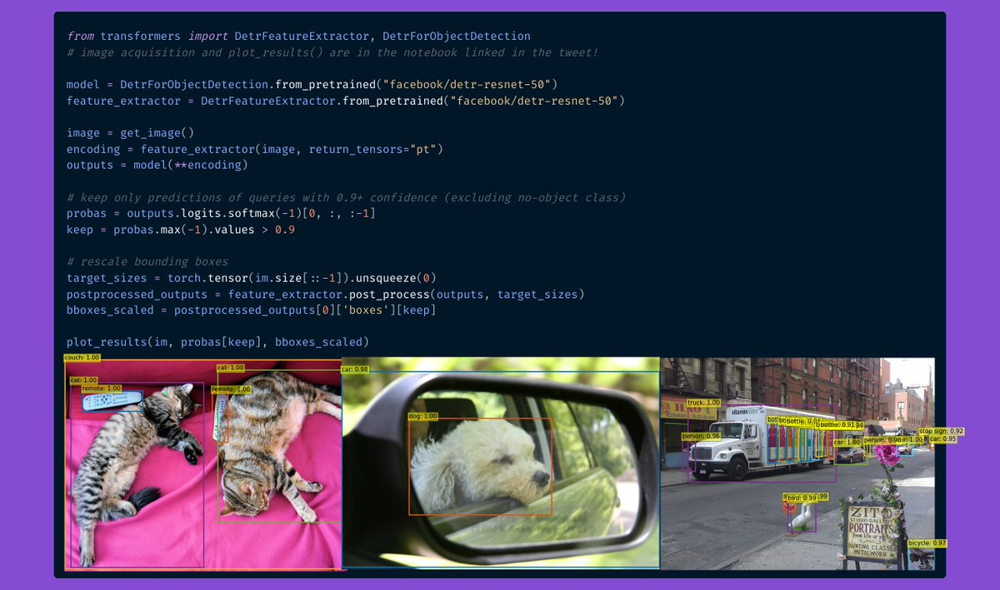

- [ByT5](https://huggingface.co/transformers/model_doc/byt5.html) is the first tokenizer-free model in the Hub! You can find all available checkpoints [here](https://huggingface.co/models?search=byt5).
- [CANINE](https://huggingface.co/transformers/model_doc/canine.html) is another tokenizer-free encoder-only model by Google AI, operating directly at the character level. You can find all (multilingual) checkpoints [here](https://huggingface.co/models?search=canine).
- [HuBERT](https://huggingface.co/transformers/model_doc/hubert.html?highlight=hubert) shows exciting results for downstream audio tasks such as [command classification](https://huggingface.co/superb/hubert-base-superb-ks) and [emotion recognition](https://huggingface.co/superb/hubert-base-superb-er). Check the models [here](https://huggingface.co/models?filter=hubert).
- [LayoutLMv2](https://huggingface.co/transformers/model_doc/layoutlmv2.html) and [LayoutXLM](https://huggingface.co/transformers/model_doc/layoutxlm.html?highlight=layoutxlm) are two incredible models capable of parsing document images (like PDFs) by incorporating text, layout, and visual information. We built a [Space demo](https://huggingface.co/spaces/nielsr/LayoutLMv2-FUNSD) so you can directly try it out! Demo notebooks can be found [here](https://github.com/NielsRogge/Transformers-Tutorials/tree/master/LayoutLMv2).

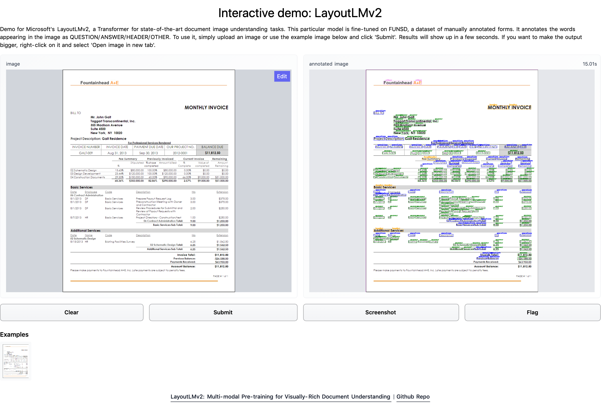

- [BEiT](https://huggingface.co/transformers/model_doc/beit.html) by Microsoft Research makes self-supervised Vision Transformers outperform supervised ones, using a clever pre-training objective inspired by BERT.
- [RemBERT](https://huggingface.co/transformers/model_doc/rembert.html?), a large multilingual Transformer that outperforms XLM-R (and mT5 with a similar number of parameters) in zero-shot transfer.
- [Splinter](https://huggingface.co/transformers/model_doc/splinter.html) which can be used for few-shot question answering. Given only 128 examples, Splinter is able to reach ~73% F1 on SQuAD, outperforming MLM-based models by 24 points!

The Hub is now integrated into `transformers`, with the ability to push to the Hub configuration, model, and tokenizer files without leaving the Python runtime! The `Trainer` can now push directly to the Hub every time a checkpoint is saved: 

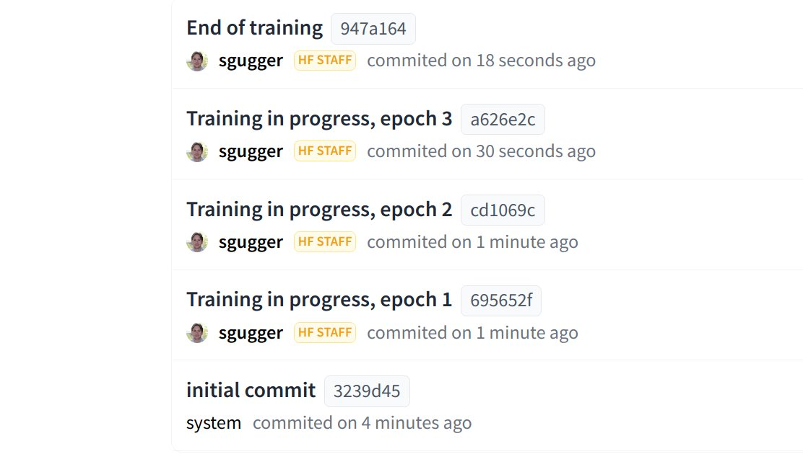

### New in Datasets

You can find 1400 public datasets in [https://huggingface.co/datasets](https://huggingface.co/datasets) thanks to the awesome contributions from all our community. 💯

The support for `datasets` keeps growing: it can be used in JAX, process parquet files, use remote files, and has wider support for other domains such as Automatic Speech Recognition and Image Classification.

Users can also directly host and share their datasets to the community simply by uploading their data files in a repository on the Dataset Hub.

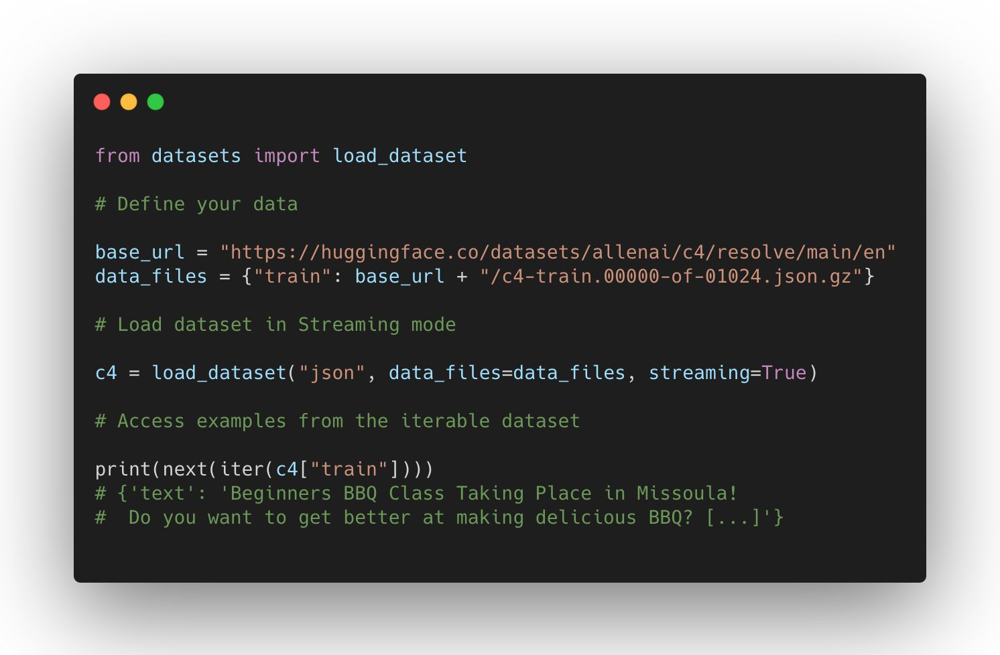

What are the new datasets highlights? Microsoft CodeXGlue [datasets](https://huggingface.co/datasets?search=code_x_glue) for multiple coding tasks (code completion, generation, search, etc), huge datasets such as [C4](https://huggingface.co/datasets/c4) and [MC4](https://huggingface.co/datasets/mc4), and many more such as  [RussianSuperGLUE](https://huggingface.co/datasets/russian_super_glue) and [DISFL-QA](https://huggingface.co/datasets/disfl_qa).

### Welcoming new Libraries to the Hub

Apart from having deep integration with `transformers`-based models, the Hub is also building great partnerships with open source ML libraries to provide free model hosting and versioning. We've been achieving this with our [huggingface_hub](https://github.com/huggingface/huggingface_hub) Open-Source library as well as new Hub [documentation](https://huggingface.co/docs/hub/main). 

All spaCy canonical pipelines can now be found in the official spaCy [organization](https://huggingface.co/spacy), and any user can share their pipelines with a single command `python -m spacy huggingface-hub`. To read more about it, head to [https://huggingface.co/blog/spacy](https://huggingface.co/blog/spacy). You can try all canonical spaCy models directly in the Hub in the demo [Space](https://huggingface.co/spaces/spacy/pipeline-visualizer)!

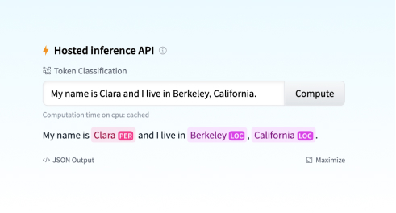

Another exciting integration is Sentence Transformers. You can read more about it in the [blog announcement](https://huggingface.co/blog/sentence-transformers-in-the-hub): you can find over 200 [models](https://huggingface.co/models?library=sentence-transformers) in the Hub, easily share your models with the rest of the community and reuse models from the community.

But that's not all! You can now find over 100 Adapter Transformers in the Hub and try out Speechbrain models with widgets directly in the browser for different tasks such as audio classification. If you're interested in our collaborations to integrate new ML libraries to the Hub, you can read more about them [here](https://huggingface.co/docs/hub/libraries).

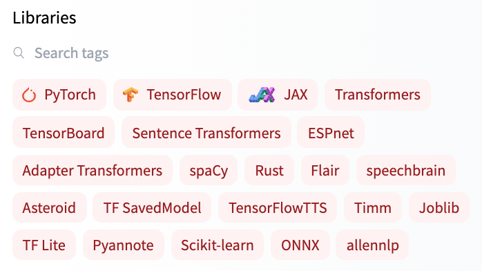


## Solutions

### **Coming soon: Infinity**

Transformers latency down to 1ms? 🤯🤯🤯

We have been working on a really sleek solution to achieve unmatched efficiency for state-of-the-art Transformer models, for companies to deploy in their own infrastructure.

- Infinity comes as a single-container and can be deployed in any production environment.
- It can achieve 1ms latency for BERT-like models on GPU and 4-10ms on CPU 🤯🤯🤯
- Infinity meets the highest security requirements and can be integrated into your system without the need for internet access. You have control over all incoming and outgoing traffic.

⚠️  Join us for a [live announcement and demo on Sep 28](https://app.livestorm.co/hugging-face/hugging-face-infinity-launch?type=detailed), where we will be showcasing Infinity for the first time in public!

### **NEW: Hardware Acceleration**

Hugging Face is [partnering with leading AI hardware accelerators](http://hf.co/hardware) such as Intel, Qualcomm and GraphCore to make state-of-the-art production performance accessible and extend training capabilities on SOTA hardware. As the first step in this journey, we [introduced a new open source library](https://huggingface.co/blog/hardware-partners-program): 🤗 Optimum - the ML optimization toolkit for production performance 🏎. Learn more in this [blog post](https://huggingface.co/blog/graphcore). 

### **NEW: Inference on SageMaker**

We launched a [new integration with AWS](https://huggingface.co/blog/deploy-hugging-face-models-easily-with-amazon-sagemaker) to make it easier than ever to deploy 🤗 Transformers in SageMaker 🔥. Pick up the code snippet right from the 🤗 Hub model page! Learn more about how to leverage transformers in SageMaker in our [docs](https://huggingface.co/docs/sagemaker/inference) or check out these [video tutorials](https://youtube.com/playlist?list=PLo2EIpI_JMQtPhGR5Eo2Ab0_Vb89XfhDJ).

For questions reach out to us on the forum: [https://discuss.huggingface.co/c/sagemaker/17](https://discuss.huggingface.co/c/sagemaker/17)

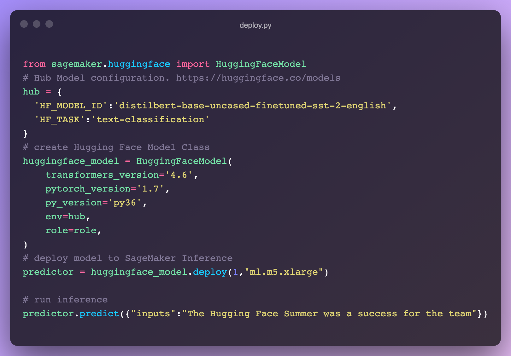

### **NEW: AutoNLP In Your Browser**

We released a new [AutoNLP](https://huggingface.co/autonlp) experience: a web interface to train models straight from your browser! Now all it takes is a few clicks to train, evaluate and deploy **🤗** Transformers models on your own data. [Try it out](https://ui.autonlp.huggingface.co/) - NO CODE needed!


### Inference API

**Webinar**:

We hosted a [live webinar](https://youtu.be/p055U0dnEos) to show how to add Machine Learning capabilities with just a few lines of code. We also built a VSCode extension that leverages the Hugging Face Inference API to generate comments describing Python code.

<iframe width="700" height="394" src="https://www.youtube.com/embed/p055U0dnEos" title="YouTube video player" frameborder="0" allow="accelerometer; autoplay; clipboard-write; encrypted-media; gyroscope; picture-in-picture" allowfullscreen></iframe>


**Hugging Face** + **Zapier Demo**

20,000+ Machine Learning models connected to 3,000+ apps? 🤯  By leveraging the [Inference API](https://huggingface.co/landing/inference-api/startups), you can now easily connect models right into apps like Gmail, Slack, Twitter, and more. In this demo video, we created a zap that uses this [code snippet](https://gist.github.com/feconroses/3476a91dc524fdb930a726b3894a1d08) to analyze your Twitter mentions and alerts you on Slack about the negative ones.

<iframe width="700" height="394" src="https://www.youtube.com/embed/sjfpOJ4KA78" title="YouTube video player" frameborder="0" allow="accelerometer; autoplay; clipboard-write; encrypted-media; gyroscope; picture-in-picture" allowfullscreen></iframe>

**Hugging Face + Google Sheets Demo**

With the [Inference API](https://huggingface.co/landing/inference-api/startups), you can easily use zero-shot classification right into your spreadsheets in Google Sheets. Just [add this script](https://gist.github.com/feconroses/302474ddd3f3c466dc069ecf16bb09d7) in Tools -> Script Editor:

<iframe width="700" height="394" src="https://www.youtube.com/embed/-A-X3aUYkDs" title="YouTube video player" frameborder="0" allow="accelerometer; autoplay; clipboard-write; encrypted-media; gyroscope; picture-in-picture" allowfullscreen></iframe>


**Few-shot learning in practice**

We wrote a [blog post](https://huggingface.co/blog/few-shot-learning-gpt-neo-and-inference-api) about what Few-Shot Learning is and explores how GPT-Neo and 🤗 Accelerated Inference API are used to generate your own predictions.

### **Expert Acceleration Program**

Check out out the brand [new home for the Expert Acceleration Program](https://huggingface.co/landing/premium-support); you can now get direct, premium support from our Machine Learning experts and build better ML solutions, faster.

## Research

At BigScience we held our first live event (since the kick off) in July BigScience Episode #1. Our second event BigScience Episode #2 was held on September 20th, 2021 with technical talks and updates by the BigScience working groups and invited talks by Jade Abbott (Masakhane), Percy Liang (Stanford CRFM), Stella Biderman (EleutherAI) and more. We have completed the first large-scale training on Jean Zay, a 13B English only decoder model (you can find the details [here](https://github.com/bigscience-workshop/bigscience/blob/master/train/tr1-13B-base/chronicles.md)), and we're currently deciding on the architecture of the second model. The organization working group has filed the application for the second half of the compute budget: Jean Zay V100 : 2,500,000 GPU hours. 🚀 

In June, we shared the result of our collaboration with the Yandex research team: [DeDLOC](https://arxiv.org/abs/2106.10207), a method to collaboratively train your large neural networks, i.e. without using an HPC cluster, but with various accessible resources such as Google Colaboratory or Kaggle notebooks, personal computers or preemptible VMs. Thanks to this method, we were able to train [sahajBERT](https://huggingface.co/neuropark/sahajBERT), a Bengali language model, with 40 volunteers! And our model competes with the state of the art, and even is [the best for the downstream task of classification](https://huggingface.co/neuropark/sahajBERT-NCC) on Soham News Article Classification dataset. You can read more about it in this [blog](https://huggingface.co/blog/collaborative-training) post. This is a fascinating line of research because it would make model pre-training much more accessible (financially speaking)!

In June our [paper](https://arxiv.org/abs/2103.08493), How Many Data Points is a Prompt Worth?, got a Best Paper award at NAACL! In it, we reconcile and compare traditional and prompting approaches to adapt pre-trained models, finding that human-written prompts are worth up to thousands of supervised data points on new tasks. You can also read its blog [post](https://huggingface.co/blog/how_many_data_points/).

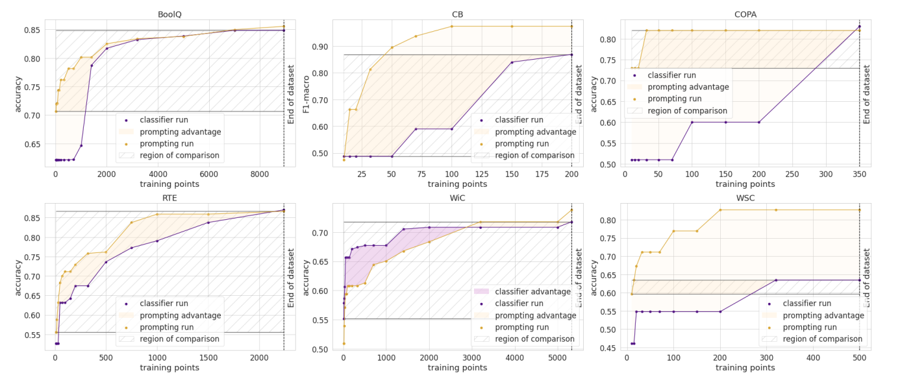


We're looking forward to EMNLP this year where we have four accepted papers!

- Our [paper](https://arxiv.org/abs/2109.02846) "[Datasets: A Community Library for Natural Language Processing](https://arxiv.org/abs/2109.02846)" documents the Hugging Face Datasets project that has over 300 contributors. This community project gives easy access to hundreds of datasets to researchers. It has facilitated new use cases of cross-dataset NLP, and has advanced features for tasks like indexing and streaming large datasets.
- Our collaboration with researchers from TU Darmstadt lead to another paper accepted at the conference (["Avoiding Inference Heuristics in Few-shot Prompt-based Finetuning"](https://arxiv.org/abs/2109.04144)). In this paper, we show that prompt-based fine-tuned language models (which achieve strong performance in few-shot setups) still suffer from learning surface heuristics (sometimes called *dataset biases*), a pitfall that zero-shot models don't exhibit.
- Our submission "[Block Pruning For Faster Transformers](https://arxiv.org/abs/2109.04838v1)" has also been accepted as a long paper. In this paper, we show how to use block sparsity to obtain both fast and small Transformer models. Our experiments yield models which are 2.4x faster and 74% smaller than BERT on SQuAD.

## Last words

😎 🔥 Summer was fun! So many things have happened! We hope you enjoyed reading this blog post and looking forward to share the new projects we're working on. See you in the winter! ❄️