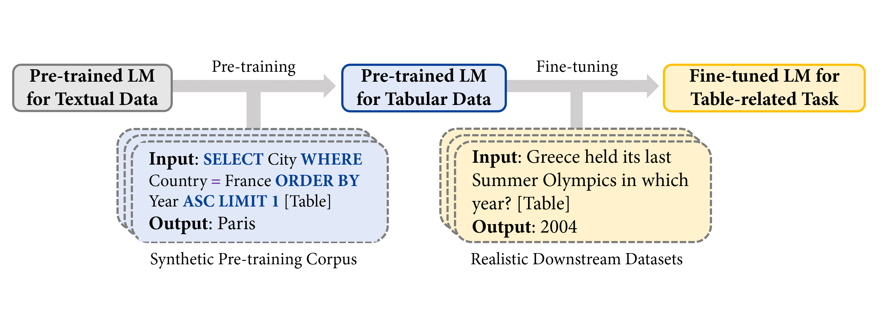
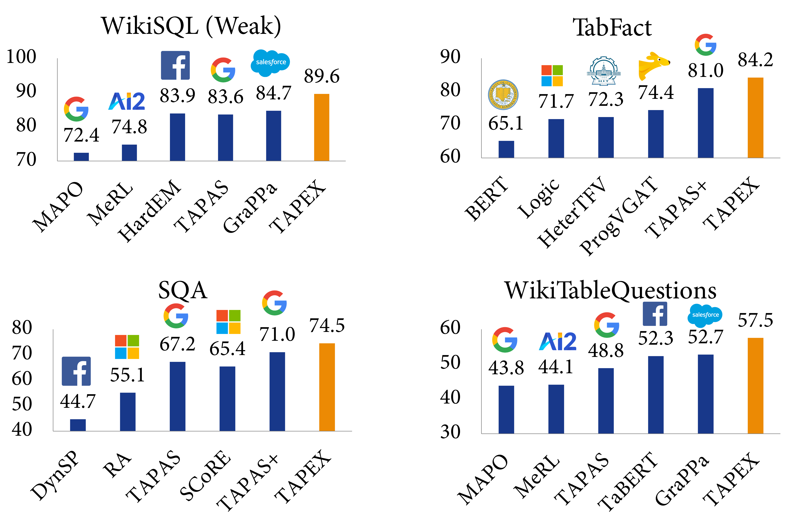
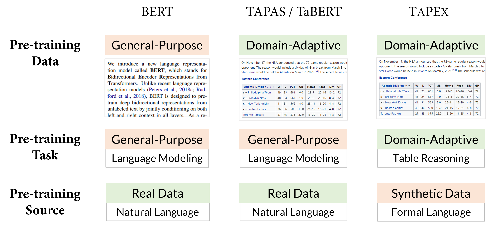
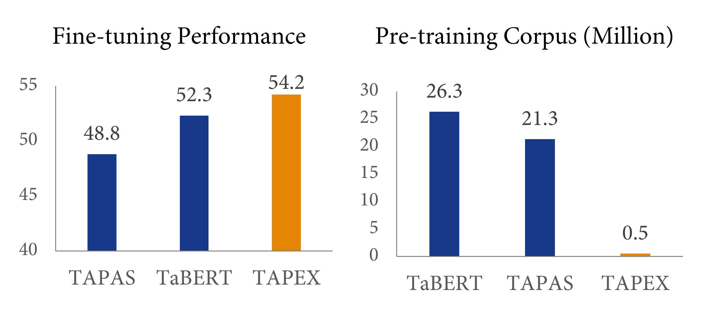

<h1>
    Query Your Tables using Natural Language: An Introduction to TAPEX
</h1>

<div class="blog-metadata">
    <small>Published May 13, 2022.</small>
    <a target="_blank" class="btn no-underline text-sm mb-5 font-sans" href="https://github.com/huggingface/blog/blob/main/tapex.md">
        Update on GitHub
    </a>
</div>

<div class="author-card">
    <a href="https://github.com/SivilTaram">
        
        <div class="bfc">
            <code>SivilTaram</code>
            <span class="fullname">Qian Liu</span>
        </div>
    </a>
</div>


In recent years, language model pre-training has achieved great success via leveraging large-scale textual data. By employing pre-training tasks such as [masked language modeling](https://arxiv.org/abs/1810.04805), these models have demonstrated surprising performance on several downstream tasks. However, the dramatic gap between the pre-training task (e.g., language modeling) and the downstream task (e.g., table question answering) makes existing pre-training not efficient enough. In practice, we often need an *extremely large amount* of pre-training data to obtain promising improvement, even for [domain-adaptive pretraining](https://arxiv.org/abs/2004.02349). How might we design a pre-training task to close the gap, and thus accelerate pre-training?

### Overview

In "[TAPEX: Table Pre-training via Learning a Neural SQL Executor](https://openreview.net/forum?id=O50443AsCP)", we explore **using synthetic data as a proxy for real data during pre-training**, and demonstrate its powerfulness with *TAPEX (Table Pre-training via Execution)* as an example. In TAPEX, we show that table pre-training can be achieved by learning a neural SQL executor over a synthetic corpus.


> Note: [Table] is a placeholder for the user provided table in the input.

As shown in the above figure, by systematically sampling *executable SQL queries and their execution outputs* over tables, TAPEX first synthesizes a synthetic and non-natural pre-training corpus. Then it continues to pre-train a language model (e.g., [BART](https://arxiv.org/abs/1910.13461)) to output the execution results of SQL queries, which mimics the process of a neural SQL executor.

### Pre-training

The following figure illustrates the pre-training process. At each step, we first take a table from the web. The example table is about Olympics Games. Then we can sample an executable SQL query `SELECT City WHERE Country = France ORDER BY Year ASC LIMIT 1`. Through an off-the-shelf SQL executor (e.g., MySQL), we can obtain the query’s execution result `Paris`. Similarly, by feeding the concatenation of the SQL query and the flattened table to the model (e.g., BART encoder) as input, the execution result serves as the supervision for the model (e.g., BART decoder) as output.


Why use programs such as SQL queries rather than natural language sentences as a source for pre-training? The greatest advantage is that the diversity and scale of programs can be systematically guaranteed, compared to uncontrollable natural language sentences. Therefore, we can easily synthesize a diverse, large-scale, and high-quality pre-training corpus by sampling SQL queries.

You can try the trained neural SQL executor in 🤗 Transformers as below:

```python
from transformers import TapexTokenizer, BartForConditionalGeneration
import pandas as pd

tokenizer = TapexTokenizer.from_pretrained("microsoft/tapex-large-sql-execution")
model = BartForConditionalGeneration.from_pretrained("microsoft/tapex-large-sql-execution")

data = {
    "year": [1896, 1900, 1904, 2004, 2008, 2012],
    "city": ["athens", "paris", "st. louis", "athens", "beijing", "london"]
}
table = pd.DataFrame.from_dict(data)

# tapex accepts uncased input since it is pre-trained on the uncased corpus
query = "select year where city = beijing"
encoding = tokenizer(table=table, query=query, return_tensors="pt")

outputs = model.generate(**encoding)

print(tokenizer.batch_decode(outputs, skip_special_tokens=True))
# ['2008']
```

### Fine-tuning

During fine-tuning, we feed the concatenation of the natural language question and the flattened table to the model as input, the answer labeled by annotators serves as the supervision for the model as output. Want to fine-tune TAPEX by yourself? You can look at the fine-tuning script [here](https://github.com/huggingface/transformers/tree/main/examples/research_projects/tapex), which has been officially integrated into 🤗 Transformers `4.19.0`!

And by now, all available fine-tuned TAPEX models have interactive widgets officially supported by Huggingface! You can try to answer some questions as below.

<div class="bg-white pb-1"><div class="SVELTE_HYDRATER contents" data-props="{&quot;apiUrl&quot;:&quot;https://api-inference.huggingface.co&quot;,&quot;model&quot;:{&quot;author&quot;:&quot;microsoft&quot;,&quot;cardData&quot;:{&quot;language&quot;:&quot;en&quot;,&quot;tags&quot;:[&quot;tapex&quot;,&quot;table-question-answering&quot;],&quot;license&quot;:&quot;mit&quot;},&quot;cardError&quot;:{&quot;errors&quot;:[],&quot;warnings&quot;:[]},&quot;cardExists&quot;:true,&quot;config&quot;:{&quot;architectures&quot;:[&quot;BartForConditionalGeneration&quot;],&quot;model_type&quot;:&quot;bart&quot;},&quot;discussionsDisabled&quot;:false,&quot;id&quot;:&quot;microsoft/tapex-large-finetuned-wtq&quot;,&quot;lastModified&quot;:&quot;2022-05-05T07:01:43.000Z&quot;,&quot;pipeline_tag&quot;:&quot;table-question-answering&quot;,&quot;library_name&quot;:&quot;transformers&quot;,&quot;mask_token&quot;:&quot;<mask>&quot;,&quot;model-index&quot;:null,&quot;private&quot;:false,&quot;gated&quot;:false,&quot;pwcLink&quot;:{&quot;error&quot;:&quot;Unknown error, can't generate link to Papers With Code.&quot;},&quot;tags&quot;:[&quot;pytorch&quot;,&quot;bart&quot;,&quot;text2text-generation&quot;,&quot;en&quot;,&quot;arxiv:2107.07653&quot;,&quot;transformers&quot;,&quot;tapex&quot;,&quot;table-question-answering&quot;,&quot;license:mit&quot;,&quot;autotrain_compatible&quot;],&quot;tag_objs&quot;:[{&quot;id&quot;:&quot;table-question-answering&quot;,&quot;label&quot;:&quot;Table Question Answering&quot;,&quot;subType&quot;:&quot;nlp&quot;,&quot;type&quot;:&quot;pipeline_tag&quot;},{&quot;id&quot;:&quot;pytorch&quot;,&quot;label&quot;:&quot;PyTorch&quot;,&quot;type&quot;:&quot;library&quot;},{&quot;id&quot;:&quot;transformers&quot;,&quot;label&quot;:&quot;Transformers&quot;,&quot;type&quot;:&quot;library&quot;},{&quot;id&quot;:&quot;en&quot;,&quot;label&quot;:&quot;en&quot;,&quot;type&quot;:&quot;language&quot;},{&quot;id&quot;:&quot;arxiv:2107.07653&quot;,&quot;label&quot;:&quot;arxiv:2107.07653&quot;,&quot;type&quot;:&quot;arxiv&quot;},{&quot;id&quot;:&quot;license:mit&quot;,&quot;label&quot;:&quot;mit&quot;,&quot;type&quot;:&quot;license&quot;},{&quot;id&quot;:&quot;bart&quot;,&quot;label&quot;:&quot;bart&quot;,&quot;type&quot;:&quot;other&quot;},{&quot;id&quot;:&quot;text2text-generation&quot;,&quot;label&quot;:&quot;text2text-generation&quot;,&quot;type&quot;:&quot;other&quot;},{&quot;id&quot;:&quot;tapex&quot;,&quot;label&quot;:&quot;tapex&quot;,&quot;type&quot;:&quot;other&quot;},{&quot;id&quot;:&quot;autotrain_compatible&quot;,&quot;label&quot;:&quot;AutoTrain Compatible&quot;,&quot;type&quot;:&quot;other&quot;}],&quot;transformersInfo&quot;:{&quot;auto_model&quot;:&quot;AutoModelForSeq2SeqLM&quot;,&quot;pipeline_tag&quot;:&quot;text2text-generation&quot;,&quot;processor&quot;:&quot;AutoTokenizer&quot;},&quot;widgetData&quot;:[{&quot;text&quot;:&quot;How many stars does the transformers repository have?&quot;,&quot;table&quot;:{&quot;Repository&quot;:[&quot;Transformers&quot;,&quot;Datasets&quot;,&quot;Tokenizers&quot;],&quot;Stars&quot;:[36542,4512,3934],&quot;Contributors&quot;:[651,77,34],&quot;Programming language&quot;:[&quot;Python&quot;,&quot;Python&quot;,&quot;Rust, Python and NodeJS&quot;]}}],&quot;likes&quot;:0,&quot;isLikedByUser&quot;:false},&quot;shouldUpdateUrl&quot;:true,&quot;includeCredentials&quot;:true}" data-target="InferenceWidget"><div class="flex flex-col w-full max-w-full
	"> <div class="font-semibold flex items-center mb-2"><div class="text-lg flex items-center"><svg xmlns="http://www.w3.org/2000/svg" xmlns:xlink="http://www.w3.org/1999/xlink" aria-hidden="true" focusable="false" role="img" class="-ml-1 mr-1 text-yellow-500" width="1em" height="1em" preserveAspectRatio="xMidYMid meet" viewBox="0 0 24 24"><path d="M11 15H6l7-14v8h5l-7 14v-8z" fill="currentColor"></path></svg>
				Hosted inference API</div> <a target="_blank" href="https://api-inference.huggingface.co/"><svg class="ml-1.5 text-sm text-gray-400 hover:text-black" xmlns="http://www.w3.org/2000/svg" xmlns:xlink="http://www.w3.org/1999/xlink" aria-hidden="true" focusable="false" role="img" width="1em" height="1em" preserveAspectRatio="xMidYMid meet" viewBox="0 0 32 32"><path d="M17 22v-8h-4v2h2v6h-3v2h8v-2h-3z" fill="currentColor"></path><path d="M16 8a1.5 1.5 0 1 0 1.5 1.5A1.5 1.5 0 0 0 16 8z" fill="currentColor"></path><path d="M16 30a14 14 0 1 1 14-14a14 14 0 0 1-14 14zm0-26a12 12 0 1 0 12 12A12 12 0 0 0 16 4z" fill="currentColor"></path></svg></a></div> <div class="flex items-center justify-between flex-wrap w-full max-w-full text-sm text-gray-500 mb-0.5"><a target="_blank"><div class="inline-flex items-center mr-2 mb-1.5"><svg class="mr-1" xmlns="http://www.w3.org/2000/svg" xmlns:xlink="http://www.w3.org/1999/xlink" aria-hidden="true" fill="currentColor" focusable="false" role="img" width="1em" height="1em" preserveAspectRatio="xMidYMid meet" viewBox="0 0 18 19"><path d="M15.825 1.88748H6.0375C5.74917 1.88777 5.47272 2.00244 5.26884 2.20632C5.06496 2.4102 4.95029 2.68665 4.95 2.97498V4.60623H2.775C2.48667 4.60652 2.21022 4.72119 2.00634 4.92507C1.80246 5.12895 1.68779 5.4054 1.6875 5.69373V16.025C1.68779 16.3133 1.80246 16.5898 2.00634 16.7936C2.21022 16.9975 2.48667 17.1122 2.775 17.1125H15.825C16.1133 17.1122 16.3898 16.9975 16.5937 16.7936C16.7975 16.5898 16.9122 16.3133 16.9125 16.025V2.97498C16.9122 2.68665 16.7975 2.4102 16.5937 2.20632C16.3898 2.00244 16.1133 1.88777 15.825 1.88748ZM6.0375 2.97498H15.825V4.60623H6.0375V2.97498ZM15.825 8.41248H11.475V5.69373H15.825V8.41248ZM6.0375 12.2187V9.49998H10.3875V12.2187H6.0375ZM10.3875 13.3062V16.025H6.0375V13.3062H10.3875ZM4.95 12.2187H2.775V9.49998H4.95V12.2187ZM10.3875 5.69373V8.41248H6.0375V5.69373H10.3875ZM11.475 9.49998H15.825V12.2187H11.475V9.49998ZM4.95 5.69373V8.41248H2.775V5.69373H4.95ZM2.775 13.3062H4.95V16.025H2.775V13.3062ZM11.475 16.025V13.3062H15.825V16.025H11.475Z"></path></svg> <span>Table Question Answering</span></div></a> <div class="relative mb-1.5
		false 
		false"><div class="no-hover:hidden inline-flex justify-between w-32 lg:w-44 rounded-md border border-gray-100 px-4 py-1"><div class="text-sm truncate">Examples</div> <svg class="-mr-1 ml-2 h-5 w-5 transition ease-in-out transform false" xmlns="http://www.w3.org/2000/svg" viewBox="0 0 20 20" fill="currentColor" aria-hidden="true"><path fill-rule="evenodd" d="M5.293 7.293a1 1 0 011.414 0L10 10.586l3.293-3.293a1 1 0 111.414 1.414l-4 4a1 1 0 01-1.414 0l-4-4a1 1 0 010-1.414z" clip-rule="evenodd"></path></svg></div> <div class="with-hover:hidden inline-flex justify-between w-32 lg:w-44 rounded-md border border-gray-100 px-4 py-1"><div class="text-sm truncate">Examples</div> <svg class="-mr-1 ml-2 h-5 w-5 transition ease-in-out transform false" xmlns="http://www.w3.org/2000/svg" viewBox="0 0 20 20" fill="currentColor" aria-hidden="true"><path fill-rule="evenodd" d="M5.293 7.293a1 1 0 011.414 0L10 10.586l3.293-3.293a1 1 0 111.414 1.414l-4 4a1 1 0 01-1.414 0l-4-4a1 1 0 010-1.414z" clip-rule="evenodd"></path></svg></div> </div></div> <form><div class="flex h-10"><input class="form-input-alt flex-1 rounded-r-none min-w-0 " placeholder="Your sentence here..." required="" type="text"> <button class="btn-widget w-24 h-10 px-5 rounded-l-none border-l-0 " type="submit">Compute</button></div></form> <div class="mt-4"> <div class="overflow-auto"><table class="table-question-answering"><thead><tr><th contenteditable="true" class="border-2 border-gray-100 h-6">Repository </th><th contenteditable="true" class="border-2 border-gray-100 h-6">Stars </th><th contenteditable="true" class="border-2 border-gray-100 h-6">Contributors </th><th contenteditable="true" class="border-2 border-gray-100 h-6">Programming language </th></tr></thead> <tbody><tr class="bg-white"><td class="border-gray-100 border-2 h-6" contenteditable="">Transformers</td><td class="border-gray-100 border-2 h-6" contenteditable="">36542</td><td class="border-gray-100 border-2 h-6" contenteditable="">651</td><td class="border-gray-100 border-2 h-6" contenteditable="">Python</td> </tr><tr class="bg-white"><td class="border-gray-100 border-2 h-6" contenteditable="">Datasets</td><td class="border-gray-100 border-2 h-6" contenteditable="">4512</td><td class="border-gray-100 border-2 h-6" contenteditable="">77</td><td class="border-gray-100 border-2 h-6" contenteditable="">Python</td> </tr><tr class="bg-white"><td class="border-gray-100 border-2 h-6" contenteditable="">Tokenizers</td><td class="border-gray-100 border-2 h-6" contenteditable="">3934</td><td class="border-gray-100 border-2 h-6" contenteditable="">34</td><td class="border-gray-100 border-2 h-6" contenteditable="">Rust, Python and NodeJS</td> </tr></tbody></table></div> <div class="flex mb-1 flex-wrap"><button class="btn-widget flex-1 lg:flex-none mt-2  mr-1.5" type="button"><svg class="mr-2" xmlns="http://www.w3.org/2000/svg" aria-hidden="true" focusable="false" role="img" width="1em" height="1em" viewBox="0 0 32 32"><path d="M3 11v2h26v-2H3zm0 8v2h26v-2H3z" fill="currentColor"></path></svg>
			Add row</button> <button class="btn-widget flex-1 lg:flex-none mt-2 lg:mr-1.5" type="button"><svg class="transform rotate-90 mr-1" xmlns="http://www.w3.org/2000/svg" aria-hidden="true" focusable="false" role="img" width="1em" height="1em" viewBox="0 0 32 32"><path d="M3 11v2h26v-2H3zm0 8v2h26v-2H3z" fill="currentColor"></path></svg>
			Add col</button> <button class="btn-widget flex-1 mt-2 lg:flex-none lg:ml-auto" type="button">Reset table</button></div></div> <div class="mt-2"><div class="text-gray-400 text-xs">This model can be loaded on the Inference API on-demand.</div> </div>   <div class="mt-auto pt-4 flex items-center text-xs text-gray-500"><button class="flex items-center cursor-not-allowed text-gray-300" disabled=""><svg class="mr-1" xmlns="http://www.w3.org/2000/svg" xmlns:xlink="http://www.w3.org/1999/xlink" aria-hidden="true" focusable="false" role="img" width="1em" height="1em" preserveAspectRatio="xMidYMid meet" viewBox="0 0 32 32" style="transform: rotate(360deg);"><path d="M31 16l-7 7l-1.41-1.41L28.17 16l-5.58-5.59L24 9l7 7z" fill="currentColor"></path><path d="M1 16l7-7l1.41 1.41L3.83 16l5.58 5.59L8 23l-7-7z" fill="currentColor"></path><path d="M12.419 25.484L17.639 6l1.932.518L14.35 26z" fill="currentColor"></path></svg>
		JSON Output</button> <button class="flex items-center ml-auto"><svg class="mr-1" xmlns="http://www.w3.org/2000/svg" xmlns:xlink="http://www.w3.org/1999/xlink" aria-hidden="true" focusable="false" role="img" width="1em" height="1em" preserveAspectRatio="xMidYMid meet" viewBox="0 0 32 32"><path d="M22 16h2V8h-8v2h6v6z" fill="currentColor"></path><path d="M8 24h8v-2h-6v-6H8v8z" fill="currentColor"></path><path d="M26 28H6a2.002 2.002 0 0 1-2-2V6a2.002 2.002 0 0 1 2-2h20a2.002 2.002 0 0 1 2 2v20a2.002 2.002 0 0 1-2 2zM6 6v20h20.001L26 6z" fill="currentColor"></path></svg>
		Maximize</button></div> </div></div></div>


### Experiments

We evaluate TAPEX on four benchmark datasets, including [WikiSQL (Weak)](https://huggingface.co/datasets/wikisql), [WikiTableQuestions](https://huggingface.co/datasets/wikitablequestions), [SQA](https://huggingface.co/datasets/msr_sqa) and [TabFact](https://huggingface.co/datasets/tab_fact). The first three datasets are about table question answering, while the last one is about table fact verification, both requiring joint reasoning about tables and natural language. Below are some examples from the most challenging dataset, WikiTableQuestions:

| Question | Answer |
|:---: |:---:|
| according to the table, what is the last title that spicy horse produced? | Akaneiro: Demon Hunters |
| what is the difference in runners-up from coleraine academical institution and royal school dungannon? | 20 |
| what were the first and last movies greenstreet acted in? | The Maltese Falcon, Malaya |
| in which olympic games did arasay thondike not finish in the top 20? | 2012 |
| which broadcaster hosted 3 titles but they had only 1 episode? | Channel 4 |

Experimental results demonstrate that TAPEX outperforms previous table pre-training approaches by a large margin and ⭐achieves new state-of-the-art results on all of them⭐. This includes the improvements on the weakly-supervised WikiSQL denotation accuracy to **89.6%** (+2.3% over SOTA, +3.8% over BART), the TabFact accuracy to **84.2%** (+3.2% over SOTA, +3.0% over BART), the SQA denotation accuracy to **74.5%** (+3.5% over SOTA, +15.9% over BART), and the WikiTableQuestion denotation accuracy to **57.5%** (+4.8% over SOTA, +19.5% over BART). To our knowledge, this is the first work to exploit pre-training via synthetic executable programs and to achieve new state-of-the-art results on various downstream tasks.




### Comparison to Previous Table Pre-training

The earliest work on table pre-training, [TAPAS](https://aclanthology.org/2020.acl-main.398/) from Google Research - also [available in 🤗 Transformers](https://huggingface.co/docs/transformers/model_doc/tapas) - and [TaBERT](https://aclanthology.org/2020.acl-main.745/) from Meta AI, have revealed that collecting more *domain-adaptive* data can improve the downstream performance. However, these previous works mainly employ *general-purpose* pre-training tasks, e.g., language modeling or its variants. TAPEX explores a different path by sacrificing the naturalness of the pre-trained source in order to obtain a *domain-adaptive* pre-trained task, i.e. SQL execution. A graphical comparison of BERT, TAPAS/TaBERT and our TAPEX can be seen below.




We believe the SQL execution task is closer to the downstream table question answering task, especially from the perspective of structural reasoning capabilities. Imagine you are faced with a SQL query `SELECT City ORDER BY Year` and a natural question `Sort all cities by year`. The reasoning paths required by the SQL query and the question are similar, except that SQL is a bit more rigid than the natural language. If a language model can be pre-trained to faithfully “execute” SQL queries and produce correct results, it should have a deep understanding on natural language with similar intents.



What about the efficiency? How efficient is such a pre-training method compared to the previous pre-training? The answer is given in the above figure: compared with previous table pre-training method TaBERT, TAPEX could yield 2% improvement only using 2% of the pre-training corpus, achieving a speedup of nearly **50** times! With larger pre-training corpus (e.g., 5 million <SQL, Table, Execution Result> pairs), the performance on downstream datasets would be better.


### Conclusion

In this blog, we introduce TAPEX, a table pre-training approach whose corpus is automatically synthesized via sampling SQL queries and their execution results. TAPEX addresses the data scarcity challenge in table pre-training by learning a neural SQL executor on a diverse, large-scale, and high-quality synthetic corpus. Experimental results on four downstream datasets demonstrate that TAPEX outperforms previous table pre-training approaches by a large margin, with a higher pre-training efficiency.

### Take Away

What can we learn from the success of TAPEX? I suggest that, especially if you want to perform efficient continual pre-training, you may try these options: (1) synthesize an accurate and small corpus, instead of mining a large but noisy corpus from Internet; (2) simulate domain-adaptive skills via programs, instead of general-purpose language modeling via natural language sentences. 