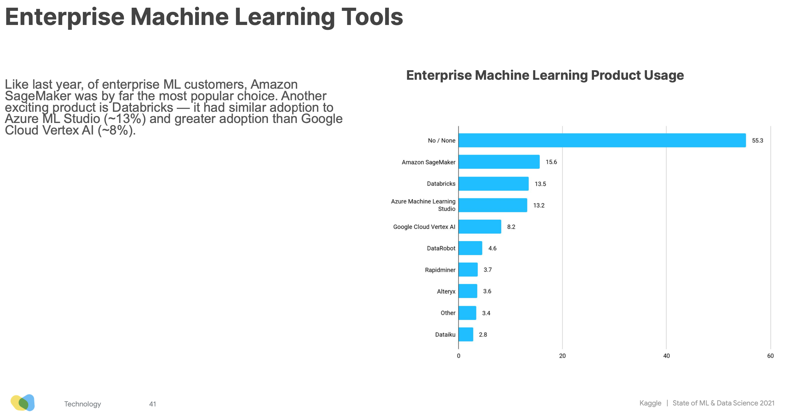
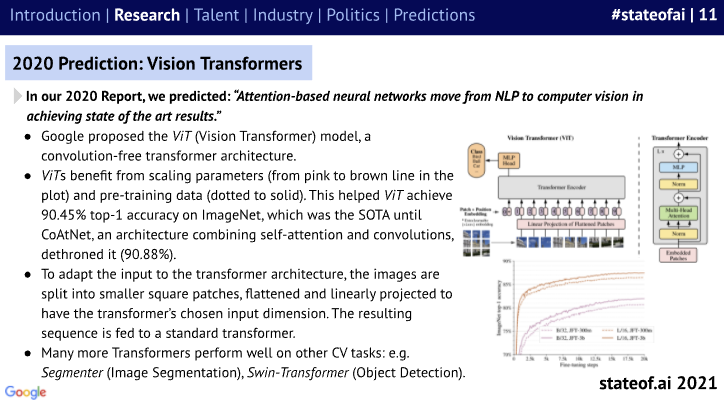
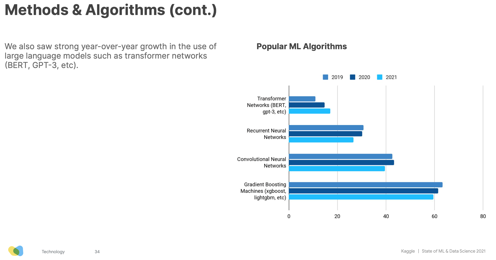
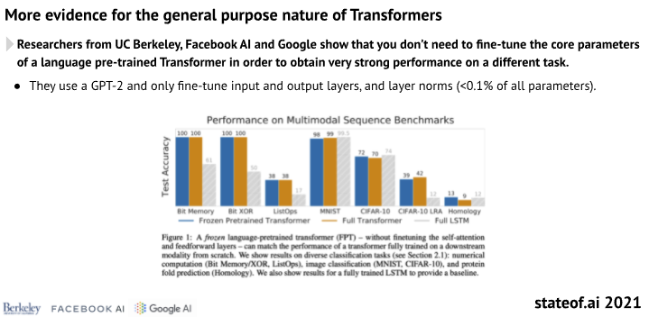
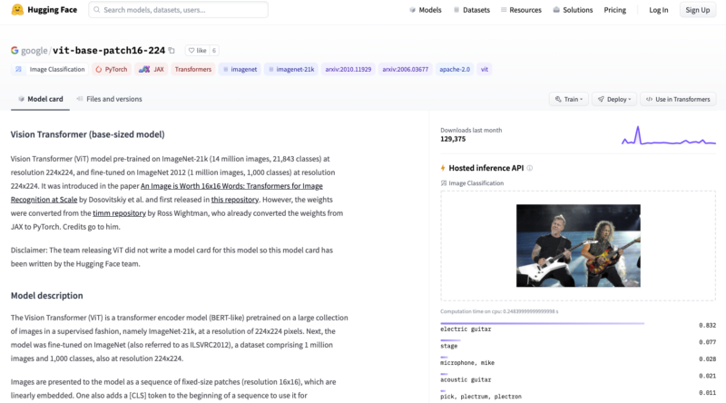
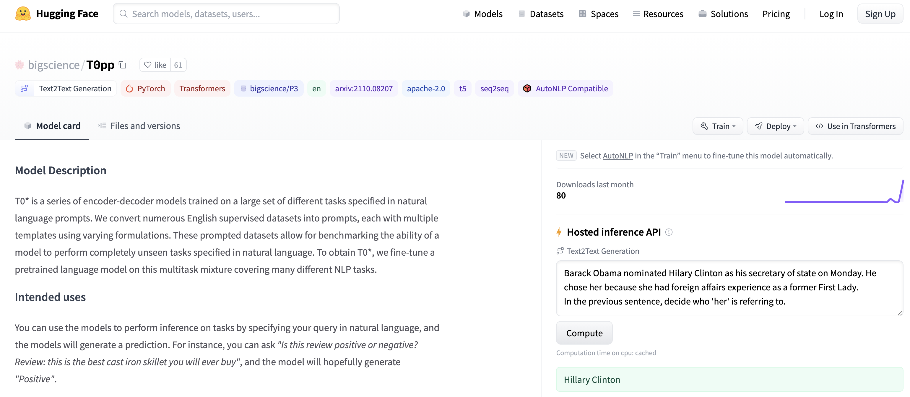
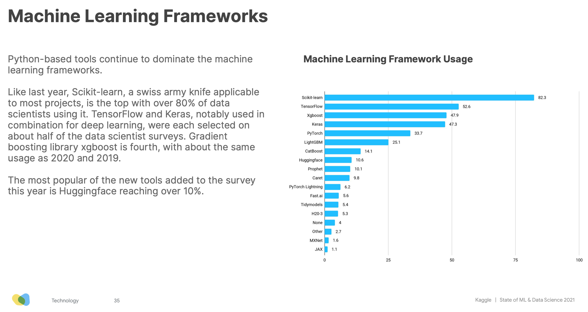

<h1>
The Age of Machine Learning As Code Has Arrived
</h1>

  
  

    <small>Published October 20, 2021.</small>
    <a target="_blank" class="btn no-underline text-sm mb-5 font-sans" href="https://github.com/huggingface/blog/blob/master/the_age_of_ml_as_code_has_arrived.md">
        Update on GitHub
    </a>

  <a href="https://twitter.com/julsimon">
    
    

      Julien Simon

    

  </a>
    </a>

The 2021 edition of the [State of AI Report](https://www.stateof.ai/2021-report-launch.html) came out last week. So did the Kaggle [State of Machine Learning and Data Science Survey](https://www.kaggle.com/c/kaggle-survey-2021). There's much to be learned and discussed in these reports, and a couple of takeaways caught my attention.

> "AI is increasingly being applied to mission critical infrastructure like national electric grids and automated supermarket warehousing calculations during pandemics. However, there are questions about whether the maturity of the industry has caught up with the enormity of its growing deployment."

There's no denying that Machine Learning-powered applications are reaching into every corner of IT. But what does that mean for companies and organizations? How do we build rock-solid Machine Learning workflows? Should we all hire 100 Data Scientists ? Or 100 DevOps engineers?

> "Transformers have emerged as a general purpose architecture for ML. Not just for Natural Language Processing, but also Speech, Computer Vision or even protein structure prediction."

Old timers have learned the hard way that there is [no silver bullet](https://en.wikipedia.org/wiki/No_Silver_Bullet) in IT. Yet, the [Transformer](https://arxiv.org/abs/1706.03762) architecture is indeed very efficient on a wide variety of Machine Learning tasks. But how can we all keep up with the frantic pace of innovation in Machine Learning? Do we really need expert skills to leverage these state of the art models? Or is there a shorter path to creating business value in less time?

Well, here's what I think.

### Machine Learning For The Masses!

Machine Learning is everywhere, or at least it's trying to be. A few years ago, Forbes wrote that "[Software ate the world, now AI is eating Software](https://www.forbes.com/sites/cognitiveworld/2019/08/29/software-ate-the-world-now-ai-is-eating-software/)", but what does this really mean? If it means that Machine Learning models should replace thousands of lines of fossilized legacy code, then I'm all for it. Die, evil business rules, die!

Now, does it mean that Machine Learning will actually replace Software Engineering? There's certainly a lot of fantasizing right now about [AI-generated code](https://www.wired.com/story/ai-latest-trick-writing-computer-code/), and some techniques are certainly interesting, such as [finding bugs and performance issues](https://aws.amazon.com/codeguru). However, not only shouldn't we even consider getting rid of developers, we should work on empowering as many as we can so that Machine Learning becomes just another boring IT workload (and [boring technology is great](http://boringtechnology.club/)). In other words, what we really need is for Software to eat Machine Learning!

### Things are not different this time

For years, I've argued and swashbuckled that decade-old best practices for Software Engineering also apply to Data Science and Machine Learning: versioning, reusability, testability, automation, deployment, monitoring, performance, optimization, etc. I felt alone for a while, and then the Google cavalry unexpectedly showed up:

> "Do machine learning like the great engineer you are, not like the great machine learning expert you aren't." - [Rules of Machine Learning](https://developers.google.com/machine-learning/guides/rules-of-ml), Google

There's no need to reinvent the wheel either. The DevOps movement solved these problems over 10 years ago. Now, the Data Science and Machine Learning community should adopt and adapt these proven tools and processes without delay. This is the only way we'll ever manage to build robust, scalable and repeatable Machine Learning systems in production. If calling it MLOps helps, fine: I won't argue about another buzzword.

It's really high time we stopped considering proof of concepts and sandbox A/B tests as notable achievements. They're merely a small stepping stone toward production, which is the only place where assumptions and business impact can be validated. Every Data Scientist and Machine Learning Engineer should obsess about getting their models in production, as quickly and as often as possible. **An okay production model beats a great sandbox model every time**.

### Infrastructure? So what?

It's 2021. IT infrastructure should no longer stand in the way. Software has devoured it a while ago, abstracting it away with cloud APIs, infrastructure as code, Kubeflow and so on. Yes, even on premises.

The same is quickly happening for Machine Learning infrastructure. According to the Kaggle survey, 75% of respondents use cloud services, and over 45% use an Enterprise ML platform, with Amazon SageMaker, Databricks and Azure ML Studio taking the top 3 spots.

<kbd>
  
</kbd>

With MLOps, software-defined infrastructure and platforms, it's never been easier to drag all these great ideas out of the sandbox, and to move them to production. To answer my original question, I'm pretty sure you need to hire more ML-savvy Software and DevOps engineers, not more Data Scientists. But deep down inside, you kind of knew that, right?

Now, let's talk about Transformers.

--

### Transformers! Transformers! Transformers! ([Ballmer style](https://www.youtube.com/watch?v=Vhh_GeBPOhs))

Says the State of AI report: "The Transformer architecture has expanded far beyond NLP and is emerging as a general purpose architecture for ML". For example, recent models like Google's [Vision Transformer](https://paperswithcode.com/method/vision-transformer), a convolution-free transformer architecture, and [CoAtNet](https://paperswithcode.com/paper/coatnet-marrying-convolution-and-attention), which mixes transformers and convolution, have set new benchmarks for image classification on ImageNet, while requiring fewer compute resources for training.

<kbd>
  
</kbd>

Transformers also do very well on audio (say, speech recognition), as well as on point clouds, a technique used to model 3D environments like autonomous driving scenes.

The Kaggle survey echoes this rise of Transformers. Their usage keeps growing year over year, while RNNs, CNNs and Gradient Boosting algorithms are receding.

<kbd>
  
</kbd>

On top of increased accuracy, Transformers also keep fulfilling the transfer learning promise, allowing teams to save on training time and compute costs, and to deliver business value quicker.

<kbd>
  
</kbd>

With Transformers, the Machine Learning world is gradually moving from "*Yeehaa!! Let's build and train our own Deep Learning model from scratch*" to "*Let's pick a proven off the shelf model, fine-tune it on our own data, and be home early for dinner.*"

It's a Good Thing in so many ways. State of the art is constantly advancing, and hardly anyone can keep up with its relentless pace. Remember that Google Vision Transformer model I mentioned earlier? Would you like to test it here and now? With Hugging Face, it's [the simplest thing](https://huggingface.co/google/vit-base-patch16-224).

<kbd>
  
</kbd>

How about the latest [zero-shot text generation models](https://huggingface.co/bigscience) from the [Big Science project](https://bigscience.huggingface.co/)?

<kbd>
  
</kbd>

You can do the same with another [16,000+ models](https://huggingface.co/models) and [1,600+ datasets](https://huggingface.co/datasets), with additional tools for [inference](https://huggingface.co/inference-api), [AutoNLP](https://huggingface.co/autonlp), [latency optimization](https://huggingface.co/infinity), and [hardware acceleration](https://huggingface.co/hardware). We can also help you get your project off the ground, [from modeling to production](https://huggingface.co/support).

Our mission at Hugging Face is to make Machine Learning as friendly and as productive as possible, for beginners and experts alike. 

We believe in writing as little code as possible to train, optimize, and deploy models. 

We believe in built-in best practices. 

We believe in making infrastructure as transparent as possible. 

We believe that nothing beats high quality models in production, fast.

### Machine Learning as Code, right here, right now!
A lot of you seem to agree. We have over 52,000 stars on [Github](https://github.com/huggingface). For the first year, Hugging Face is also featured in the Kaggle survey, with usage already over 10%.

<kbd>
  
</kbd>

**Thank you all**. And yeah, we're just getting started.

--

*Interested in how Hugging Face can help your organization build and deploy production-grade Machine Learning solutions? Get in touch at [julsimon@huggingface.co](mailto:julsimon@huggingface.co) (no recruiters, no sales pitches, please).*