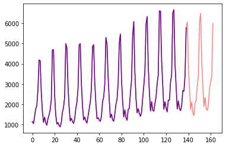
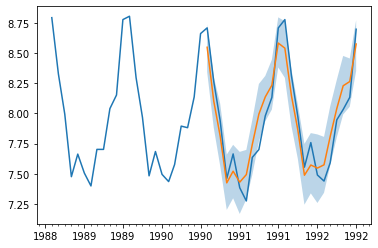

# Probabilistic Forecasting with Transformers


## Introduction

Time series forecasting is an essential scientific and business problem and as such has also seen a lot of innovation recently with the use of [Deep Learning based](https://dl.acm.org/doi/abs/10.1145/3533382) models in comparison to the [classical methods](https://otexts.com/fpp3/). Classical methods like ARIMA are typically called "local" or "single" methods as they are fitted on each time series in a dataset individually.

When dealing with a large amount of time series for an application, it is typically more efficient to train a single deep learning model so that it can benefit from learned representations from several related time series at inference time in order to make better forecasts. These forecasts are typically point valued and models are trained by minimizing an L2 or L1 type of loss with respect to the ground truth data. However, since these forecasts are most probably used in some real-world decision making pipeline, even with humans in the loop, it is much more beneficial to provide the (aleatoric) uncertainties of predictions. Thus *probabilistic* forecasting methods are deployed which hopes to learn the distribution of future values.

It is common in the probabilistic setting to for example learn the future parameters of some chosen parametric distribution like Gaussian or Student-T, or learn the conditional quantile function or use the framework of Conformal Prediction adapted to the time series setting. The choice of method does not effect the modeling aspect and thus can be typically thought of as yet another hyperparameter. Empirical means or medians can also provide the point forecasting outputs if desired.

In terms of modeling time series data which are sequential in nature, as one can imagine, researchers have come up with models which use Recurrent Neural Networks (RNN) like the LSTM or GRU, or Convolutional Networks (CNN), and more recently even Transformer based methods which fit naturally to the time series forecasting setting and is the subject of this post. Since most applications of forecasting require the prediction of some logged data, the sequence-to-sequence (seq2seq) paradigm is a good choice where at inference time the very last window of some data can be passed to an encoder and then the decoder can be used to autoregressively output the predictions. For some architectures, the encoder-decoder merges into a single entity (e.g. RNNs) but this view is still beneficial.

## Transformer for Forecasting

As mentioned, the Encoder-Decoder based Transformer is a natural choice of forecasting as it encapsulates a number of inductive biases nicely. To begin with, the use of an Encoder-Decoder architecture is helpful at inference time where typically for some logged data we wish to know the forecast some prediction steps into the future. This can be thought of as analogous to the text generation task where given some context we autoregressively sample the next token. Similarly here we can also, given some distribution type, sample from it autoregressively to return forecasts up until our desired prediction horizon.

Secondly, this paradigm helps us to train on time series data which might contain thousands of time points. It might not be feasible to input *all* the history of a time series at once to the model, due to the time- and memory constraints of the attention mechanism. Thus, one can consider some appropriate context window and sample this window and the subsequent prediction length sized window from the training data when constructing batches for stochastic gradient descent (SGD). The context sized window can be passed to the encoder and the prediction window to a *causal-masked* decoder. This means that the decoder can only look at previous time steps when learning the next value.

Another benefit of Transformers over the other architectures is that we can incorporate missing values (which are common in the time series setting) as an additional mask to the encoder or decoder and still train without resorting to in-filling or imputation. This is equivalent to the `attention_mask` of models like BERT and GPT-2 in the Transformers library, to not include padding tokens in the computation of the attention matrix.

A drawback of this architecture is that obviously there is a limit to the sizes of the context and prediction windows in view of the quadratic compute and memory requirements of the vanilla Transformer and also since the Transformer is a power architecture it might overfit or learn spurious correlations much more easily compared to other methods.

The 🤗 Transformers library comes with a vanilla probabilistic time series Transformer model which is able to learn a number of real and integer valued parametric distributions together with all the features of neural forecasting which we will highlight below!

## Set-up Environment

First, let's install the necessary libraries: 🤗 Transformers, 🤗 Datasets, 🤗 Evaluate,  🤗 Accelerate and Gluon-ts.

As we will show, [Gluon-ts](https://github.com/awslabs/gluonts) will be used for transforming the data to create features as well as for creating appropriate training, validation and test batches.


```python
!pip install -q transformers

!pip install -q datasets

!pip install -q evaluate

!pip install -q accelerate

!pip install -q gluonts ujson
```

## Load Dataset

Let's load the `tourism_monthly` dataset from the 🤗 [hub](https://huggingface.co/datasets/monash_tsf). This dataset contains monthly tourism volumes for 366 regions in Australia.

This dataset is part of the [Monash Time Series Forecasting](https://forecastingdata.org/) repository, a collection of  time series datasets from a number of domains.


```python
from datasets import load_dataset

dataset = load_dataset("monash_tsf", "tourism_monthly")
```


As can be seen, the dataset contains 3 splits: train, validation and test.


```python
dataset

    DatasetDict({
        train: Dataset({
            features: ['start', 'target', 'feat_static_cat', 'feat_dynamic_real', 'item_id'],
            num_rows: 366
        })
        test: Dataset({
            features: ['start', 'target', 'feat_static_cat', 'feat_dynamic_real', 'item_id'],
            num_rows: 366
        })
        validation: Dataset({
            features: ['start', 'target', 'feat_static_cat', 'feat_dynamic_real', 'item_id'],
            num_rows: 366
        })
    })
```


Each example contains a few keys, of which `start` and `target` are the most important ones. Let us have a look at the first time series in the dataset:


```python
train_example = dataset['train'][0]
train_example.keys()

    dict_keys(['start', 'target', 'feat_static_cat', 'feat_dynamic_real', 'item_id'])

```


The `start` simply indicates the start of the time series (as a datetime), and the `target` contains the actual values of the time series.

The `start` will be useful to add time related features to the time series values, as extra input to the model (such as "month of year"). Since we know the frequency of the data is `monthly`, we know for instance that the second value has the timestamp `1979-02-01`, etc.


```python
print(train_example['start'])
print(train_example['target'])

    1979-01-01 00:00:00
    [1149.8699951171875, 1053.8001708984375, ..., 5772.876953125]
```


The validation set contains the same data as the training set, just for a `prediction_length` longer amount of time. This allows us to validate the model's predictions against the ground truth.

The test set is again one `prediction_length` longer data compared to the validation set (or some multiple of  `prediction_length` longer data compared to the training set for testing on multiple rolling windows).


```python
validation_example = dataset['validation'][0]
validation_example.keys()

    dict_keys(['start', 'target', 'feat_static_cat', 'feat_dynamic_real', 'item_id'])
```


The initial values are exactly the same as the corresponding training example:


```python
print(validation_example['start'])
print(validation_example['target'])

    1979-01-01 00:00:00
    [1149.8699951171875, 1053.8001708984375, ..., 5985.830078125]
```


However, this example has `prediction_length=24` additional values compared to the training example. Let us verify it.


```python
freq = "1M"
prediction_length = 24

assert len(train_example['target']) + prediction_length == len(validation_example['target'])
```

Let's visualize this:


```python
import matplotlib.pyplot as plt

figure, axes = plt.subplots()
axes.plot(train_example['target'], color="blue") 
axes.plot(validation_example['target'], color="red", alpha=0.5)

plt.show()
```
    

    

Let's split up the data:


```python
train_dataset = dataset["train"]
val_dataset = dataset["validation"]
```

## Update `start` to `pd.Period` and transform `target`

We need to convert the `start` feature of each time series to a pandas `Period` index using the data's `freq` and while we are at it we can also log scale the `target` in view of the huge numbers:


```python
from functools import lru_cache

import pandas as pd
import numpy as np

@lru_cache(10_000)
def convert_to_pandas_period(date, freq):
    return pd.Period(date, freq)

def transform_start_field(batch, freq, log1p=False):
    batch["start"] = [convert_to_pandas_period(date, freq) for date in batch["start"]]
    if log1p:
        batch["target"] = [np.log1p(value) for value in batch["target"]]
    return batch
```

We now use `datasets`' `set_transform` to do this on-the-fly in place:


```python
from functools import partial

train_dataset.set_transform(partial(transform_start_field, freq=freq, log1p=True))
val_dataset.set_transform(partial(transform_start_field, freq=freq, log1p=True))
```

## Define the Model

Next, let's instantiate a model. The model will be trained from scratch, hence we won't use the `from_pretrained` method here, but rather instantiate the model from a `config`.

We specify a couple of additional parameters to the model:
- `prediction_length` (in our case, 24 months): this is horizon the decoder of the Transformer will learn to predict for;
- `context_length`: the model will set the `context_length` (input of the encoder) equal to this, if no `context_length` is specified;
- `lags` for a given frequency: these specify how much we "look back", to be added as additional features. e.g. for a `Daily` frequency we might consider a look back of `[1, 2, 7, 30, ...]` or in other words look back 1, 2, ... days) while for `Minute` data we might consider `[1, 30, 60, 60*24, ...]` etc.;
- the number of time features: in our case, this will be `2` as we'll add `MonthOfYear` as well as an `Age` feature;
- the number of static categorical features: in our case, this will be just 1 as we'll add a single "time series ID" feature;
- the cardinality: the number of values of each categorical feature, as a list which for our case will be `[366]` as we have 366 different time series
- the embedding dimension: the embedding dimension for each categorical feature, as a list, for example `[2]` meaning the model will learn an embedding for vector of size `2` for each of the `366` time series.


Let's use the default lags provided by Gluon-ts for the given frequency ("monthly"):


```python
from gluonts.time_feature import get_lags_for_frequency

lags_sequence = get_lags_for_frequency(freq)
print(lags_sequence)

    [1, 2, 3, 4, 5, 6, 7, 11, 12, 13, 23, 24, 25, 35, 36, 37]
```


This means that we'll look back up to 37 months for each time step, as additional features.

Let's also check the default time features which Gluon provides us:


```python
from gluonts.time_feature import time_features_from_frequency_str

time_features = time_features_from_frequency_str(freq)
print(time_features)

    [<function month_of_year at 0x7fa496d0ca70>]
```


In this case, there's only a single feature, namely "month of year". This means that for each time step, we'll add the month as a scalar value (e.g. `1` in case the timestamp is "january", `2` in case the timestamp is "february", etc.). We have everything now to define the model:


```python
from transformers import TimeSeriesTransformerConfig, TimeSeriesTransformerForPrediction

config = TimeSeriesTransformerConfig(
    prediction_length=prediction_length,
    context_length=prediction_length*3, # context length
    lags_sequence=lags_sequence,
    num_time_features=len(time_features) + 1, # we'll add 2 time features ("month of year" and "age", see further)
    num_static_categorical_features=1, # we have a single static categorical feature, namely time series ID
    cardinality=[len(train_dataset)], # it has 366 possible values
    embedding_dimension=[2], # the model will learn an embedding of size 2 for each of the 366 possible values
    encoder_layers=4, 
    decoder_layers=4,
)

model = TimeSeriesTransformerForPrediction(config)
```

## Define Transformations

Here we define the transformations for the data, in particular for the creation of the time features (based on the dataset or universal ones).

Again, we'll use the Gluon-ts library for this. We define a `Chain` of transformations (which is a bit comparable to `torchvision.transforms.Compose` for images).


```python
from gluonts.time_feature import time_features_from_frequency_str, TimeFeature, get_lags_for_frequency
from gluonts.dataset.field_names import FieldName
from gluonts.transform import (
    AddAgeFeature,
    AddObservedValuesIndicator,
    AddTimeFeatures,
    AsNumpyArray,
    Chain,
    ExpectedNumInstanceSampler,
    InstanceSplitter,
    RemoveFields,
    SelectFields,
    SetField,
    TestSplitSampler,
    Transformation,
    ValidationSplitSampler,
    VstackFeatures,
    RenameFields,
)
```

The transformations below are annotated with comments, to explain what they do, but at a hight level we will iterate over or dataset and add or remove fields or features to them via the following Chain of transformations:


```python
from transformers import PretrainedConfig

def create_transformation(freq: str, config: PretrainedConfig) -> Transformation:
    remove_field_names = []
    if config.num_static_real_features == 0:
        remove_field_names.append(FieldName.FEAT_STATIC_REAL)
    if config.num_dynamic_real_features == 0:
        remove_field_names.append(FieldName.FEAT_DYNAMIC_REAL)

    # a bit like torchvision.transforms.Compose
    return Chain(
        # step 1: remove static/dynamic fields if not specified
        [RemoveFields(field_names=remove_field_names)]
        # step 2: use static features if available, if not add dummy values
        + (
            [SetField(output_field=FieldName.FEAT_STATIC_CAT, value=[0])]
            if not config.num_static_categorical_features > 0
            else []
        )
        + (
            [SetField(output_field=FieldName.FEAT_STATIC_REAL, value=[0.0])]
            if not config.num_static_real_features > 0
            else []
        )
        # step 3: convert the data to NumPy (potentially not needed)
        + [
            AsNumpyArray(
                field=FieldName.FEAT_STATIC_CAT,
                expected_ndim=1,
                dtype=int,
            ),
            AsNumpyArray(
                field=FieldName.FEAT_STATIC_REAL,
                expected_ndim=1,
            ),
            AsNumpyArray(
                field=FieldName.TARGET,
                # in the following line, we add 1 for the time dimension
                expected_ndim=1 if config.input_size==1 else 2,
            ),
            # step 4: handle the NaN's by filling in the target with zero
            # and return the mask (which is in the observed values)
            # true for observed values, false for nan's
            # the decoder uses this mask (no loss is incurred for unobserved values)
            # see loss_weights inside the xxxForPrediction model
            AddObservedValuesIndicator(
                target_field=FieldName.TARGET,
                output_field=FieldName.OBSERVED_VALUES,
            ),
            # step 5: add temporal features based on freq of the dataset
            # month of year in this case
            # these serve as positional encodings
            AddTimeFeatures(
                start_field=FieldName.START,
                target_field=FieldName.TARGET,
                output_field=FieldName.FEAT_TIME,
                time_features=time_features_from_frequency_str(freq),
                pred_length=config.prediction_length,
            ),
            # step 6: add another temporal feature (just a single number)
            # tells the model where in the life the value of the time series is
            # sort of running counter
            AddAgeFeature(
                target_field=FieldName.TARGET,
                output_field=FieldName.FEAT_AGE,
                pred_length=config.prediction_length,
                log_scale=True,
            ),
            # step 7: vertically stack all the temporal features
            VstackFeatures(
                output_field=FieldName.FEAT_TIME,
                input_fields=[FieldName.FEAT_TIME, FieldName.FEAT_AGE]
                + ([FieldName.FEAT_DYNAMIC_REAL] if config.num_dynamic_real_features > 0 else []),
            ),
            # step 8: rename to match HuggingFace names
            RenameFields(
                mapping={
                    FieldName.FEAT_STATIC_CAT: "static_categorical_features",
                    FieldName.FEAT_STATIC_REAL: "static_real_features",
                    FieldName.FEAT_TIME: "time_features",
                    FieldName.TARGET: "values",
                    FieldName.OBSERVED_VALUES: "observed_mask",
                }
            ),
        ]
    )

```

## Define `InstanceSplitter`

For training/val/testing we next create transformations using the corresponding `instance_sampler` which is one of the most important transformation and also potentially the most confusing.  It will for example for training for a time series, sample a random context sized and subsequent prediction sized window and append a `past_` or `future_` key to any temporal keys for the respective windows. For example after this transformation the `values` will be split into a `past_values` and subsequent `future_values` keys. And the same for any keys in the `time_series_fields` argument:

<!-- During training time the splitter will sample a random window within a time series of `context_length` and -->


```python
from gluonts.transform.sampler import InstanceSampler
from typing import Optional

def create_instance_splitter(config: PretrainedConfig, mode: str, train_sampler: Optional[InstanceSampler] = None,
    validation_sampler: Optional[InstanceSampler] = None,) -> Transformation:
    assert mode in ["train", "validation", "test"]

    instance_sampler = {
        "train": train_sampler or ExpectedNumInstanceSampler(
            num_instances=1.0, min_future=config.prediction_length
        ),
        "validation":  validation_sampler or ValidationSplitSampler(
            min_future=config.prediction_length
        ),
        "test": TestSplitSampler(),
    }[mode]

    return InstanceSplitter(
        target_field="values",
        is_pad_field=FieldName.IS_PAD,
        start_field=FieldName.START,
        forecast_start_field=FieldName.FORECAST_START,
        instance_sampler=instance_sampler,
        past_length=config.context_length + max(config.lags_sequence),
        future_length=config.prediction_length,
        time_series_fields=[
            "time_features",
            "observed_mask",
        ],
    )
```

## Create PyTorch DataLoaders

Next, it's time to create PyTorch DataLoaders, which allow us to have batches of (input, output pairs) - or in other words (`past_values`, `future_values`).


```python
from gluonts.itertools import Cyclic, IterableSlice, PseudoShuffled
from gluonts.torch.util import IterableDataset
from torch.utils.data import DataLoader

from typing import Iterable

def create_train_dataloader(
    config: PretrainedConfig,
    freq,
    data,
    batch_size: int,
    num_batches_per_epoch: int,
    shuffle_buffer_length: Optional[int] = None,
    **kwargs,
) -> Iterable:
    PREDICTION_INPUT_NAMES = [
        "static_categorical_features",
        "static_real_features",
        "past_time_features",
        "past_values",
        "past_observed_mask",
        "future_time_features",
        ]

    TRAINING_INPUT_NAMES = PREDICTION_INPUT_NAMES + [
        "future_values",
        "future_observed_mask",
        ]
    
    transformation = create_transformation(freq, config)
    transformed_data = transformation.apply(data, is_train=True)
    
    # we initialize a Training instance
    instance_splitter = create_instance_splitter(
        config, "train"
    ) + SelectFields(TRAINING_INPUT_NAMES)


    # the instance splitter will sample a window of 
    # context length + lags + prediction length (from the 366 possible transformed time series)
    # randomly from within the target time series and return an iterator.
    training_instances = instance_splitter.apply(
        Cyclic(transformed_data)
        if shuffle_buffer_length is None
        else PseudoShuffled(
            Cyclic(transformed_data), 
            shuffle_buffer_length=shuffle_buffer_length,
        )
    )

    # from the training instances iterator we now return a Dataloader which will 
    # continue to sample random windows for as long as it is called
    # to return batch_size of the appropriate tensors ready for training!
    return IterableSlice(
        iter(
            DataLoader(
                IterableDataset(training_instances),
                batch_size=batch_size,
                **kwargs,
            )
        ),
        num_batches_per_epoch,
    )
```


```python
def create_test_dataloader(
    config: PretrainedConfig,
    freq,
    data,
    batch_size: int,
    **kwargs,
):
    PREDICTION_INPUT_NAMES = [
        "static_categorical_features",
        "static_real_features",
        "past_time_features",
        "past_values",
        "past_observed_mask",
        "future_time_features",
        ]
    
    transformation = create_transformation(freq, config)
    transformed_data = transformation.apply(data, is_train=False)
    
    # we create a Test Instance splitter which will sample the very last 
    # context window seen during training only for the encoder.
    instance_splitter = create_instance_splitter(
        config, "test"
    ) + SelectFields(PREDICTION_INPUT_NAMES)
    
    # we apply the transformations in test mode
    testing_instances = instance_splitter.apply(transformed_data, is_train=False)
    
    # This returns a Dataloader which will go over the dataset once.
    return DataLoader(IterableDataset(testing_instances), batch_size=batch_size, **kwargs)
```


```python
train_dataloader = create_train_dataloader(
    config=config, freq=freq, data=train_dataset, batch_size=128, num_batches_per_epoch=100
)

test_dataloader = create_test_dataloader(config=config, freq=freq, data=val_dataset, batch_size=64)
```

Let's check the first batch:


```python
batch = next(iter(train_dataloader))
for k,v in batch.items():
  print(k,v.shape, v.type())

    static_categorical_features torch.Size([128, 1]) torch.LongTensor
    static_real_features torch.Size([128, 1]) torch.FloatTensor
    past_time_features torch.Size([128, 109, 2]) torch.FloatTensor
    past_values torch.Size([128, 109]) torch.FloatTensor
    past_observed_mask torch.Size([128, 109]) torch.FloatTensor
    future_time_features torch.Size([128, 24, 2]) torch.FloatTensor
    future_values torch.Size([128, 24]) torch.FloatTensor
    future_observed_mask torch.Size([128, 24]) torch.FloatTensor
```


As can be seen, we'll feed more than just past values:


```python
outputs = model(
    past_values=batch["past_values"],
    past_time_features=batch["past_time_features"],
    past_observed_mask=batch["past_observed_mask"],
    static_categorical_features=batch["static_categorical_features"],
    static_real_features=batch["static_real_features"],
    future_values=batch["future_values"],
    future_time_features=batch["future_time_features"],
    future_observed_mask=batch["future_observed_mask"],
    output_hidden_states=True
)
```


```python
outputs['encoder_last_hidden_state'].shape

    torch.Size([128, 72, 22])
```


So what are the inputs to the encoder-decoder Transformer? We have:

## Encoder Inputs

1. `feat_static_cat` (`batch_size`, number of categorical features): this has no time dimension because it's static (same value for all time steps in the future)
1. `feat_static_real` (`batch_size`, `1`)
datasets can have static real features (example is an image embedding of an article price etc.) something real valued that doesn't change over time
1. `past_time_feat` (`batch_size`, `context window + lags`, date time feature dimension) these are the temporal features, so in this case it will just be month of the year + age feature (that's why we have `2`)

1. `past_observed_values` (`batch_size`, `time`) this is the mask indicating which values are observed (1) and which aren't (0) typically same dimension as `past_values` and in case of multivariate this would be (`batch_size`, `time`, `variate dimension`)
1. `*_static`: static features which will  gets copied (repeated)  in the `time`
 dimension 
    1. `feat_static_cat` gets passed through embedding layer to get something like `(64, 1, 4)` and this is repeated for the `time` steps and concatenated into the dynamic feature tensors
1. `past_values` is of dimension (`batch_size`, `time`) where time dimension = `context length` + additional time steps (for lags)  e.g.  we have `61 - 24 = 37` additional time steps. We don't care about sequence length increasing here, we just add the lags. The model will then make the lag features (to move lags to the feature dimension).  This will then shrink back to the context length within the model (before feeding to the encoder). See `create_network_inputs`


## Decoder Inputs

1. `future_values` the values in the prediction window
1. static features will just be copied to the future (as they are static)
1. `future_time_feat` (`batch_size`, `prediction_length`, number of time features)

Note that the decoder uses a causal mask to not look into the future as the values it needs to predict are in the `future_values` tensor.

## Train the model

We will use the Accelerate library to prepare the model for the appropriate optimizer and data loader and train it on the available `device`.


```python
from accelerate import Accelerator
from torch.optim import Adam

accelerator = Accelerator()
device = accelerator.device

model.to(device)
optimizer = Adam(model.parameters(), lr=1e-3)
 
model, optimizer, train_dataloader = accelerator.prepare(
    model, optimizer, train_dataloader, 
)

for epoch in range(100):
    model.train()
    for batch in train_dataloader:
        optimizer.zero_grad()
        outputs = model(
            static_categorical_features=batch["static_categorical_features"].to(device),
            static_real_features=batch["static_real_features"].to(device),
            past_time_features=batch["past_time_features"].to(device),
            past_values=batch["past_values"].to(device),
            future_time_features=batch["future_time_features"].to(device),
            future_values=batch["future_values"].to(device),
            past_observed_mask=batch["past_observed_mask"].to(device),
            future_observed_mask=batch["future_observed_mask"].to(device),
        )
        loss = outputs.loss

        # Backpropagation
        accelerator.backward(loss)
        optimizer.step()

        print(loss.item())
```


## Forecasting


```python
model.to(device)
model.eval()

forecasts = []

for batch in test_dataloader:
    outputs = model.generate(
        static_categorical_features=batch["static_categorical_features"].to(device),
        static_real_features=batch["static_real_features"].to(device),
        past_time_features=batch["past_time_features"].to(device),
        past_values=batch["past_values"].to(device),
        future_time_features=batch["future_time_features"].to(device),
        past_observed_mask=batch["past_observed_mask"].to(device),
    )
    forecasts.append(outputs.sequences.cpu().numpy())
```

The model outputs a tensor of shape (`batch_size`, `number of samples`, `prediction length`). 

In this case, we get `100` possible values for the next `24` months (for each example in the batch).


```python
forecasts[0].shape


    (64, 100, 24)
```

```python
forecasts = np.vstack(forecasts)
```


```python
from evaluate import load
from gluonts.time_feature import get_seasonality

mase_metric = load("evaluate-metric/mase")

forecast_median = np.median(forecasts, 1)
metric = []
for item_id, ts in enumerate(val_dataset):
    training_data = ts["target"][:-prediction_length]
    ground_truth = ts["target"][-prediction_length:]
    mase = mase_metric.compute(
        predictions=forecast_median[item_id], 
        references=np.array(ground_truth), 
        training=np.array(training_data), 
        periodicity=get_seasonality(freq))
    metric.append(mase["mase"])
```


```python
print(f"MASE: {np.mean(metric)}")

    MASE: 0.8633554107449066
```

```python
from gluonts.evaluation.metrics import calculate_seasonal_error, mase

forecast_median = np.median(forecasts, 1)
metric = []
seasonal_errors = []
for item_id, ts in enumerate(val_dataset):
    past_data = ts["target"][:-prediction_length]
    ground_truth = ts["target"][-prediction_length:]
    seasonal_error = calculate_seasonal_error(np.array(past_data), freq)
    metric.append(mase(np.array(ground_truth), forecast_median[item_id], seasonal_error))
    seasonal_errors.append(seasonal_error)
```


```python
print(f"MASE: {np.mean(metric)}")

    MASE: 0.8633554107449066
```


```python
print(f"Seasonal Error: {np.mean(seasonal_errors)}")

    Seasonal Error: 0.3137719994821435
```

```python
index=pd.period_range(
    start=val_dataset[0][FieldName.START],
    periods=len(val_dataset[0][FieldName.TARGET]),
    freq=val_dataset[0][FieldName.START].freq,
).to_timestamp()
```


```python
import matplotlib.dates as mdates

fig, ax = plt.subplots()

# Major ticks every half year, minor ticks every month,
ax.xaxis.set_major_locator(mdates.MonthLocator(bymonth=(1, 7)))
ax.xaxis.set_minor_locator(mdates.MonthLocator())

ax.plot(index[-2*prediction_length:], val_dataset[0]["target"][-2*prediction_length:])


plt.plot(index[-prediction_length:], np.median(forecasts[0], axis=0))
plt.fill_between(
    index[-prediction_length:],
    forecasts[0].mean(0) - forecasts[0].std(axis=0), 
    forecasts[0].mean(0) + forecasts[0].std(axis=0), 
    alpha=0.3, 
    interpolate=True
)
```


    
