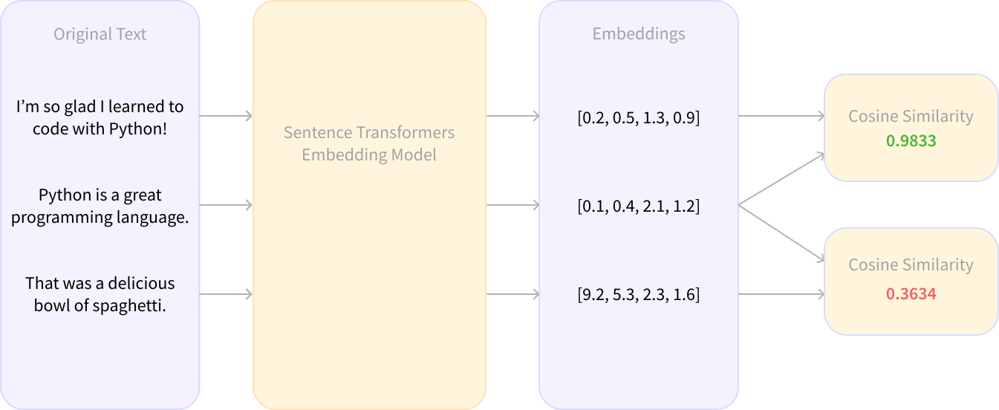

<h1>
    Liftoff! Tips for your first Sentence Transformers project 🚀
</h1>

    <small>Published June 29, 2022.</small>
    <a target="_blank" class="btn no-underline text-sm mb-5 font-sans" href="https://github.com/huggingface/blog/blob/main/tips-for-sentence-transformers.md">
        Update on GitHub
    </a>

    <a href="/nimaboscarino"> 
        
        

            <code>nimaboscarino</code>
            Nima Boscarino
            Opinion piece
        

    </a>

People who are new to the Machine Learning world often run into two recurring stumbling blocks. The first is choosing the right library to learn, which can be daunting when there are so many to pick from. Even once you’ve settled on a library and gone through some tutorials, the next issue is coming up with your first big project and scoping it properly to maximize your learning. If you’ve run into those problems, Sentence Transformers is a great library to choose for a number of reasons. In this post I’ll take you through some tips for going from 0 to 100 with a new tool like Sentence Transformers. We’ll also talk about how I built my first ST-powered project, and what I learned along the way. You may also see why you should add Sentence Transformers to your toolkit for your next project 🛠 

## What is Sentence Transformers?

Sentence embeddings? Semantic search? Cosine similarity?!?! 😱 Just a few short weeks ago, these terms were so confusing to me that they made my head spin. I’d heard that [Sentence Transformers](https://www.sbert.net) (ST) was a powerful and versatile library for working with language and image data and I was eager to play around with it, but I was worried that I would be out of my depth.  As it turns out, I couldn’t have been more wrong!

Sentence Transformers is [among the libraries that Hugging Face integrates with](https://huggingface.co/docs/hub/models-libraries), where it’s described with the following:

> Compute dense vector representations for sentences, paragraphs, and images

In a nutshell, Sentence Transformers answers one question: What if we could treat sentences as points in a multi-dimensional vector space? This means that ST lets you give it an arbitrary string of text (e.g., “I’m so glad I learned to code with Python!”), and it’ll transform it into a vector, such as `[0.2, 0.5, 1.3, 0.9]`. Another sentence, such as “Python is a great programming language.”, would be transformed into a different vector. These vectors are called “embeddings,” and [they play an essential role in Machine Learning](https://medium.com/@b.terryjack/nlp-everything-about-word-embeddings-9ea21f51ccfe). If these two sentences were embedded with the same model, then both would coexist in the same vector space, allowing for many interesting possibilities.

What makes ST particularly useful is that, once you’ve generated some embeddings, you can use the built-in utility functions to compare how similar one sentence is to another, ***including synonyms!*** 🤯 One way to do this is with the [“Cosine Similarity”](https://www.machinelearningplus.com/nlp/cosine-similarity/) function. With ST, you can skip all the pesky math and call the *very* handy `util.cos_sim` function to get a score from -1 to 1 that signifies how “similar” the embedded sentences are in the vector space they share – the bigger the score is, the more similar the sentences are!

<figure class="image table text-center m-0 w-full">
  
  <figcaption>After embedding sentences, we can compare them with Cosine Similarity.</figcaption>
</figure>

Comparing sentences by similarity means that if we have a collection of sentences or paragraphs, we can quickly find the ones that match a particular search query with a process called *[semantic search](https://www.sbert.net/examples/applications/semantic-search/README.html)*. For some specific applications of this, see [this tutorial for making a GitHub code-searcher](https://huggingface.co/spaces/sentence-transformers/Sentence_Transformers_for_semantic_search) or this other tutorial on [building an FAQ engine](https://huggingface.co/blog/getting-started-with-embeddings) using Sentence Transformers.

## Why learn to use Sentence Transformers?

First, it offers a low-barrier way to get hands-on experience with state-of-the-art models to generate [embeddings](https://daleonai.com/embeddings-explained). I found that creating my own sentence embeddings was a powerful learning tool that helped strengthen my understanding of how modern models work with text, and it also got the creative juices flowing for ideation! Within a few minutes of loading up the [msmarco-MiniLM-L-6-v3 model](https://huggingface.co/sentence-transformers/msmarco-MiniLM-L-6-v3) in a Jupyter notebook I’d come up with a bunch of fun project ideas just from embedding some sentences and running some of ST’s utility functions on them.

Second, Sentence Transformers is an accessible entry-point to many important ML concepts that you can branch off into. For example, you can use it to learn about [clustering](https://www.sbert.net/examples/applications/clustering/README.html), [model distillation](https://www.sbert.net/examples/training/distillation/README.html), and even launch into text-to-image work with [CLIP](https://www.sbert.net/examples/applications/image-search/README.html). In fact, Sentence Transformers is so versatile that it’s skyrocketed to almost 8,000 stars on GitHub, with [more than 3,000 projects and packages depending on it](https://github.com/UKPLab/sentence-transformers/network/dependents?dependent_type=REPOSITORY&package_id=UGFja2FnZS00ODgyNDAwNzQ%3D). On top of the official docs, there’s an abundance of community-created content (look for some links at the end of this post 👀), and the library’s ubiquity has made it [popular in research](https://twitter.com/NimaBoscarino/status/1535331680805801984?s=20&t=gd0BycVE-H4_10G9w30DcQ).

Third, embeddings are key for several industrial applications. Google searches use embeddings to [match text to text and text to images](https://cloud.google.com/blog/topics/developers-practitioners/meet-ais-multitool-vector-embeddings); Snapchat uses them to "[serve the right ad to the right user at the right time](https://eng.snap.com/machine-learning-snap-ad-ranking)"; and Meta (Facebook) uses them for [their social search](https://research.facebook.com/publications/embedding-based-retrieval-in-facebook-search/). In other words, embeddings allow you to build things like chatbots, recommendation systems, zero-shot classifiers, image search, FAQ systems, and more.

On top of it all, it’s also supported with a ton of [Hugging Face integrations](https://huggingface.co/docs/hub/sentence-transformers) 🤗.

## Tackling your first project

So you’ve decided to check out Sentence Transformers and worked through some examples in the docs… now what? Your first self-driven project (I call these Rocket Launch projects 🚀) is a big step in your learning journey, and you’ll want to make the most of it! Here’s a little recipe that I like to follow when I’m trying out a new tool:

1. **Do a brain dump of everything you know the tool’s capable of**: For Sentence Transformers this includes generating sentence embeddings, comparing sentences, [retrieve and re-rank for complex search tasks](https://www.sbert.net/examples/applications/retrieve_rerank/README.html), clustering, and searching for similar documents with [semantic search](https://www.sbert.net/examples/applications/semantic-search/README.html).
2. **Reflect on some interesting data sources:** There’s a huge collection of datasets on the [Hugging Face Hub](https://huggingface.co/datasets), or you can also consult lists like [awesome-public-datasets](https://github.com/awesomedata/awesome-public-datasets) for some inspiration. You can often find interesting data in unexpected places – your municipality, for example, may have an [open data portal](https://opendata.vancouver.ca/pages/home/). You’re going to spend a decent amount of time working with your data, so you may as well pick datasets that excite you!
3. **Pick a *secondary* tool that you’re somewhat comfortable with:** Why limit your experience to learning one tool at a time? [“Distributed practice”](https://senecalearning.com/en-GB/blog/top-10-most-effective-learning-strategies/) (a.k.a. “spaced repetition”) means spreading your learning across multiple sessions, and it’s been proven to be an effective strategy for learning new material. One way to actively do this is by practicing new skills even in situations where they’re not the main learning focus. If you’ve recently picked up a new tool, this is a great opportunity to multiply your learning potential by battle-testing your skills. I recommend only including one secondary tool in your Rocket Launch projects.
4. **Ideate:** Spend some time brainstorming on what different combination of the elements from the first 3 steps could look like! No idea is a bad idea, and I usually try to aim for quantity instead of stressing over quality. Before long you’ll find a few ideas that light that special spark of curiosity for you ✨

For my first Sentence Transformers project, I remembered that I had a little dataset of popular song lyrics kicking around, which I realized I could combine with ST’s semantic search functionality to create a fun playlist generator. I imagined that if I could ask a user for a text prompt (e.g. “I’m feeling wild and free!”), maybe I could find songs that had lyrics that matched the prompt! I’d also been making demos with [Gradio](https://gradio.app/) and had recently been working on scaling up my skills with the newly-released [Gradio Blocks](https://gradio.app/introduction_to_blocks/?utm_campaign=Gradio&utm_medium=web&utm_source=Gradio_4), so for my secondary tool I decided I would make a cool Blocks-based Gradio app to showcase my project. Never pass up a chance to feed two birds with one scone 🦆🐓

[Here’s what I ended up making!](https://huggingface.co/spaces/NimaBoscarino/playlist-generator) Keep an eye out for a future blog post where we'll break down how this was built 👀

<iframe src="https://hf.space/embed/NimaBoscarino/playlist-generator/+" frameBorder="0" width="1400" height="690" title="Gradio app" class="p-0 flex-grow space-iframe" allow="accelerometer; ambient-light-sensor; autoplay; battery; camera; document-domain; encrypted-media; fullscreen; geolocation; gyroscope; layout-animations; legacy-image-formats; magnetometer; microphone; midi; oversized-images; payment; picture-in-picture; publickey-credentials-get; sync-xhr; usb; vr ; wake-lock; xr-spatial-tracking" sandbox="allow-forms allow-modals allow-popups allow-popups-to-escape-sandbox allow-same-origin allow-scripts allow-downloads"></iframe>

## What can you expect to learn from your first project?

Since every project is unique, your learning journey will also be unique! According to the [“constructivism” theory of learning](https://www.wgu.edu/blog/what-constructivism2005.html), knowledge is deeply personal and constructed by actively making connections to other knowledge we already possess. Through my Playlist Generator project, for example, I had to learn about the various pre-trained models that Sentence Transformers supports so that I could find one that matched my use-case. Since I was working with Gradio on [Hugging Face Spaces](https://huggingface.co/spaces), I learned about hosting my embeddings on the Hugging Face Hub and loading them into my app. To top it off, since I had a lot of lyrics to embed, I looked for ways to speed up the embedding process and even got to learn about [Sentence Transformers’ Multi-Processor support](https://www.sbert.net/examples/applications/computing-embeddings/README.html#multi-process-multi-gpu-encoding).

---

Once you’ve gone through your first project, you’ll find that you’ll have even more ideas for things to work on! Have fun, and don’t forget to share your projects and everything you’ve learned with us over at [hf.co/join/discord](http://hf.co/join/discord) 🤗

Further reading:

- [Getting Started with Embeddings](https://huggingface.co/blog/getting-started-with-embeddings)
- [Sentence Transformers and Hugging Face](https://huggingface.co/docs/hub/sentence-transformers)
- [Sentence_Transformers for Semantic Search - by Omar Espejel](https://huggingface.co/spaces/sentence-transformers/Sentence_Transformers_for_semantic_search)
- [Pinecone.io - Sentence Embeddings](https://www.pinecone.io/learn/sentence-embeddings/#some-context)
- [Sentence embeddings - by John Brandt](https://johnbrandt.org/blog/sentence-similarity/)
