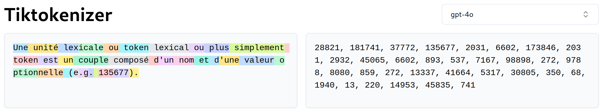
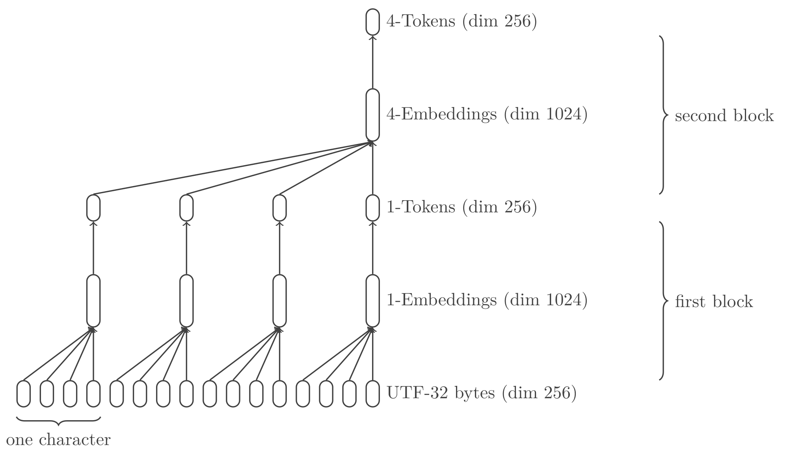
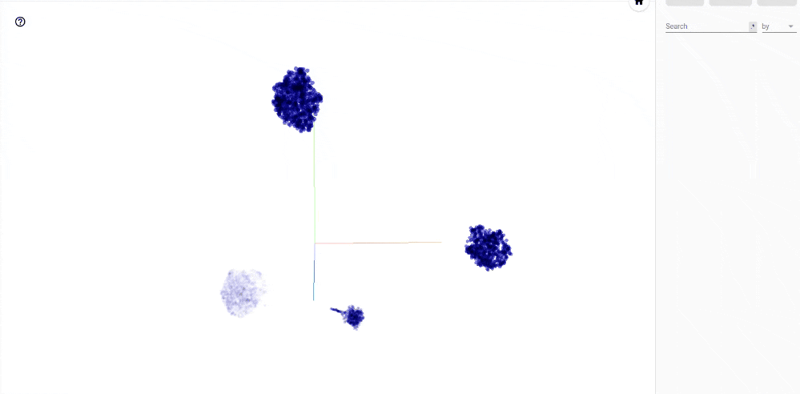
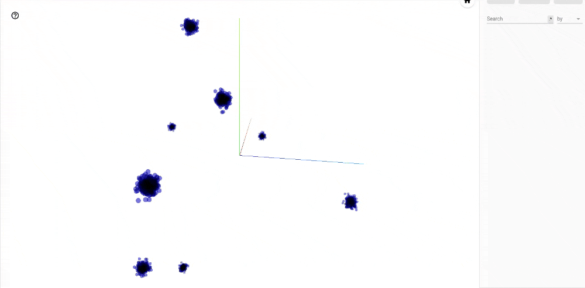

# Tokenization Is A Dead Weight

> `tokun` took tokens to t-can

Current tokenizers have notorious issues that are bringing the LLMs down.

These algorithms follow the human intuition of language to convert text to numbers.
But neural networks have ways to store and process data unlike any interpretable algorithm. 

We will show that a model can be trained to produce a much more efficient text encoding.

Interestingly, this process is different from training a model to understand language:

- the proposed model has a different architecture from transformers
- the best training data is **not** human text but random bytes

Input text will be split in chunks of 16 Unicode characters, regardless of the content.

Obfuscated code, raw HEX or brainf\*ck programming language are all compressed by a factor 16:

| Embedding 1           | Embedding 2           | Embedding 3        |
| --------------------- | --------------------- | ------------------ |
| `$P='++)u){$o.=u)`    | `$t{u)$i}^$k{$j};`    | `}}u)retuu)rn $o;` |
| `0x60806040523480`    | `1561001057600080`    | `fd5b506000805460` |
| `++++++++[>++++[>`    | `++>+++>+++>+<<<<`    | `-]>+>+>->>+[<]<-` |

None of these combinations of characters would ever be made into tokens by traditional tokenizers, especially not of length 16.

## Intuition

OpenAI stated that the [GPT-4 tokens have a length of 4 characters][openai-tokenizer], on average and in English.

With UTF-8, these 4 characters amount to less than 8 bytes for the Latin languages and less than 12 bytes in the vast majority of cases.

These 8 bytes are translated into a vector of dimension 100k by a common tokenizer like `cl100`.
If the elements of the vectors are stored as `float32` that's **400k bytes worth of space** for each 4 characters.

Despite tricks and optimizations, there is still a lot of waste in the encoding.
Let's see how it works in detail.

## State Of The Art Tokenization

Suppose you include the following excerpt in a prompt to `GPT-4o`:

```
Une unité lexicale ou token lexical ou plus simplement token est un couple composé d'un nom et d'une valeur optionnelle (e.g. 135677).
```

Since LLMs don't actually handle text, this sentence has first to be translated to numbers.
This process has several stages: encoding, tokenization and embedding.

For now, consider the [end result from the tokenizer `o200k`][tiktokenizer-o200k] (used in `GPT-4o`):



The sentence is split into chunks called "tokens", which have a 1:1 match with an ID.
Each tokenizer has its own vocabulary and `o200k` contains 200k identified tokens.

These IDs are not yet edible for a NN: AI models digest tensors, which are glorified arrays.
The trick is to interprete each ID as an index in an array of 200k elements:

```
"." => 13 => [0, 0, 0, 0, 0, 0, 0, 0, 0, 0, 0, 0, 0, 1, 0, ..., 0]
```

This operation is called "one-hot encoding".

It turns the orginal prompt in a `(32, 199998)` tensor:
32 ones for each token and 6399904 zeroes.

## Relation With Performances

The encoded input has two axes, the dimensions of which have a direct impact on performance.

### Forward-Pass

First, the number of tokens is related to the sequence dimension.
It defines the quantity of information a LLM can process at once.

By fitting more characters in each token you can either:

- lower the sequence dimension: keep the same attention scope but reduce computing requirements
- keep the same sequence dimension: increase the attention with unchanged 

### Model Size

The second axis has a constant dimension of several 100k, the vocabulary size.

It is directly related to the size of the model, as it will require a neuron for each element.
For example `llama3-8B` has a `128000 x 4096` kernel in its first layer, the embedding layer.

The size of the model has an overarching impact on the cost.
The number of parameters is roughly a balance between efficiency and quality.

### Model Training

Since tokens are unrelated to each other, LLMs have to see each variation to build relevant embeddings.
Having been trained on `"hot dog"` does not transfer to `"hotdog"`.

The model would not link the two and fail to understand puns that play with ambiguity.
Unless a similar context for the two wordings happens in the training data, which is a lot to ask.

Since `tokun` embeddings hold the information of each character, the two representations will differ only by a space.
LLMs will not need to be trained on each variation, they would understand the nuances natively.

Although I cannot quantify the magnitude, this will lower the volume of data required to build meaningful embeddings (in pretraining).

## Limitations Of Current Tokenizers

This simple example already brings out a number of quirks.
For example, the input tensor is *very* large and mostly zero??

As Andrej Karpathy [pointed out][youtube-karpathy-tokenizer], there are many more:

- [ ] tokenizers are built and operate outside of the NN models
- [ ] they generalize poorly across languages
- [ ] they result in input vectors with dimensions of several 100k
- [ ] they require the definition of additional "special tokens"
- [ ] words out of the vocabulary are fragmented: `["option", "nelle"]`
- [ ] tokens are a priori unrelated to each other:
    - [ ] characters: `"hello"` has no relation to `"h"` or the ASCII code `104`
    - [ ] capitalization: `"New-York"` and `"new-york"`
    - [ ] typos: `"helllo"` and `"hello"`
    - [ ] repetitions: `"    "` and `"\t"`
    - [ ] inflections:
        - conjugation: `"is"` and `"be"`
        - plural: `"languages"` and `"language"`
        - gender: `"franc"` and `"franche"`
        - cases: genetive, nominative, etc
- [ ] words are tokenized differently depending on their surrounding elements:
    - [ ] `"\thello world"` is split into `["\th", "ello", " world"]` by [GPT-4][tiktokenizer-gpt-4]
    - [ ] while `"hello world"` results in `["hello", " world"]`
- [ ] tokenizers have trouble with numbers:
    - [ ] fragmentation: `"8222.3"` is split into `["822", "2", ".", "3"]`
    - [ ] base: `"0x10"` and `"16"`
    - [ ] format: `"1.6e-1"` and `"0.16"`

Obviously I asked `ChatGPT` if he / it / they wanted to add something:

- [ ] dependency on the training data can lead to biases and limit generalization
- [ ] efficiency: some tokenizers can be slow to encode and decode large texts
- [ ] handling of compound words: `"hotdog"` is unrelated to `"hot dog"`

`tokun` addresses most of these shortcomings.

The serie is heavily focused on western languages, due to personal knowledge.
Still the concepts were tested on Asian and Middle-Eastern languages.

## Proposition

Instead of building vocabularies outside of LLMs, the idea is to train a NN to transform any character sequence into a vector embedding.

The model will learn to compress and decompress text at the same time, *from the raw Unicode bytes*.

Compared to current techniques, both axes will be reduced by several orders:
eventually, the example prompt of 134 characters would be represented as a `(9, 256)` tensor, just the length of "Une unité".

## UTF-32 <=> "Better" UTF-8

Just like traditional tokenization, the goal is to compose meaningful tokens from independent bytes.

It starts with the encoding of text characters and symbols, following the [Unicode standard][wiki-unicode].

Usually the translation is performed using [UTF][wiki-utf], but these schemes do not perfectly fit NN requirements:

| Encoding | Advantages  | Shortcomings |
| ---------| ----------- | ------------ |
| UTF-8    | No gaps     | Varying size |
| UTF-32   | Fixed size  | Null data    |

Having a constant size will allow to split the input text into tensors of fixed shape.

And avoiding null data will help to maximize the information density in the input space.

Actually, we can achieve both goals at once by compressing UTF-32 with a neural network.
This will be the first block layer of the `tokun` model.

## The Model

Overall, the model is a straightforward [variational autoencoder][wiki-vae].

The original [implementation is using Tensorflow][tokun-github].

### Inputs

The input tensor has shape `(B, S * T, U)`, where:

- `B` is the batch dimension
- `S` is the sequence dimension
- `T` is the token dimension, typically 64
- `U` is the encoding dimension, 256

The original text samples are preprocessed as follows:

- each text sample is padded (on the right) with `0x00` to a fixed length `S`
- then encoded as UTF-32, which means 4 bytes per character

### Embeddings

The first half of the model, the encoder, turns the inputs into compressed embedding vectors.

Given the input tensor `(B, S * T, U)`, the embeddings have a shape `(B, S, L)`.
`L` is the latent dimension, typically chosen so that `U = L = 256`.

So the encoder divides the sequence length by a factor `T = 64`.
Since the sequence is made of UTF-32 bytes, 4 per character, the text sequence is **compressed 16 times**.

### Outputs

The second half of the model decodes these embeddings back into their constituting bytes.

So, the overall model (encoder + decoder) produces probabilitiy vectors with the same shape as the input.
They can be easily post-processed with `argmax` to predict the actual byte values.

### Architecture

#### Hyper Parameters

- `N = 3`, the number of tokenization blocks
- `G = [4, 4, 4]`, the token unit dimension for each block
- `U = 256`, the encoding dimension from UTF-32-BE
- `E = 256`, the embedding dimension
- `L = 256`, the latent dimension

A priori the dimensions of the last axes could be different.
As we'll see in [the results](#features), these choices seem to fit best.

#### Encoder

The encoder is a CNN, with stacked dilated convolutions similar the the [WaveNet model][arxiv-wavenet].
In the case of a stack of 2 tokenization blocks, the encoding process is:



Each block layer merges the sequence axis chunk by chunk, by a factor $G_i$:

1. the `LayerNorm` layer performs layer normalization
2. the `Reshape` layer splits the sequence axis: `(B, S * G_i, E)` => `(B, S, G_i * E)`
3. the `Dense` layer finally compresses the last dimension `G_i * E` into `E`

With `G = [4, 4, 4]`, the first block merges UTF-32 bytes 4 by 4 and then produces one embedding vector for each Unicode character.
Then the second layer merges the embeddings 4 by 4, etc.

#### Decoder

The decoder performs exactly the reverse operations, with the same token units:

1. the `Dense` layer expands the latent dimension from `E` to `G_i * E`
2. the `Reshape` layer splits the feature axis:  `(B, S, G_i * E)` => `(B, S * G_i, E)`
3. the `LayerNorm` layer performs layer normalization

It is a stack of detokenization layers, decompressing the successive embeddings.

#### Head

The head applies a projection followed by a softmax on the last axis to compute the probability of each byte.

#### Variants

Many variations of the model were trained and compared, with and without :

- normalization, both RMS and layer norm
- attention
- positional embedding
- feed forward layers

Surprisingly, **the simplest model performs significantly better**.

The only relevant variations of the model are on the token units:

- `[4, 16]` has the best balance between capacity and flexibility
- `[4, 4, 4]` often gets stuck at 75% accuracy but can reach 100% with luck: it is brittle
- `[4, 4]` can be used for extra resilience of the embeddings
- other variants are underperforming / bloated

## Training

Words, numbers and code amount for a very limited range of the possible combinations of Unicode characters.
And using standard datasets may push the model to emphasize common patterns and undermine unique sequences.

The role of `tokun` is actually to compress the encoding, **not** the language.

So the most significant part is to **train the model on random sequences** of UTF-32-BE bytes.
Since the dataset is random, it can natively scale and there is no need for data augmentation.

Validation was also performed on [MLQA][github-mlqa] to make sure the model keeps its accuracy on regular text.

## Features

The model is meant to be used as a tokenizer: it should decode the embeddings back to the original byte sequence without fail.

This is why we will be comparing inputs and outputs thoughout this section.

For example, they are calculated on the prompt from [the introduction](#state-of-the-art-tokenization) with:

```python
sample      = """Une unité lexicale ou token lexical ou plus simplement token est un couple composé d'un nom et d'une valeur optionnelle (e.g. 135677)."""
inputs      = tokun.pipeline.preprocess(text=sample, groups=[4, 16], expand=[1], flatten=True) # input = UTF-32-BE bytes
embeddings  = MODEL._encoder(inputs) # embedding = tokens
outputs     = MODEL._decoder(embeddings) # output = probabilities for each byte
predictions = tokun.pipeline.postprocess(outputs) # text = interpreted probabilities
```

### Input Compression

The sequence length of *any input tensor* is **divided by 16**:

```python
print(len(sample)) # count in Unicode characters
# 134
print(inputs.shape) # count in UTF-32 bytes
# (1, 576)
print(embeddings.shape) # number of embeddings
# (1, 9, 256)
print(9 * 16) # padded input
# 144
```

And the embeddings have a dimension 256 only, compared to 4096 in `llama3-8B` for example.

### Reliance

Current tokenizers are biased toward the most frequent occurences in their training set.
Their performance is dependent on the content of the input text.

`tokun` will **always** chunk the input by blocks of 16, whatever the content.

### Language Agnostic

The model can encode any Unicode sequence, including any human language.

It was never trained on Korean and still the embeddings are decoded with 100% accuracy:

```python
print(sample)
# 프롬프트 엔지니어링(영어: prompt engineering)은 인공지능의 한 개념으로 특히 자연어 처리 부분에 해당된다.
print(predictions)
# 프롬프트 엔지니어링(영어: prompt engineering)은 인공지능의 한 개념으로 특히 자연어 처리 부분에 해당된다.
print(tokun.evaluation.compart(sample, prediction))
# 1.0
```

Any programming language:

```python
print(sample)
# ++++++++[>++++[>++>+++>+++>+<<<<-]>+>+>->>+[<]<-]>>.>---.+++++++..+++.>>.<-.<.+++.------.--------.>>+.>++.
print(predictions)
# ++++++++[>++++[>++>+++>+++>+<<<<-]>+>+>->>+[<]<-]>>.>---.+++++++..+++.>>.<-.<.+++.------.--------.>>+.>++.
print(tokun.evaluation.compart(sample, prediction))
# 1.0
```

Or random binary (HEX encoded before printing):

```python
print(sample.encode('utf-8').hex())
# 000084ea000055510001952c00018225000007a00003163c0003e4ff0003726b
print(predictions.encode('utf-8').hex())
# 000084ea000055510001952c00018225000007a00003163c0003e4ff0003726b
print(tokun.evaluation.compart(sample, prediction))
# 1.0
```

### Meaningful Tokens

The embedding vectors hold all the information up to the byte level.

This ensures that text inputs with similar content, like "hotdog" and "hot-dog", are close in the latent space.

This can be visualized [in tensorboard][tensorboard-projector] with the [algorithm t-SNE][wiki-tsne] or [UMAP][wiki-dimensionality-reduction]:



Languages from different Unicode planes are clearly separated:
the Unicode space is very structured and the proximity of codepoints is meaningful.

Even within the same alphabet the German, English and Vietnamese samples are segregated.
The more characters the embeddings share, the closer they are:

| "ated in the cons"                | "r anderem drei 5"                |
| --------------------------------- | --------------------------------- |
| ![][image-tsne-english]           | ![][image-tsne-german]            |

Order is also encoded and it plays a major role:

| samples               | Shared    | Position  |
| --------------------- | --------- | --------- |
| `ated in the cons`    | 100%      | 100%      |
| `ated by the conc`    | 82%       | 81%       |
| `ased on the Cons`    | 90%       | 81%       |
| ` video game cons`    | 82%       | 44%       |
| `ower in the arch`    | 82%       | 56%       |
| `ations, the Brit`    | 82%       | 44%       |
| `rtension is more`    | 78%       | 31%       |
| ` jury in the 5th`    | 55%       | 0%        |

The samples above are sorted according to the distance of their embedding to the vector or "ated in the cons".
The first percentage on the right is the ratio of shared characters, and the second one is the ratio of characters with exactly the same position.

Keep in mind that this model was not trained on human language but on random Unicode data.

### Built-in Special Tokens

Unicode comes with [special characters out-of-the-box][unicode-table]:

| 0000 - 001F                       | 007F - 009F                       |
| --------------------------------- | --------------------------------- |
| ![][image-unicode-table-00-1f]    | ![][image-unicode-table-7f-9f]    |

Many of these special characters are obsolete and can be repurposed as special tokens.

For instance `0x0002` and `0x0003` stand for "start" and "end of text" in Unicode, they are similar to `<|im_start|>` `<|im_end|>` used in `GPT-4`.

### Robustness

The embeddings are quite robust to noise even when it doesn't respect the underlying structure.

```python
std = tf.math.reduce_std(EMBEDDINGS[64]['en'], axis=0)
noise = tf.random.normal(shape=(256,), mean=0., stddev=tf.math.reduce_mean(__std).numpy())

inputs = tokun.pipeline.preprocess(sample, groups=[4, 16], expand=[1], flatten=True)
embeddings = MODEL._encoder(inputs)
```

```python
print(tokun.pipeline.postprocess(MODEL._decoder(embeddings)))
# Une unité lexicale ou token lexical ou plus simplement token est un couple composé d'un nom et d'une valeur optionnelle (e.g. 135677).
```

The embeddings can withstand a structured noise of amplitude $\sigma$ and start making mistakes outside this range:

```python
print(tokun.pipeline.postprocess(MODEL._decoder(embeddings + 1.2 * std)))
# Une unité lexicale ou token lexical ou plus simplement token est un couple composé d'un nom et d'une valeur optionnelle (e.g. 135677).
print(tokun.pipeline.postprocess(MODEL._decoder(embeddings + 1.3 * std)))
# Une unité lexicale ou token lexical ou plus simpleねent token est un couple composé d'un nom et d'une valeur optionnelle (e.g. 135677).
```

They are more susceptible to random noise:

```python
print(tokun.pipeline.postprocess(MODEL._decoder(embeddings + 0.1 * noise)))
# Une unité lexicale ou token lexical ou plus simplement token est un couple composé d'un nom et d'une valeur optionnelle (e.g. 135677).
print(tokun.pipeline.postprocess(MODEL._decoder(embeddings + 0.2 * noise)))
# Une unité lꝥxicɡle ou token꜠lexɩcal ou plus꜠simᝰlement tokeꝮ es᝴ un couple ꝣompɯsé d'un nom꜠づt ᝤ'une ɶaleur꜠optɩonnelle (e.ꝧ. 1ȳ5677).�����꜀팀��
```

The stability of decoding on the neighborhood of each embedding is more apparent on a UMAP graph:



It is actually a good property that a whole set of vectors encode the same text.
If the model had a 1:1 match it would be very brittle and the host LLM would be unable to predict the exact vector.

Going back to the estimation based on the storage space, 1024 embedding bytes for every 64 input bytes seems like a decent ratio.
It gives leeway for the predictions of LLMs while having a significant compression factor.

This also explains why robustness is very dependent on the model variation:
`tokun-4x16` can only take $0.1 * \sigma$ but `tokun-4x4` can go up to $\sigma$.

## Conclusion

Until now, LLMs learnt to understand the language in the pretraining phase.
Then to understand human interactions or other tasks in the fine-tuning phase.
And finally were taught to behave according to policies.

Here, we argued that neural networks can learn to encode and decode text to better fit their needs.

Each of these processes require specific architectures and data.
Just like in regular programming languages, neural modules are being built.

Machine learning is actually reminiscent of HTML and declarative programming languages:
instead of specifying the process that NN have to follow the properties of the result are shown through data.

Rather than referring to vague notions like "AGI", this field would benefit from being standardized and rationalized like a new *programming language*.

## Resources

All the variants of the model are already available on:

- [Github][tokun-github]
- [Hugging Face][tokun-hf]

You will also find notebooks on:

- [Github][tokun-notebooks]
- [Google Colab][tokun-colab]

And [more detailed articles][tokun-articles] on the iterations of the model on Github.

[arxiv-wavenet]: https://arxiv.org/pdf/1609.03499.pdf
[github-mlqa]: https://github.com/facebookresearch/MLQA
[openai-tokenizer]: https://platform.openai.com/tokenizer
[tensorboard-projector]: https://projector.tensorflow.org/
[tiktokenizer-gpt-4]: https://tiktokenizer.vercel.app/?model=gpt-4
[tiktokenizer-o200k]: https://tiktokenizer.vercel.app/?model=o200k_base
[unicode-table]: https://symbl.cc/en/unicode-table/

[image-unicode-table-00-1f]: assets/tokenization-is-a-dead-weight/unicode-special-tokens.00-1f.png
[image-unicode-table-7f-9f]: assets/tokenization-is-a-dead-weight/unicode-special-tokens.7f-9f.png

[image-tsne-english]: assets/tokenization-is-a-dead-weight/tsne.english.png
[image-tsne-german]: assets/tokenization-is-a-dead-weight/tsne.german.png

[youtube-karpathy-tokenizer]: https://www.youtube.com/watch?v=zduSFxRajkE

[tokun-articles]: https://github.com/apehex/tokun/tree/main/articles
[tokun-colab]: https://colab.research.google.com/github/apehex/tokun/blob/main/notebooks/tokun.model.ipynb
[tokun-github]: https://github.com/apehex/tokun
[tokun-hf]: https://github.com/apehex/tokun
[tokun-notebooks]: https://github.com/apehex/tokun/tree/main/notebooks

[wiki-dimensionality-reduction]: https://en.wikipedia.org/wiki/Nonlinear_dimensionality_reduction
[wiki-unicode]: https://en.wikipedia.org/wiki/Unicode
[wiki-utf]: https://en.wikipedia.org/wiki/Unicode#UTF
[wiki-vae]: https://en.wikipedia.org/wiki/Variational_autoencoder
[wiki-tsne]: https://en.wikipedia.org/wiki/T-distributed_stochastic_neighbor_embedding
