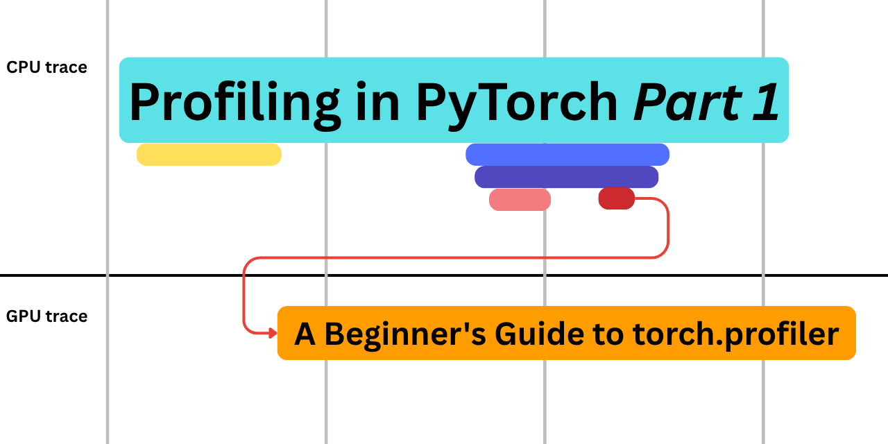

# Profiling in PyTorch: A Beginner's Guide to torch.profiler



Have you ever wondered what goes on under the hood of CPU and GPU your model runs on? To quench that thirst, you might find yourself reading the `modeling_<model_name>.py` files in [transformers](https://github.com/huggingface/transformers), looking at the PyTorch operations, and then wondering how those kernels are dispatched, and how they actually run.

Working at Hugging Face has its own perks, you are surrounded by smarter people all the time. Upon talking to my colleagues about my motivation, I was quickly pointed to the "skill of profiling". If I was given a dollar for every time I was advised to work on profiling, I would have 3 dollars, because I had asked [Sayak Paul](https://huggingface.co/sayakpaul), [Rémi Ouazan Reboul](https://huggingface.co/ror), and [Ferdinand Mom](https://huggingface.co/3outeille).

This is the opening post of **Profiling in PyTorch**, a series where we slowly build up the skill of reading profiler traces, starting from the simplest possible operation and gradually working our way up to more advanced workloads, involving large models.

In this essay, we document "How to profile in PyTorch" from a beginner's point of view. You need no prerequisites to go through this, apart from knowing basic PyTorch. We will try to make this as educational as possible, so this can be treated as a leisurely read with some "Aha!" moments.

> [!NOTE]
> Here is the entire script that we use for the essay: [`01_matmul_add.py`](https://huggingface.co/datasets/ariG23498/profiling-pytorch/blob/main/01_matmul_add.py). It is adviced to open this script on a seperate tab and walk through the code step by step.

## The matrix multiplication and addition operation

As correctly [quipped by Dr. Sara Hooker](https://youtu.be/7knwihgj0fU?si=uvzGH-J9bsCHP4Nn&t=2199), like we are primarily made up of water, Deep Neural Networks are primarily made up of matrix multiplies. As fundamental as they are, it would be a shame to start our profiling journey with anything else.

```py
def fn(x, w, b):
  return torch.add(torch.matmul(x, w), b)
```

> The matrix addition along with the matrix multiplication mimics how weights and biases interact in a neuron. This addition (pun intended) will help us understand how it paves the way for compilation [later in the essay](#lets-see-some-torch-compile-at-work).

To profile, we will be using the `torch.profiler` module. The steps involved are:

1. Have the [algorithm ready](https://huggingface.co/datasets/ariG23498/profiling-pytorch/blob/main/01_matmul_add.py#L26-L27) (here `def fn`, which wraps the matrix multiplication and matrix addition)
2. [Annotate](https://huggingface.co/datasets/ariG23498/profiling-pytorch/blob/main/01_matmul_add.py#L32) the algorithm. While this is completely optional, we recommend doing this. The `record_function` annotates our function as `matmul_add`, which will be easy to navigate in the traces (as we note later)
```py
def step():
  with torch.profiler.record_function("matmul_add"):
    return fn(x, w, b)
```
3. Wrap the code with the `torch.profiler.profile` [context manager](https://huggingface.co/datasets/ariG23498/profiling-pytorch/blob/main/01_matmul_add.py#L53-L62)
```py
  with torch.profiler.profile(
    activities=[
        torch.profiler.ProfilerActivity.CPU,  # the cpu activities
        torch.profiler.ProfilerActivity.CUDA, # the gpu activities
    ],
  ) as prof:
    # it is recommened to run events mutiple times to warm up the GPUs
    for _ in range(5):
      step()
      prof.step()
```
4. Export the [profile](https://huggingface.co/datasets/ariG23498/profiling-pytorch/blob/main/01_matmul_add.py#L70)
```py
prof.export_chrome_trace(trace_path)
prof.key_averages().table(sort_by="cuda_time_total", row_limit=15)
```

The profiler exports two distinct artifacts:

1. The profiler table: Provides the statistical summary of the algorithm. It answers "What is expensive". This becomes really helpful to figure out hotspots. A hotspot would be events that take the most amount of time, can be a bottleneck of the pipeline, or an event that is triggered a lot of times.
2. The profiler trace: Provides the temporal execution view. Answers "When and Why it happened", depicting the activities taking place on the CPU and the GPU. This is helpful when we want to investigate the kernel(s) that were launched, any delays in launching them, any overlap between CPU and GPU activities, etc.

Let's see the two in action with our first execution. ([Here is the entire `01_matmul_add.py` script](https://huggingface.co/datasets/ariG23498/profiling-pytorch/blob/main/01_matmul_add.py))

> [!NOTE]
> It is recommended to run this script on a machine with a GPU.

```bash
uv run 01_matmul_add.py --size 64
```

If you run the above script (on a GPU machine) you will find a folder `traces/01_matmul_add` with the two artifacts:

```bash
64_bf16_cold_eager.json
64_bf16_cold_eager.txt
```

|  |
| :--: |
| Figure 1: Profiler table for matmul add on 64 sized matrices|

The `.txt` file holds the profiler table. Upon opening the file, as shown in Figure 1, one would be greeted with a big table with the first column consisting of the events that were triggered inside the scope of profile.

The other columns are related to the time the event takes on the CPU or GPU or any other device(s) specified in `activities` within `torch.profiler.profile`. Look at which events take the most amount of time, and try to intuitively understand if that event should in fact take that time. It is also important to look at the column "# of Calls" which dictates how many times the event was triggered.

While we are at it, let's also talk about "Self CPU/CUDA" vs "CPU/CUDA total". The "Self" columns measure time spent only inside the event itself, excluding its children. The "total" columns include the event and all of its children together. So if you look at the "CPU total" of `matmul_add`, it consists of the time it took on self plus the children events it triggered. This is an important demarcation to note.

If you look at the last two lines out of the table you would notice that the profiler tells us that

```bash
Self CPU time total: 2.314ms
Self CUDA time total: 23.104us
```

The CPU time is in `ms` while the GPU time is in `us`. To put things in perspective, we are spending ~112x more time than the GPU (`ampere_bf16_s16816gemm...`) on the CPU (`matmul_add`).  The GPU stays idle most of the time, which is an immediate red flag. This is a textbook case of the algorithm being overhead-bound. In simple words, the launch overheads on the CPU side are much larger than the work the kernel does on the GPU. The easiest way to move out of the overhead-bound regime is to make a bigger matrix multiplications.

```bash
uv run 01_matmul_add.py --size 4096 
```

|  |
| :--: |
| Figure 2: Profiler table for matmul add on 4096 sized matrices |

The last two lines in Figure 2 is:

```bash
Self CPU time total: 4.908ms
Self CUDA time total: 4.495ms
```

Both the time are in ms, which means we have materialized more GPU time just by increasing the size of the matrix multiplications. If you look at Figure X you would also notice that the most CUDA time is now taken by `ampere_bf16_s16816gemm_..` and not by `matmul_add`. This means that we were indeed able to move from overhead bound to compute bound.

We now move into visualising the dispatch chain, which lives inside the `.json` artifacts. You can upload them to [Perfetto UI](https://ui.perfetto.dev) and see the traces, or you can use `uvx trace-util traces -b traces` to generate the Perfetto links directly.

## 64x64 traces

|  |
| :--: |
| Figure 3: Profiler trace for matmul and add on 64 sized matrices |

In Figure 3, we see the profiler trace for the matrix multiplication and addition. The script was run with default configurations which are:

- size 64: The inputs, weights and biases are sized (64, 64)
- dtype bf16: The data type is bfloat16
- no compile: We have not compiled the torch operations
- no warmup: We have not warmed up the GPU before profiling

> With Perfetto we suggest using the keyboard for quicker access to the trace. One could use "W A S D" for navigating the trace.

|  |
| :--: |
| Figure 4: The CPU and GPU lanes of a PyTorch profiler trace |

There are two lanes in Figure 4, one for the CPU activity and one for the GPU activity. In the CPU lane one would notice three profile steps (starting from `ProfileStep#2`). This comes from the `schedule`.

```py
schedule = torch.profiler.schedule(wait=1, warmup=1, active=3, repeat=1)
```

The `wait` skips noisy initializations (`ProfileStep#0`), `warmup` runs through the profiler without recording (`ProfileStep#1`), and `active` is what shows up in trace. One can find the schedule being used in the [script here](https://huggingface.co/datasets/ariG23498/profiling-pytorch/blob/main/01_matmul_add.py#L58).

Let's put on our detective hats and investigate the trace and ask some questions.

### Why does the ProfileStep#2 take so long?

|  |
| :--: |
| Figure 5: `ProfileStep#2` is visibly wider than the steps that follow it |

In Figure 5, we notice that `ProfileStep#2` takes more time compared to the other steps, and upon looking closely you would see a similar pattern with the `matmul_add` annotation as well. The smoking gun is inside the annotation, not the annotation itself:

| Step | `matmul_add` start | `aten::matmul` start | gap |
| :--: | :--: | :--: | :--: |
| #2 | 138.736 | 366.493 | 227.757 µs |
| #3 | 517.926 | 523.447 | 5.521 µs |
| #4 | 610.039 | 614.527 | 4.488 µs |

|  |
| :--: |
| Figure 6: The ~228 µs dead window between `record_function("matmul_add")` and `aten::matmul` |

That ~228 µs shown in Figure 6 is the "dead window" between entering `record_function("matmul_add")` and PyTorch actually dispatching `aten::matmul`. This can happen for multiple reasons: 

- cuBLAS keeps a persistent workspace. Even though the schedule's `warmup=1` step ran a GEMM (GEneral Matrix-Matrix Multiplication), the workspace allocation can still hit on the first active call if the previous launch's allocator/sync state hadn't settled.

- cuBLAS heuristic + algo cache lookup for this exact (M=N=K=64, bf16, NN) shape.

- Possibly a lazy module load for the specific kernel variant cuBLAS chose (64x64_sliced1x2_*).

We can either look away or run [some more warmup steps](https://huggingface.co/datasets/ariG23498/profiling-pytorch/blob/main/01_matmul_add.py#L35-L39) before we profile (which is the standard)

In the terms of profiling, warmup is when you run the events a couple of times before actually profiling it. The pre-work done by the GPU (including the above pointers) are one time efforts which we do not want to profile. In our example, we have two warmup stages, one where we actually loop over the function before entering the profiler, and two inside the profiler which is achieved by the `warmup` argument. In this section, we have enabled the actual iterations along with the schedule.

```bash
uv run 01_matmul_add.py --warmup
```

[Perfetto Trace for 64x64 with Warmup](https://ui.perfetto.dev/#!/?url=https://huggingface.co/buckets/ariG23498/traces/resolve/01_matmul_add/64_bf16_warm_eager.json)

| |
| :--: |
| Figure 7: After warming up, every profile step takes a similar amount of time |

In Figure 7 we see that each profile steps takes similar time, but this does not mean we were able to optimize the one time overheads. We warmed up the runs so that the overheads were not profiled.

### Why is there an offset of ~2.5 ms between the CPU and GPU lanes?

|  |
| :--: |
| Figure 8: The 2.32 ms offset between the CPU and GPU lanes |

In Figure 8, we see that the CPU and GPU lanes have an offset of around 2.32 ms. One might think the warmup stage combined with the schedule's `wait` and `warmup` should keep a stable CUDA stream and would diminish the offset.

To uncover what is really happening, let's change our schedule a little:

```diff
- schedule = torch.profiler.schedule(wait=1, warmup=1, active=3, repeat=1)
+ schedule = torch.profiler.schedule(wait=0, warmup=0, active=3, repeat=1)
```

|  |
| :--: |
| Figure 9: With `wait=0` and `warmup=0`, the trace reveals an `Activity Buffer Request` |

Figure 9 shows us that there is an `Activity Buffer Request` in the GPU lane before any operation. Let's zoom in a little more.

|  |
| :--: |
| Figure 10: A gap appears between the matmul and add kernels on profile step 1 |

Upon zooming into the GPU trace, we notice that the matmul and add kernels for `ProfileStep#0` happen one after the other, while the kernels for `ProfileStep#1` have a window in between. The best explanation for this is that there was an overflow of buffers, and another buffer request was issued during the kernel execution.

The best way to rule out other possibilities is to profile for more iterations and see whether a similar window appears in other parts of the trace. To do that we run with `active=20`.

|  |
| :--: |
| Figure 11: With 20 active steps the gap only shows up once, confirming it is a buffer request |

As shown in Figure 11, we see a similar trend in `ProfileStep#1`. This is aligned to our findings previously and can safely conclude that it was indeed another buffer request.

### The chain of events

|  |
| :--: |
| Figure 12: The chain of dispatch |

In Figure 12, we see the nested CPU calls. This is an important visualization, where one gets to understand what a chain of dispatch really looks like.

We begin with `ProfileStep#<id>` which encapsulates the profiling step. Due to us annotating the step, we see the `matmul_add` row. The `matmul_add` consists of two `aten` calls, one for matrix multiplication and one for matrix addition.

The `aten::matmul` is the [ATen-level](https://github.com/pytorch/pytorch/tree/main/aten/src/ATen) dispatch that those user-facing PyTorch matmul calls land on. `aten::mm` is the 2D matrix-matrix multiply backend.

It is very interesting to note how PyTorch calls `aten::bmm` (batched matrix multiplication) if we add the batch axis to our matrices. Let's take a de-tour and see the `aten::bmm` in action.

```diff
- x = torch.randn(args.size, args.size, device=device, dtype=dtype)
- w = torch.randn( args.size, args.size, device=device, dtype=dtype)
- b = torch.randn(args.size, args.size, device=device, dtype=dtype)

+ x = torch.randn(args.size, args.size, args.size, device=device, dtype=dtype)
+ w = torch.randn(args.size, args.size, args.size, device=device, dtype=dtype)
+ b = torch.randn(args.size, args.size, args.size, device=device, dtype=dtype)

```

|  |
| :--: |
| Figure 13: Batched Matrix Multiplication |

In Figure 13, upon adding the batch axis to the inputs, `aten::matmul` now encapsulates a bunch of other prerequisite CUDA runtime calls along with `aten::bmm` (instead of `aten:mm`). This also hints at the heuristics that cuBLAS needs to do in oder to dispatch the right (most suitable) kernel for the program.

> In the rest of the essay, we will be working with simple 2D matrices, unless otherwise mentioned.

### Why does matmul have an extra CUDA runtime call?

|  |
| :--: |
| Figure 14: A CUDA occupancy query fires before the matmul kernel launch |

We notice that for `aten::mm` there are two CUDA Runtime calls, namely `cudaOccupancyMaxActiveBlocksPerMultiprocessor` (boxed in Figure 14) and `cudaLaunchKernel`, while for `aten::add` there is only the `cudaLaunchKernel`.

`cudaOccupancyMaxActiveBlocksPerMultiprocessor` is a planning call and is purely CPU side. It asks: "given a kernel function, a chosen block size, and a chosen dynamic shared memory size, how many blocks of this kernel can simultaneously reside on one SM (Streaming Multiprocessor)?"

This begs the question, why do we need planning for matmul and not for add?

To understand this, we have to look at the kernel's resource footprint. If you click on the GPU kernels, you will be able to inspect the resource footprint for the respective kernel.

|  |  |
| :--: | :--: |
| Figure 15: Matmul footprint | Figure 16: Add footprint |

In Figure 15, we note that for matrix multiplication the `registers per thread` and `shared memory` is dynamic (based on the size of the matrix). cuBLAS ships hundreds of kernel variants, and each has a heuristic-driven launch path that needs runtime information about hardware capacity. The occupancy query is part of that heuristic.

From Figure 16 we see that the footprint of addition says 32 registers and zero shared memory. That fits trivially. There's nothing to query, because no hardware resource is going to limit occupancy. The kernel is, by design, resource-light.

> [!NOTE]
> You can use this as a quick diagnostic when reading any trace. Scan the CPU lane for `cudaOccupancyMaxActiveBlocksPerMultiprocessor`. Each occurrence flags a "heavyweight, adaptively launched" kernel, usually a GEMM, conv, or similar. The kernels without a preceding occupancy query are the elementwise/reduction crowd that PyTorch launches mechanically.

### Why is cudaDeviceSynchronize so big (~1.78 ms)?

`cudaDeviceSynchronize` blocks the CPU until all GPU work on this device finishes. The profiler emits this sync at the end of the active window to flush events. Without it, kernel timings would be missing.

A 1.78 ms sync covering 26 µs of real GPU work tells you this run was 98% idle. That's the textbook overhead-bound symptom.

## 4096x4096 traces

We already know from the profiler table analysis (above) that providing bigger matrices to our algorithm moves it out from the overhead-bound region to being compute-bound. 

Let's run the command and dive deeper into the traces.

```bash
uv run 01_matmul_add.py --size 4096 --warmup
```

### Why does the same kernel take more time compared to others?

| |
| :--: |
| Figure 17: One matmul kernel runs longer than the others despite identical inputs |

In Figure 17, we notice that the matmul kernel for `ProfileStep#3` takes longer on the GPU than the other steps. This is particularly interesting to note, because the other kernels launched were the exact same, which means there were no cuBLAS heuristics involved. There are no scheduling gaps, the CPU launches are normal, and it is not a profiler artifact.

This trace in Figure 17 makes a useful point that's easy to miss in idealized examples: kernel runtimes are not constants, even on the same hardware environment running identical code on identical data.

Let's make this more concrete by modifying the script a little. We run the iteration 20 times, capturing each of the steps.

```diff
- schedule = torch.profiler.schedule(wait=1, warmup=1, active=3, repeat=1)
+ schedule = torch.profiler.schedule(wait=0, warmup=0, active=20, repeat=1)

- for _ in range(5):
+ for _ in range(20):
```

|  |
| :--: |
| Figure 18: Across 20 iterations the same matmul kernel runs at different speeds |

Figure 18 reveals a similar finding. While each kernel was the exact same, they time differently. The different compute times can be blamed on a bunch of reasons:

- GPU clocks on idle and boost
- GPU heating
- GPU power management
- Driver side housekeeping

A reader who only saw the average would conclude that a matmul took ~1 ms (mean of 5 = 1084 µs); a reader who looked at the trace would see that the matmul takes ~580 µs except when the GPU throws a fit. Those are very different mental models, and only one of them is correct.

## Let's see some torch compile at work

Working with `torch.compile` has always amazed me. One writes normal eager PyTorch code, but PyTorch tries to capture tensor-heavy regions, turn them into graphs, optimize them, and run generated code. The default backend is usually `TorchInductor`, and the broad pipeline is:

1. `TorchDynamo` captures Python execution into an FX graph
2. `AOTAutograd` prepares forward/backward graphs when gradients are involved
3. `Inductor` lowers the graph into optimized CPU or GPU code.

In this section, we talk about compilation and look at the profiler traces.

```bash
uv run 01_matmul_add.py --size 4096 --warmup --compile
```

The `args.compile` flag triggeres the following code:

```py
def fn(x, w, b):
  return torch.add(torch.matmul(x, w), b)

fn = torch.compile(fn) if args.compile else fn
```

|  |
| :--: |
| Figure 21: The compiled regions show up as TorchDynamo and Inductor frames in the trace |

In Figure 21, we see the new CPU rows named `Torch-Compiled Region: 0/0` which points us to the compiled functions being used.

### Did we fuse the matmul and add kernels into one?

|  |
| :--: |
| Figure 22: Compiled run dispatches a single `aten::addmm` |

Looking at Figure 22 we ask the question, did we actually fuse the multiplication and addition operations together into one?

This is operator fusion at the graph level. Inductor took our `torch.add(torch.matmul(x, w), b)` and rewrote it into a single `aten::addmm(b, x, w)` call. The important thing to note here is that it did **not** produce a **new** fused CUDA kernel. The actual GPU work is still `ampere_bf16_s16816gemm_bf16_128x256_ldg8_f2f_stages_64x3_nn`, the same cuBLAS kernel eager mode used. So the "fusion" here is at the dispatcher level, not at the kernel level.

### torch.compile's runtime architecture

While we know in theory what happens when we compile our functions it is equally important to see it in action. Let's look at the CPU-side hierarchy which reflects `torch.compile`'s runtime architecture.

**TorchDynamo Cache Lookup** is where Dynamo checks that the current call still matches what was compiled with the same input shapes, dtypes, devices, and tensor metadata. If anything mismatched, Dynamo would recompile. This cost is paid every call, even after compilation.

**Torch-Compiled Region** is the wrapper that "enters" the compiled version. **AOTDispatcher Runtime Wrapper Prologue** is AOT Autograd's runtime wrapper. Even though we don't need gradients here, AOTDispatcher is always in the stack handling tensor metadata, view tracking, and would set up the backward pass if `requires_grad` were true.

**## Call CompiledFxGraph <hash>** is where the actual generated code runs. The string after "CompiledFxGraph" is the content hash of the FX graph. It's the same across all three active steps, confirming cache hits.

> [!TIP]
> You can find the generated code on disk under `/tmp/torchinductor_<user>/fxgraph` keyed by this hash, useful when you want to read the Triton/C++ that Inductor actually produced.

### Do the CUDA launches go down by half?

|  |
| :--: |
| Figure 23: Each compiled step still launches two GPU kernels, a Device-to-Device memcpy and the GEMM |

Looking at the traces in Figure 23, we were really happy to notice only one `cudaLaunchKernel` per step. This directly contradicted what we were seeing in the GPU trace. There were still two kernels being launched per step, namely the `Memcpy DtoD (Device -> Device)` and the GEMM. Going back to the CPU trace, we noticed that we had completely missed the `cudaMemcpyAsync` dispatch.

`addmm` computes `out = β·C + α·A·B`, and cuBLAS's GEMM-with-bias-add epilogue (think of it as an event that happens after matmul) writes into a destination buffer that needs to already contain the bias. So Inductor's generated code does:

- `out = copy(b)` ← that's the DtoD memcpy (32 MB, takes ~33 µs)
- `out = α·(x·w) + β·out` ← GEMM with `α=β=1`, "fusing" the bias add into the writeback

The result is mathematically `out = x·w + b`. The bias add isn't "free": we pay a memcpy upfront plus a slightly more expensive GEMM epilogue.

The "fusion" one might have hoped for, where `x·w + b` collapses into a single kernel with no extra memory traffic, isn't what happened. Inductor preserved the two memory-touching operations, it just relabeled the bias copy as a memcpy and the addition as a GEMM epilogue.

A truly fused implementation would skip the memcpy. That's what FlashAttention-style hand-written kernels do, and what Inductor can do via Triton codegen, but for a `4096×4096 bf16 matmul`, Inductor evidently decided "use cuBLAS, do the bias via epilogue setup" was the best path.

### CPU overhead went up, not down

This is the easiest thing to miss when comparing an eager and a compiled run:

| step | eager dur (ms) | compile dur (ms) |
| :--: | :--: | :--: |
| #2 | 0.1 | 0.2 |
| #3 | 0.07 | 0.1 |
| #4 | 0.07 | 0.1 |

Compile is roughly 2× more expensive on the CPU per step. That's because every call walks the full Dynamo > AOTAutograd > Inductor stack, on top of the same `aten::addmm` dispatch we have anyway. The compile pipeline is built for ML models with dozens of ops where the per-call overhead amortizes (for a single op it's a tax).

> [!TIP]
> `torch.compile` has a `mode` argument. It is for the reader to take home as an assignment to read the documentation and come up with a `mode` that could take the CPU overhead down. 🤗

## Conclusion

We started with a tiny `matmul + add` and used it as an excuse to learn how to read a PyTorch profiler. Along the way we picked up a few mental models that travel well to bigger workloads. This was the first stop in the **Profiling PyTorch** series. In the posts that follow, we will gradually leave this two-op toy behind and walk up the ladder of complexity, looking at larger building blocks and, eventually, real models.
