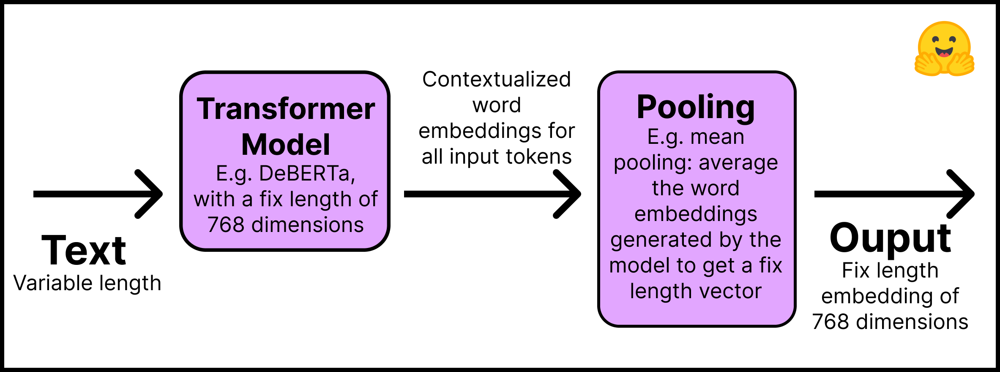

<h1>
    Training and Fine-Tuning Sentence Transformers Models
</h1>

<div class="blog-metadata">
    <small>Published July 15, 2022.</small>
    <a target="_blank" class="btn no-underline text-sm mb-5 font-sans" href="https://github.com/huggingface/blog/blob/main/train-and-fine-tune-sentence-transformers-models.md">
        Update on GitHub
    </a>
</div>

<div class="author-card">
    <a href="/espejelomar"> 
        
        <div class="bfc">
            <code>espejelomar</code>
            <span class="fullname">Omar Espejel</span>
        </div>
    </a>
</div>

Check out this tutorial with the Notebook Companion:
<a target="_blank" href="TODO">
    
</a>


Training or fine-tuning a Sentence Transfomer greatly depends on your available data and on your target task. The key is to understand how you can feed data to the model and prepare your dataset accordingly. 

In this tutorial we will:

1. Understand how Sentence Transformers models work and create ours from "zero".
2. 

## How Sentence Transformers models work

In a Sentence Transformer model we are mapping a variable length text (or image pixels) to a fixed sized embedding representing the meaning of such input. For getting started on embeddings please refer to our [previous tutorial](https://huggingface.co/blog/getting-started-with-embeddings). In this post we will focus on text. 

This is how Sentence Transformers models work:

1. **Layer 1**: The input text passes trough a pre-trained Transformer model that can be obtained directly from the [Hugging Face Hub](https://huggingface.co/models?pipeline_tag=fill-mask&sort=downloads). This tutorial will use the "microsoft/deberta-v3-small" model. The outputs of the Transformer are contextualized word embeddings for all inputs tokens; imagine an embedding for each word of the text.
2. **Layer 2**: The word embeddings go trough a pooling process to obtain a single fix length embedding for the whole text. For example, mean pooling averages the word embeddings generated by the model.   

The following image summarizes the process:

 

Remember to install the Sentence Transormers library with `pip install -U sentence-transformers`. In code, this two steps process is simple: 

```py
from sentence_transformers import SentenceTransformer, models

## Step 1: use an existing language model
word_embedding_model = models.Transformer('bert-base-uncased', max_seq_length=256)

## Step 2: use a pool function over the token embeddings
pooling_model = models.Pooling(word_embedding_model.get_word_embedding_dimension())

## Join steps 1 and 2 using the modules argument
model = SentenceTransformer(modules=[word_embedding_model, pooling_model])
```

From the code above we can see that Sentence Transformers models are composed of modules, i.e. a list of layers which are executed consecutively. The input text enters the first layer and the final output comes from the last layer. The model above is the simplest Sentence Transformer possible, however, we can add additional layers, for example, dense, bag of words, and convolutional.

Why not use a Transfomers model, such as BERT or RoBERTa, out of the box to create embeddings for complete sentences and texts? There are at least two reasons. 

1. Pre-trained Transformers require great computation to perform semantic search tasks. For example, finding the most similar pair in a collection of 10,000 sentences [requires about 50 million inference computations (~65 hours) with BERT](https://arxiv.org/abs/1908.10084). In contrast, a BERT Sentence Transformer model reduces the time to about 5 seconds.
2. Once trained,Transformers create rather poor sentence representations out-of-the-box.

If you only want to fine-tune an existing Sentence Transformers model then you can skip this steps and simply import the model from the Hugging Face Hub:

```py
from sentence_transformers import SentenceTransformer

model_id = "sentence-transformers/multi-qa-MiniLM-L6-cos-v1"
model = SentenceTransformer(model_id)
```

Now, the most important part: the structure of the data.

## How to prepare your dataset for training a Sentence Transformers model

> "To represent our training data, we use the `InputExample` class to store training examples. As parameters, it accepts texts, which is a list of strings representing our pairs (or triplets). Further, we can also pass a label (either float or int)." - [Sentence Transformers Documentation](https://www.sbert.net/docs/training/overview.html#training-data).

To train a Sentence Transformer model you need to somehow inform it that two sentences have a certain degree of similarity. Thus, each example from our data requires a label or structure that allows the model to understand if two sentences are similar or unsimilar. 

Unfortunately, there is not a single way to prepare your data for training a Sentence Transformer model. It highly depends on your goals and structure of your data. If you do not have an explicit label, which is the most likely scenario, you can derive it from the structure of the documents where you derive the sentences. For example, two sentence on the same report ought to be more comparable than two sentences from distinctive reports. Neighboring sentences can to be more comparable than non-neighboring sentences.

Furthermore, the structure of our data will affect the loss function we can use. In the next session we will review this part.

Most datasets setups will have one of this four forms: 

- Case 1: The example is a pair of sentences and a label indicating how similar they are.
- Case 2: The example is a pair of positive (similar) sentences **without** a label. For example, pairs of paraphrases, pairs of duplicate questions, pairs of (query, response), or pairs of (source_language, target_language). Natural Language Inference datasets can be formated this way. Having your data in this format can be great since we can use the `MultipleNegativesRankingLoss`, one of the most use lost functions for Sentence Transformers models. 
- Case 3: The example is a triplet; you have three sentences where the first one is an "anchor", the second a "positive" of the same class as the anchor, and the third a "negative" of a different class. For each sentnce there is an integer label indicating the class to which it belongs.
- Case 3: Similar to the second case, the example is a triplet (anchor, positive, negative); however, **there is no class** (nor label) for the sentences.

For each of the above cases there are Datasets in the Hugging Hub. Additionaly, the Datasets in the Hub have a Dataset Preview functionality that allows to visualize datasets before dowloading them. Here are dataset examples for each of these cases:

- Case 1: 

- Case 2: The same setup as for NLI can be used. Review the structure of the [SNLI dataset](https://huggingface.co/datasets/snli). The [Sentence Compression dataset](https://huggingface.co/datasets/embedding-data/sentence-compression) is another example.

- Case 3: The [TREC dataset](https://huggingface.co/datasets/trec).

- Case 4: The [Quora Triplets dataset](https://huggingface.co/datasets/embedding-data/QQP_triplets).

The next step is to convert the dataset in a format that our Sentence Transformer model can understand. The model do can not accept a raw lists of Strings. Each example should be converted to a `sentence_transformers.InputExample` class and then to a `torch.utils.data.DataLoader` class to create batches and shuffle the examples. This tutorial will follow the steps in the Notebook Companion:

Install Hugging Face Datasets with `pip install datasets`. Then import a dataset with the `load_dataset` function:

```py
from datasets import load_dataset

dataset_id = "embedding-data/QQP_triplets"
dataset = load_dataset(dataset_id)
```

In this case we are using an unlabled triplets dataset, that is, the fourth case above.

We can index and explore the Hugging Face datasets easily (see the [Documentation](https://huggingface.co/docs/datasets/index)):

```py
print(f"- The {dataset_id} dataset has {dataset['train'].num_rows} examples.")
print(f"- Each example is a {type(dataset['train'][0])} with a {type(dataset['train'][0]['set'])} as value.")
print(f"- Examples look like this: {dataset['train'][0]}")
```
Output:

```py
- The embedding-data/QQP_triplets dataset has 101762 examples.
- Each example is a <class 'dict'> with a <class 'dict'> as value.
- Examples look like this: {'set': {'query': 'Why in India do we not have one on one political debate as in USA?', 'pos': ['Why cant we have a public debate between politicians in India like the one in US?'], 'neg': ['Can people on Quora stop India Pakistan debate? We are sick and tired seeing this everyday in bulk?'...]
```
Convert the examples into `InputExample`'s. For simplicity (1) only one of the negatives in the [embedding-data/QQP_triplets]((https://huggingface.co/datasets/embedding-data/QQP_triplets)) dataset and (2) only 100 examples will be used. We use `tqdm` to get a progress bar.

```py
from tqdm.auto import tqdm

train_examples = []
n_examples = 100 
## For training with the entire dataset you can use `for i in range(dataset['train'].num_rows):`

for i in tqdm(range(n_examples)):
  example = dataset['train']['set'][i]
  train_examples.append(InputExample(texts=[example['query'], example['pos'], example['neg'][0]], label=0))
```
Convert the training examples to a `Dataloader`.

```py
from torch.utils.data import DataLoader

train_dataloader = DataLoader(train_examples, shuffle=True, batch_size=16)
```

The next step is to choose a proper loss function that can be inputed with the current format of our data.


## Loss functions for training a Sentence Transformers model

Remember the the four different cases in which your data might be? Each will have a different loss function associated with it.

Case 1: Pair of sentences and a label indicating how similar they are. 

Case 2: If we had only two similar sentences (two positives) with no labels then we can use the [`MultipleNegativesRankingLoss`](https://www.sbert.net/docs/package_reference/losses.html#multiplenegativesrankingloss) function.

Case 3: When our example is a triplet of the format `[anchor, positive, negative]` and we have an integer label for each, a loss function optimizes the model such that the anchor and positive sentences are closer in the vector space than the anchor and negative sentences. We can use the [`BatchHardTripletLoss`](https://www.sbert.net/docs/package_reference/losses.html#batchhardtripletloss) which requires that the data is labeled with integers (e.g. labels 1, 2, 3) assuming that samples with the same label are similar. Thus, anchors and positives should have the same label while the negative should have a different one. Alternatively, the [`BatchAllTripletLoss`](https://www.sbert.net/docs/package_reference/losses.html#batchalltripletloss), [`BatchHardSoftMarginTripletLoss`](https://www.sbert.net/docs/package_reference/losses.html#batchhardsoftmargintripletloss), or the [`BatchSemiHardTripletLoss`](https://www.sbert.net/docs/package_reference/losses.html#batchsemihardtripletloss). The differences between them are out of the scope of this tutorial but can be review in the Sentence Transformers documentation.

Case 4: If we do not have a label for each sentence in the triplets we should use the [`TripletLoss`](https://www.sbert.net/docs/package_reference/losses.html#tripletloss). This loss minimizes the distance between anchor and positive sentences while maximixing the distance between the anchor and negative sentences. 

The most difficult part is conceptually choosing an adequate loss function. In code it is only two lines:

```py
from sentence_transformers import losses

train_loss = losses.TripletLoss(model=model)
```
Once the dataset in the desired format and an adequate loss function is in place, fine-tuning and training a Sentence Transformer is simple.


## How to fine-tune a Sentence Transformer model

> "SentenceTransformers was designed in such way that fine-tuning your own sentence / text embeddings models is easy. It provides most of the building blocks that you can stick together to tune embeddings for your specific task." - [Sentence Transformers Documentation](https://www.sbert.net/docs/training/overview.html#training-overview).

For simplicity we are not adding an Evaluator that works on a development subset of the data. However, if we had it would look like this: `evaluator = TripletEvaluator.from_input_examples(dev_examples, name='dev')`.

This is how training looks: 

```py
model.fit(train_objectives=[(train_dataloader, train_loss)], epochs=1) 
```

Remember that if you are fine-tuning an existing Sentence Transformers model then you can call the `fit` method directly from it. If it is a brand new Sentence Transformers model then you have to define it first as we did in section "How Sentence Transformers models work."

That is it!

## What are the limis of Sentence Transformers?

Sentence Transformers work amazingly for semantic search. Much better than simple Transformers models. However, where do Sentence Transformers models do not work well? If your task is classification, then using sentence embeddings is in most cases the wrong approach. In that case, [Cross Encoders](https://www.sbert.net/examples/training/cross-encoder/README.html) work much better. Fortunately, you can find these models in the same Sentence Transformers library. Let us know if there is interest in exploring them!


Thanks for reading!
