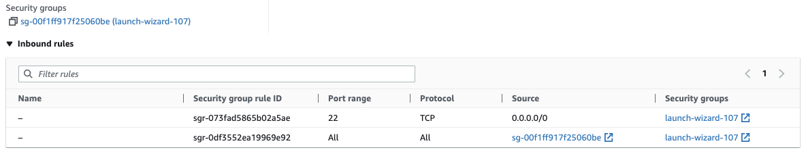
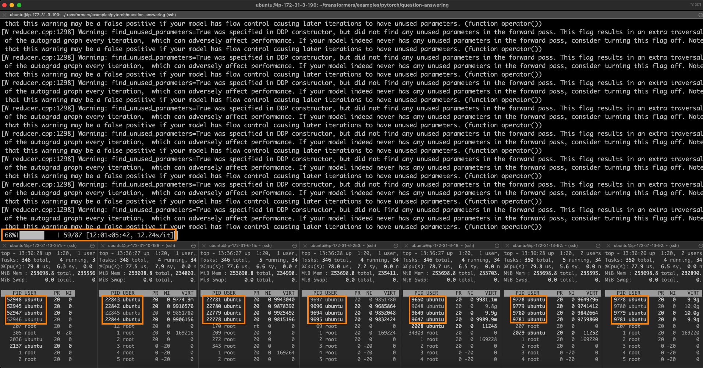

<h1>
Accelerating PyTorch Transformers with Intel Xeon CPUs (Sapphire Rapids)</h1>


<div class="blog-metadata">
    <small>Published December xx, 2022.</small>
    <a target="_blank" class="btn no-underline text-sm mb-5 font-sans" href="https://github.com/juliensimon/blog/blob/main/transformers-on-intel-sapphire-rapids-cpus.md">
        Update on GitHub
    </a>
</div>

<div class="author-card">
    <a href="https://twitter.com/julsimon">
        
        <div class="bfc">
            <code>juliensimon</code>
            <span class=fullname">Julien Simon</span>
        </div>
    </a>
</div>

About a year ago, I [showed you](https://huggingface.co/blog/accelerating-pytorch) how to accelerate Hugging Face transformers with Intel Xeon Scalable CPUs based on the Ice Lake architecture. Recently, Intel has launched the 4th generation of [Intel Xeon Scalable](https://www.intel.com/content/www/us/en/products/details/processors/xeon/scalable.html) CPUs. Code-named Sapphire Rapids, this new architecture introduces new CPU instructions designed to speed up operations commonly found in deep learning (DL) training and inference.

In this post, you will first learn how to accelerate a PyTorch training job with a cluster of Sapphire Rapids servers running on AWS. We'll use the [Intel oneAPI Collective Communications Library](https://www.intel.com/content/www/us/en/developer/tools/oneapi/oneccl.html) (CCL) to distribute the job, and the [Intel Extension for PyTorch](https://github.com/intel/intel-extension-for-pytorch) (IPEX) library to automatically leverage the new CPU instructions. As both libraries are already integrated into the Hugging Face Trainer API and sample scripts, we'll be able to run our training job out of the box, without changing a line of code.

Then, we'll run inference tests on a few well-known models to demonstrate the speedup that Sapphire Rapids brings compared to Ice Lake.


## Accelerating Deep Learning with New Instructions

The Sapphire Rapids architecture introduces new instructions for DL acceleration :

* Adding to the well-known Intel Advanced Vector Extensions ([AVX-512](https://en.wikipedia.org/wiki/AVX-512)), [AVX512-FP16](https://en.wikipedia.org/wiki/AVX-512#FP16) brings new instructions dedicated to 16-bit floating point (FP16) data. For example, the VFMADD instruction can multiply two FP16 values and add the result to a third FP16 value, aka 'multiply and add', a common operation used by DL models at inference time.

* The Intel Advanced Matrix Extensions ([AMX](https://en.wikipedia.org/wiki/Advanced_Matrix_Extensions)) is a net new instruction set to accelerate matrix multiplication, which is at the core of training DL models on batches of data. AMX
 supports both Brain Floating Point ([BF16](https://en.wikipedia.org/wiki/Bfloat16_floating-point_format)) and 8-bit integer (INT8) values, enabling ML practitioners to use it respectively for vanilla fine-tuning and quantization-aware training.
 
 As you will see, using these new instructions is as easy as installing the latest version of IPEX. There is no need to change anything in your Hugging Face code.

## Building a Cluster of Sapphire Rapids CPUs

At the time of writing, the simplest way to get your hands on Sapphire Rapids-powered servers is to use the new Amazon EC2 [R7iz](https://aws.amazon.com/ec2/instance-types/r7iz/) instance, family. These have just been announced at AWS re: Invent 2022 and for now, you should sign up for the preview to get access.

As I'm not really keen on setting up each node in the cluster manually, I'll set up only one, which I'll use to create a new Amazon Machine Image ([AMI](https://docs.aws.amazon.com/AWSEC2/latest/UserGuide/AMIs.html)). Then, I'll use this AMI to launch additional nodes.

From a networking perspective, we will need the following setup:

* Open port 22 for ssh access on all instances for setup and debugging.

* Configure [password-less ssh](https://www.redhat.com/sysadmin/passwordless-ssh) from the master instance (the one you'll launch training from) to all other instances (master included). In other words, the ssh public key of the master node needs to be present on all nodes.

* Allow all network traffic inside the cluster (and only there) to let distributed training run unencumbered. AWS provides a convenient way to do this by only allowing connections from instances running a particular [security group](https://docs.aws.amazon.com/vpc/latest/userguide/VPC_SecurityGroups.html). Just create a security group that allows all traffic from instances configured with that same security group, and make sure you attach the security group to all instances in the cluster. Here's how my setup looks.

<kbd>
  
</kbd>


## Setting Up the Master Node

I first create the master node by launching an `r7iz.8xlarge` instance with an Ubunutu 20.04 AMI and the security group I created earlier.

Once the instance is running, I ssh to it and install all dependencies.

```
# Create a virtual environment
sudo apt-get update 
sudo apt-get install python3-pip -y
pip install pip --upgrade
export PATH=/home/ubuntu/.local/bin:$PATH
pip install virtualenv

# Activate the virtual environment
virtualenv cluster_env
source cluster_env/bin/activate

# Install PyTorch, IPEX, CCL and Transformers
pip3 install torch==1.13.0 -f https://download.pytorch.org/whl/cpu
pip3 install intel_extension_for_pytorch==1.13.0 -f https://developer.intel.com/ipex-whl-stable-cpu
pip3 install oneccl_bind_pt==1.13 -f https://developer.intel.com/ipex-whl-stable-cpu
pip3 install transformers==4.24.0

# Clone the transformers repository for its example scripts
git clone https://github.com/huggingface/transformers.git
cd transformers
git checkout v4.24.0
```

Next, I create a new ssh key pair called 'cluster' with `ssh-keygen` and store it at the default location (`~/.ssh`).

Finally, I create a [new AMI](https://docs.aws.amazon.com/AWSEC2/latest/UserGuide/creating-an-ami-ebs.html) from this instance.

## Setting Up the Cluster

Once the AMI is ready, I use it to launch 7 additional `r7iz.8xlarge` instances, without forgetting to attach the security group created earlier.

While these instances are starting, I ssh it to the master node to complete the network setup. First, I edit the ssh configuration file at `~/.ssh/config` to enable password-less connections from the master to all other nodes, using their private IP address and the key pair created earlier. Here's what my file looks like:

```
Host 172.31.*.*
   StrictHostKeyChecking no

Host node1
    HostName 172.31.10.251
    User ubuntu
    IdentityFile ~/.ssh/cluster

Host node2
    HostName 172.31.10.189
    User ubuntu
    IdentityFile ~/.ssh/cluster

Host node3
    HostName 172.31.6.15
    User ubuntu
    IdentityFile ~/.ssh/cluster

Host node4
    HostName 172.31.6.253
    User ubuntu
    IdentityFile ~/.ssh/cluster

Host node5
    HostName 172.31.6.18
    User ubuntu
    IdentityFile ~/.ssh/cluster

Host node6
    HostName 172.31.13.92
    User ubuntu
    IdentityFile ~/.ssh/cluster

Host node7
    HostName 172.31.2.72
    User ubuntu
    IdentityFile ~/.ssh/cluster
```

At this point, I can use `ssh node[0-7]` to connect to any node without any prompt.

Still on the master node, I create a `~/hosts` file with the names of all nodes in the cluster as defined in the ssh configuration above. I use `localhost` for the master as I'll launch the training script there. Here's what my file looks like.

```
localhost
node1
node2
node3
node4
node5
node6
node7
```

The cluster is now ready for training.

## Launching a Distributed Training Job

In this example, I'll fine-tune a [DistilBERT](https://huggingface.co/distilbert-base-uncased) model for question answering on the [SQUAD](https://huggingface.co/datasets/squad) dataset. Feel free to try other examples if you'd like.

```
source ~/cluster_env/bin/activate
cd ~/transformers/examples/pytorch/question-answering
pip3 install -r requirements.txt
```

As a sanity check, I first launch a local training job. Please note several important flags: 

* `no_cuda` makes sure the job is ignoring any GPU on this machine,
* `use_ipex` enables the IPEX library and thus the new AVX and AMX instructions, 
* `bf16` enables BF16 training.
	

```
python run_qa.py --model_name_or_path distilbert-base-uncased --dataset_name squad --do_train --do_eval --per_device_train_batch_size 32  --num_train_epochs 1  --output_dir /tmp/debug_squad/ --use_ipex --bf16 --no_cuda
```
No need to let it run to completion, I just let it start and run for a minute to make sure that all dependencies have been correctly installed. This also gives me a baseline for single-instance training: 1 epoch takes about **2 hours and 15 minutes**. For reference, I clocked the exact same job on a comparable Ice Lake instance (`c6i.8xlarge`) at **6 hours** per epoch. We can already see how beneficial the new instructions are!

Now, let's run distribute the training job on two instances. Given that an `r7iz.8xlarge` instance has 32 vCPUs, I decide to allocate 24 (`OMP_NUM_THREADS`) to run 4 Python processes per node (`NUM_PROCESSES_PER_NODE`). Hence, the total number of Python jobs running on the 2-node cluster is 8 (`NUM_PROCESSES`).

```
# Set up environment variables for CCL
oneccl_bindings_for_pytorch_path=$(python -c "from oneccl_bindings_for_pytorch import cwd; print(cwd)")
source $oneccl_bindings_for_pytorch_path/env/setvars.sh

# Set up CCL and MPI environment variables
export MASTER_ADDR=172.31.3.190
export NUM_PROCESSES=8
export NUM_PROCESSES_PER_NODE=4
export CCL_WORKER_COUNT=4
export CCL_WORKER_AFFINITY=auto

# Launch distributed training
mpirun -f ~/hosts -n $NUM_PROCESSES -ppn $NUM_PROCESSES_PER_NODE  \
 -genv OMP_NUM_THREADS=24 \
 python3 run_qa.py \
 --model_name_or_path distilbert-base-uncased \
 --dataset_name squad \
 --do_train \
 --do_eval \
 --per_device_train_batch_size 32  \
 --num_train_epochs 1  \
 --output_dir /tmp/debug_squad/ \
 --overwrite_output_dir \
 --no_cuda \
 --xpu_backend ccl \
 --bf16
```

One epoch now takes 1 hour and 6 minutes. Running on 4 nodes (`NUM_PROCESSES=16`) and 8 nodes (`NUM_PROCESSES=32`), the times for one epoch are respectively **33 minutes and 30 seconds**, and **17 minutes and 40 seconds**.

Here's what the 8-node job looks like. The master node is at the top, and you can see the four processes running on each one of the other 7 nodes.

<kbd>
  
</kbd>

Perfect linear scaling on 8 nodes would be 16 minutes and 52 seconds (2 hours and 15 minutes divided by 8). We're extremely close to this ideal value, which shows how scalable this approach is.


## Inference

TBD


 