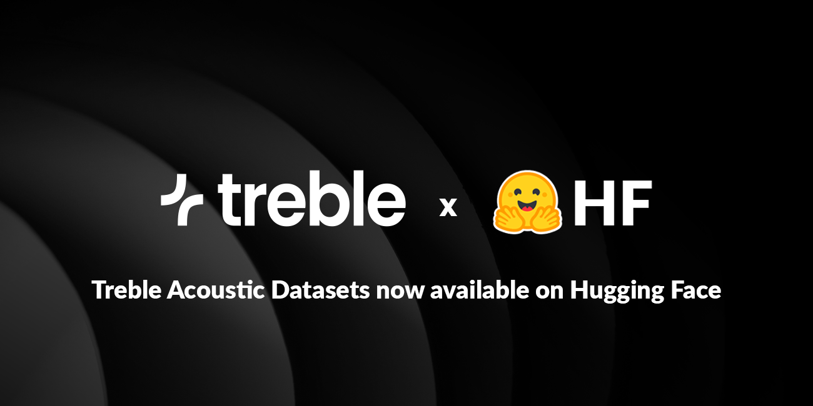

# High-Quality Datasets for Far-Field ASR (Treble Technologies x Hugging Face)

  

## Treble Technologies x Hugging Face

We are thrilled to announce the start of a collaboration between [Treble Technologies](https://huggingface.co/treble-technologies) and Hugging Face. In connection with the collaboration, we are publishing the Treble10 dataset, which contains high fidelity room-acoustic simulations from 10 different furnished rooms:
- [**Treble10-Speech**](https://huggingface.co/datasets/treble-technologies/Treble10-Speech) with over 3000 speech samples from the [LibriSpeech test set](https://huggingface.co/datasets/openslr/librispeech_asr) (`test.clean` & `test.other`) convolved with simulated RIRs (mono, HOA or multi-channel), for benchmarking a variety of single and multi-channel tasks; far-field ASR, dereverberation, speech enhancement, etc.
- [**Treble10-RIR**](https://huggingface.co/datasets/treble-technologies/Treble10-RIR) with the corresponding impulse responses (mono, HOA or multi-channel) for generating your own far-field content. 

🗣️🎤 ***Code examples can be found at the Dataset cards*** 🗣️🎤

Accurate room-acoustic data is the foundation for far-field speech recognition, dereverberation, speech enhancement, or source separation. Yet most existing datasets are limited either in scale or realism. Measured corpora, such as the [BUT ReverbDB](https://speech.fit.vut.cz/software/but-speech-fit-reverb-database) or the [CHIME3 challenge dataset](https://www.chimechallenge.org/challenges/chime3/data) capture acoustic conditions of the measured scenes reliably, but only coarsely cover selected areas of the rooms. For example, BUT ReverbDB contains around 1400 measured room impulse responses (RIRs) from 9 rooms, recorded with a sound source and a few dozen microphones inside spatially constrained areas. Expanding or replicating these datasets is extremely time-consuming and expensive. The CHiME datasets offer much larger amounts of noisy, reverberant speech but usually do not provide the underlying RIRs. The lack of matching RIR data limits the usability for tasks like dereverberation, where both original (aka “dry”) and reverberant versions of the same utterance are required. Additionally, systematic data generation and controlled ablations are not possible in such cases.

The Treble10 dataset bridges this gap by combining physical accuracy with the scalability of advanced simulation. Using the Treble SDK’s hybrid wave-based and geometrical-acoustics engine, we model sound propagation in 10 realistic, fully furnished rooms. In contrast to other simulation tools, which typically rely on simplified geometrical acoustics modeling, our hybrid approach models physical effects such as scattering, diffraction, interference, and the resulting modal behavior. Each room of the Treble10 dataset is densely sampled across receiver grids at multiple heights, resulting in over 3000 distinct transfer paths / RIRs per subset. The dataset includes 6 subsets: mono, 8th-order Ambisonics, and 6-channel device RIRs, along with corresponding reverberant speech signals from the [LibriSpeech test set](https://huggingface.co/datasets/openslr/librispeech_asr) (`test.clean` & `test.other`). All responses are broadband (32 kHz sampling rate), accurately modeling both low-frequency wave behavior and high-frequency reflections.

## TL;DR — What Makes the Treble10 Dataset Unique ✨

- **High-fidelity room acoustics at scale**: Over 3000 physically accurate room impulse responses (RIRs) from 10 realistic, furnished rooms, simulated with the Treble SDK’s hybrid wave-based + geometrical-acoustics approach. 
- **Bridging the realism gap**: Combines the physical accuracy of measured datasets with the scalability of simulation, capturing phenomena such as diffraction, scattering, interference, and modal behavior that simpler simulations miss. 
- **6 high-quality subsets for maximum flexibility**: mono, 8th-order Ambisonics, and 6-channel device RIRs, plus matching reverberant speech versions for each. 
- **Broadband and physically grounded**: All data are broadband at 32 kHz, modeling low-frequency wave effects and high-frequency reflections for realistic, full-band audio behavior. 
- **Open and ready to use**: Freely available on the [Treble10-Speech](https://huggingface.co/datasets/treble-technologies/Treble10-Speech) and [Treble10-RIR](https://huggingface.co/datasets/treble-technologies/Treble10-RIR), enabling straightforward integration into ASR, dereverberation, speech-enhancement, and source-separation pipelines.

## The Treble10 dataset 

The **Treble10 dataset** contains high fidelity room-acoustic simulations from 10 different furnished rooms (see the table below for more details). 

| **Room**                       | **Volume (m³)** | **Reverberation time (T30)**, averaged over all source-receiver configurations and octave bands (s) |
|-----------------------------|-------------|---------------------------------------------------------------------------------------------------|
| Bathroom 1                  | 15.42       | 0.58                                                                                              |
| Bathroom 2                  | 18.42       | 0.77                                                                                              |
| Bedroom 1                   | 15.6        | 0.43                                                                                              |
| Bedroom 2                   | 17.65       | 0.22                                                                                              |
| Living room with hallway 1  | 38.66       | 0.62                                                                                              |
| Living room with hallway 2  | 46.08       | 0.62                                                                                              |
| Living room 1               | 40.91       | 0.37                                                                                              |
| Living room 2               | 43.16       | 0.87                                                                                              |
| Meeting room 1              | 13.83       | 0.38                                                                                              |
| Meeting room 2              | 23.97       | 0.19   

The dataset contains six subsets:  

1. **Treble10-RIR-mono**: This subset contains mono RIRs. In each room, RIRs are available between 5 sound sources and several receivers. The receivers are placed along horizontal receiver grids with 0.5 m resolution at three heights (0.5 m, 1.0 m, 1.5 m). The validity of all source and receiver positions is checked to ensure that none of them intersects with the room geometry or furniture. 
2. **Treble10-RIR-HOA8**: This subset contains 8th-order Ambisonics RIRs. The sound sources and receivers are identical to the RIR-mono subset. 
3. **Treble10-RIR-6ch**: For this subset, a 6-channel cylindrical device, see Fig. 1, is placed at the receiver positions from the RIR-mono subset. RIRs are then acquired between the 5 sound sources from above and each of the 6 device microphones. In other words, there is a 6-channel DeviceRIR for each source-receiver combination of the RIR-mono subset. The microphone coordinates along with an example of how to use the multichannel device is present in the dataset card. 
4. **Treble10-Speech-mono**: Each RIR from the RIR-mono subset is convolved with a speech file from the [LibriSpeech test set](https://huggingface.co/datasets/openslr/librispeech_asr) (`test.clean` & `test.other`). 
5. **Treble10-Speech-HOA8**: Each Ambisonics RIR from the RIR-HOA subset is convolved with a speech file from the [LibriSpeech test set](https://huggingface.co/datasets/openslr/librispeech_asr) (`test.clean` & `test.other`). 
6. **Treble10-Scene-6ch**: Each DeviceRIR from the RIR-6ch subset is convolved with a speech file from the [LibriSpeech test set](https://huggingface.co/datasets/openslr/librispeech_asr) (`test.clean` & `test.other`). 

 
   
<em>Fig1: Sketch of the multi channel device included in the dataset. The device consists of 6 microphones evenly spaced with a radius of 3 cm. The coordinates of the microphones are present in the metadata for the 6ch split and also in the dataset card. </em> 
 
 

All RIRs (mono/HOA/device) were simulated with the Treble SDK, and more details on the tool can be found in the dedicated section below. We use a hybrid simulation paradigm that combines a numerical wave-based solver (discontinuous Galerkin method, DGM) at low to midrange frequencies with geometrical acoustics (GA) simulations at high frequencies. For the Treble10 dataset, the transition frequency between the wave-based and the GA simulation is set at 5 kHz. The resulting hybrid RIRs are broadband signals with a 32 kHz sampling rate, thus covering the entire frequency range of the signal and containing audio content up to 16 kHz.

A small subset of simulations from the same rooms has previously been released as part of the [Generative Data Augmentation (GenDA) challenge at ICASSP 2025](https://ieeexplore.ieee.org/document/11011109). The Treble10 dataset differs from the GenDA dataset in three fundamental aspects: 

1. The Treble10 dataset contains broadband RIRs from a hybrid simulation paradigm (wave-based below 5 kHz, GA above 5 kHz), covering the entire frequency range of a 32 kHz signal. In contrast to the GenDA subset, which only contained the wave-based portion, the Treble10 dataset therefore more than doubles the usable frequency range. 

2. The Treble10 dataset consists of 6 subsets in total. While three of those subsets contain RIRs (mono, 8th-order Ambisonics, 6-channel device), the other three contain pre-convolved scenes in identical channel formats. The GenDA subset was limited to mono and 8th-order Ambisonics RIRs, and no pre-convolved scenes were provided. 

3. With Treble10, we publish the entire dataset, containing approximately 3100 source-receiver configurations. The GenDA subset only contained a small fraction of approximately 60 randomly selected source-receiver configurations.

## Why should I include room acoustics during algorithm development?

Which use cases benefit from the Treble10 dataset? Let us explain this briefly with an example scenario. Consider the difference between far-field and near-field automatic speech recognition (ASR). 

In near-field ASR, a user speaks directly into a smartphone or headset, and the captured speech signal is relatively clean. The microphone is close to the mouth, so the direct sound dominates while reverberation and background noise are comparatively weak. In these conditions, ASR models may perform well even with limited room-acoustic diversity in the training data. However, in far-field ASR, as in smart speakers or conference-room devices, the microphone may be located several meters from the talker. The speech signal reaching the microphone is a complex mixture of direct sound, reverberation, and background noise, making the recognition task substantially more challenging. 

The difference between near-field and far-field conditions is not just a matter of distance, but also a matter of physics. In far-field setups, sound interacts heavily with the room: it reflects off walls, diffracts around furniture, and decays over time. RIRs comprise all of these effects and encode how sound propagates from the source to the receiver. By convolving a dry audio signal with an RIR, we can simulate reverberant speech for a specific room configuration, replicating the far-field scenario.

 
   
<em>Fig 2: The transformation of a clean audio signal into a reverberant one via convolution with a simulated Room Impulse Response in Treble is shown here. The initial clean speech (left) is convolved with the RIR (center), a sonic fingerprint of a room. This operation yields augmented clean speech (right) that incorporates the acoustic characteristics of that particular room.</em> 
 
 

For far-field ASR systems to be robust, they must be trained on data that accurately represents the complex far-field behavior. Similarly, the performance of far-field ASR systems can only be reliably determined when evaluating them on data that is accurate enough to model sound propagation in complex environments. 

This example illustrates the need for accurate RIR datasets in far-field ASR. Other speech-related tasks, such as speech enhancement, dereverberation and source separation, in real-world conditions benefit analogously from high-quality training data.

## Importance of domain data

With this blog post, we introduce the Treble10 dataset, a curated and quality-screened collection of highly accurate RIRs designed to support research and development of audio and speech algorithms. The dataset is accessible via the Hugging Face Hub, enabling straightforward integration into existing pipelines. This accessibility allows researchers and practitioners to directly evaluate the data’s fidelity and applicability within their own workflows. Beyond providing an initial hands-on opportunity to explore high accuracy simulated room acoustics, the remainder of this article outlines how similar datasets can be systematically generated, and what challenges arise during that process.

 
   
 
 

The figure above shows that room-acoustic data exhibits many degrees of freedom. To make algorithms perform well in a broad range of realistic conditions, we want the underlying training data to cover different source-receiver configurations, different source and receiver directivities or devices, different room volumes, different room shapes, different wall absorption properties, and different geometric details like scattering objects. 

However, when developing audio algorithms or training machine learning models for acoustic tasks, a central question inevitably arises: Where can we obtain sufficiently large and high-quality room-acoustic datasets that cover all outlined dataset dimensions? Room-acoustic measurements capture the physical sound pressure within a space at a specific moment in time, and therefore, faithfully represent the actual acoustic conditions of that environment at the measurement time. Unfortunately, conducting such measurements is both labor-intensive and time-consuming.  

Even with recent advances in automated room-acoustic measurements, large-scale, measurement-based dataset acquisition that sufficiently covers the abovementioned dataset dimensions remains impractical. Such large measurement campaigns would not only require tremendous amounts of manual labor, but also quickly reach practical limits regarding scalability. For example, a research team may have physical access to ten or even a hundred different rooms, but scaling such a campaign to the order of ten or even a hundred thousand rooms is infeasible. Setting up device-specific multi-channel datasets further multiplies the measurement effort, as new measurements have to be conducted for every device configuration.

## How simulations can help

Room-acoustic simulations are a scalable tool for generating large amounts of synthetic data under controlled, reproducible, and diverse acoustic conditions. This makes them a powerful alternative to physical measurements for training and evaluating audio machine learning models. A wide range of simulation methods exist, from geometrical acoustics techniques like the image-source method and ray tracing, to more advanced, wave-based approaches that capture the underlying physics of sound propagation in greater detail.

Reproducing real-world acoustics with simulations requires accurate modeling of key [wave phenomena](https://www.treble.tech/insights/wave-based-simulations-in-acoustics) that shape how sound interacts with the environment, including: 

- [**Reflection and scattering**](https://docs.treble.tech/validation/fundamental-effects/RS1): how sound waves reflect on surfaces and diffuse from rough or textured materials; 
- [**Diffraction**](https://docs.treble.tech/validation/fundamental-effects/RS6): how sound bends around obstacles such as furniture, people, or architectural features; 
- [**Absorption**](https://docs.treble.tech/validation/fundamental-effects/RS1#22-absorption-case): how different materials attenuate sound energy in a frequency-dependent manner; and 
- [**Reverberation**](https://docs.treble.tech/validation/Full-bandwidth-wave-based-simulations-using-Treble): the complex temporal decay of reflections that gives each room its distinctive acoustic character. 

However, many existing data augmentation pipelines still rely on simplified simulation techniques, such as [basic image-source models and ray tracing](https://pubs.aip.org/asa/jasa/article/138/2/708/917382/Overview-of-geometrical-room-acoustic-modeling). Although these approaches can be effective for simple environments, [they often fail to capture the full physical complexity of real-world acoustics](https://pubs.aip.org/asa/jasa/article/145/4/2746/848382/A-round-robin-on-room-acoustical-simulation-and), particularly in spaces with irregular geometries, frequency-dependent materials, or scattering objects. 

## Treble Technologies and the Treble SDK

At Treble Technologies, we believe that advancing audio machine learning requires revisiting the underlying physics of sound propagation. A physically accurate simulation paradigm is crucial, especially when modelling the complex behavior of sound in realistic rooms and with multi-channel devices. Tools like the Treble SDK bridge the gap between high scalability and high accuracy when working with room-acoustic simulations.  

The Treble SDK offers a flexible, Python-based framework powered by an advanced acoustic simulation engine. It enables engineers and researchers to: 

Simulate complex acoustic environments: Move beyond simple room models to capture detailed geometries and devices. Model wave effects that are crucial phenomena in real-world sound propagation, such as diffraction, scattering, interference, and the resulting modal behavior. 

Generate multi-channel room impulse responses (RIRs) at scale: Create large datasets of physically accurate, high-fidelity RIRs, including precise simulations for custom microphone arrays embedded within device structures. 

Control acoustic parameters with precision: Adjust room size, material properties, source and receiver positions (including array layouts), and object placements to produce diverse and well-controlled acoustic conditions. 
