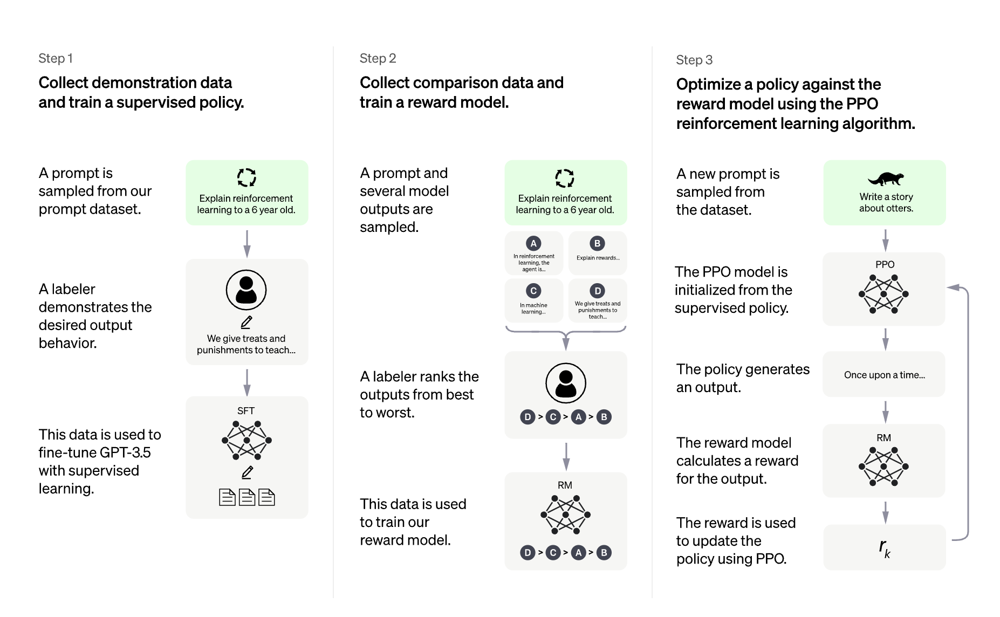
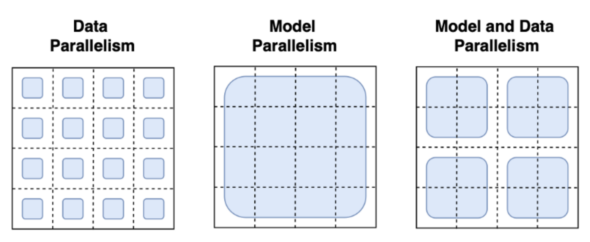
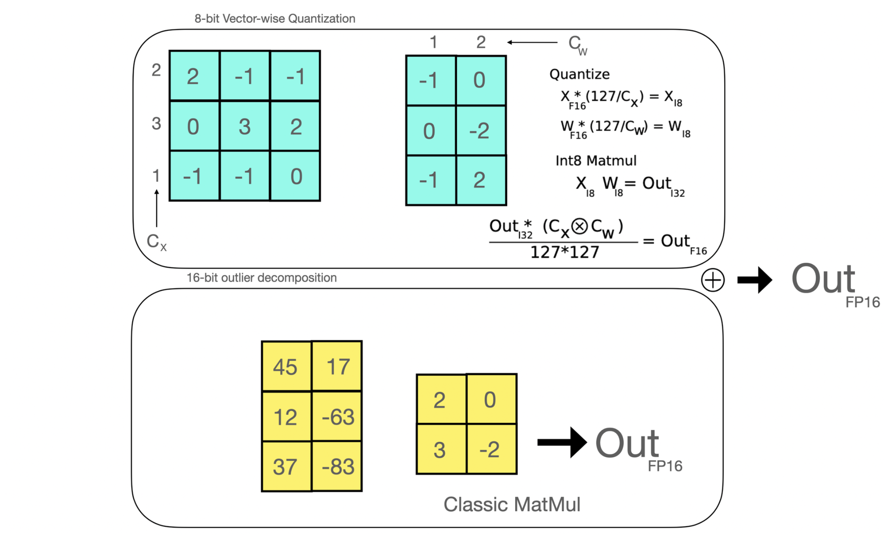
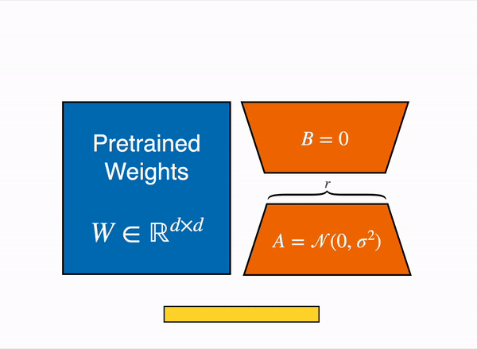
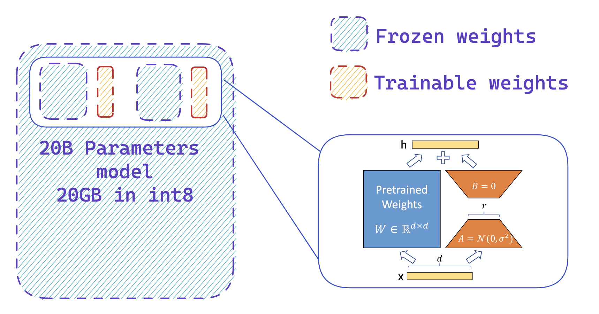
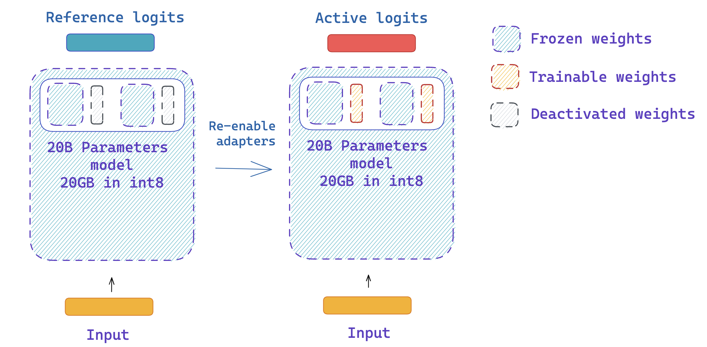

<h1>
	<h5><i> Fine-tuning 20B LLMs with RLHF on a 24GB consumer GPU </i></h5>
</h1>

We are excited to officially release the integration of `trl` with `peft` to make LLMs fine-tuning with Reinforcement Learning more accessible to anyone! Let us explain why this is a very competitive alternative to existing fine-tuning approaches in this article. 

Note `peft` is a general tool that can be applied to many ML use-cases but it’s particularly interesting for RLHF as this method is especially memory-hungry!

## Introduction

### LLMs & RLHF

Large Language Models combined with RLHF (Reinforcement Learning with Human Feedback) seems to be the next go-to approach for building very powerful AI systems such as ChatGPT.

Training a language model with RLHF typically involves the following three steps:

1- Fine-tune a pretrained LLM on a specific domain or corpus of instructions and human demonstrations 

2- Collect a human annotated dataset and train a reward model

3- Fine-tune the LLM with the reward model and this dataset using RL (e.g. PPO)

|  |
|:--:|
| <b>Overview of ChatGPT training protocol, from the data collection to the RL part</b>|

The choice of the base LLM is quite crucial here. At this time of writing, the “best” open-source LLM that can be used “out-of-the-box” for many tasks are instruction finetuned LLMs. Notable models being:  bloomz , flan-t5 , flan-ul2 opt-iml llama-i (Upon non commercial license). The downside of these models is their model size. To get a decent model, you need at least to play with 10B+ scale models which would require up to 40GB GPU memory in full precision, just to fit the model on a single GPU device without doing any training at all!

### What is `trl`?

The `trl` library aims at making the RL step much easier and more flexible so that anyone can fine-tune their Language Model using RL on their custom dataset and training setup. Among many other application, you can use this algorithm to fine-tune a model to generate [positive movie reviews](https://huggingface.co/docs/trl/sentiment_tuning), do [controlled generation](https://github.com/lvwerra/trl/blob/main/examples/sentiment/notebooks/gpt2-sentiment-control.ipynb) or [making the model less toxic](https://huggingface.co/docs/trl/detoxifying_a_lm). 

Using `trl` you can run PPO algorithm, one popular RL method, in a distributed manner or on a single device! We leverage `accelerate` from the Hugging Face ecosystem to make this possible, so that any user can scale up the experiments up to an interesting scale.

Fine-tuning a language model with RL follows roughly the protocol detailed below. This requires having 2 copies of the original model; to avoid the active model to deviate too much from its original behavior / distribution you need to compute the logits of the reference model at each optimization step. This adds a hard constraint on the optimization process as you need always at least two copies of the model per GPU device. If the model grows in size, it becomes more and more tricky to fit the setup on a single GPU.

|  |
|:--:|
| <b>Overview of the PPO training setup in TRL.</b>|

In trl you can use shared layers between reference and active models to avoid entire copies. A concrete example of this feature is showcased in the detoxification example.

### Training at scale

Training at scale can be challenging. The first challenge is fitingt the model and its optimizer states on the available GPU devices. The amount of GPU memory a single parameter takes in the memory depends on its “precision” (or more specifically `dtype`). The most common `dtype` being `float32` (32-bit), `float16`, and `bfloat16` (16-bit). More recently “exotic” precisions are supported out-of-the-box for training and inference (with certain conditions and constraints) such as `int8` (8-bit). In a nutshell, to load a model on a GPU device each billion parameter costs 4GB in float32 precision, 2GB in float16 and 1GB in int8. If you would like to learn more about this topic, have a look at [this blogpost](https://huggingface.co/blog/hf-bitsandbytes-integration) which dives deeper.

If you use an Adam optimizer (which is the most popular optimizer as we are writing this blogpost), each parameter needs 3 times its allocated memory (e.g. if your model needs 1GB GPU memory, the full Adam optimizer of the model would require 3GB GPU memory).

Many techniques have been adopted to tackle these challenges at scale. Most familiar paradigms being Pipeline Parallelism, Tensor Parallelism and Data Parallelism.

|  |
|:--:|
| <b>Image Credits to <a href="https://towardsdatascience.com/distributed-parallel-training-data-parallelism-and-model-parallelism-ec2d234e3214 " rel="noopener" target="_blank" >this blogpost</a> </b>|

With data parallelism the same model is hosted in parallel on several machines and each instance is fed a different data batch. This is the most straight forward parallelism strategy essentially replicating the single-GPU case and is already supported by `trl`. With Pipeline and Tensor Parallelism the model itself is distributed across machines: in Pipeline Parallelism this model is split layer-wise whereas Tensor Parallelism splits tensor operations across GPUs (e.g. matrix multiplications). With these Model Parallelism strategies, you need to shard the model weights across many devices which requires you to define a communication protocol of the activations and gradients across processes. This is not trivial to implement and might need the adoption of some frameworks such as [Megatron-DeepSpeed](https://github.com/microsoft/Megatron-DeepSpeed) or `[Nemo](https://github.com/NVIDIA/NeMo)` .  It is also important to highlight other tools that are essential for scaling LLM training such as Adaptive activation checkpointing and fused kernels. Further reading about parallelism paradigms can be found [here](https://huggingface.co/docs/transformers/v4.17.0/en/parallelism).

Therefore, we asked ourselves the following question: how far can we go with the just data parallelism? Can we use existing tools to fit super-large training processes (including active model, reference model and optimizer states) in a single device? The answers appears to be yes. The main ingredients being: adapters and 8bit matrix multiplication! Let us cover these topics in the next sections:

### 8-bit matrix multiplication

Efficient 8-bit matrix multiplication is a method that has been first introduced in the paper [LLM.int8()](https://arxiv.org/abs/2208.07339) and aims to solve the performance degradation issue when quantizing large-scale models. The proposed method  breaks down the matrix multiplications that are applied under the hood in Linear layers in two stages: the outlier hidden states part that is going to be performed in float16 & the “non-outlier” part that is performed in int8. 

|  |
|:--:|
| <b>Efficient 8-bit matrix multiplication is a method that has been first introduced in the paper [LLM.int8()](https://arxiv.org/abs/2208.07339) and aims to solve the performance degradation issue when quantizing large-scale models. The proposed method  breaks down the matrix multiplications that are applied under the hood in Linear layers in two stages: the outlier hidden states part that is going to be performed in float16 & the “non-outlier” part that is performed in int8.</b>|

In a nutshell, you can reduce the size of a full-precision model by 4 (thus, by 2 for half-precision models) if you use 8-bit matrix multiplication. 

### Low rank adaptation and peft

In 2021, a paper called LoRA: Low-Rank Adaption of Large Language Models demonstrated that fine tuning of large language models can be performed by freezing the pretrained weights and creating low rank versions of the query and value layers attention matrices. These low rank matrices have far fewer parameters than the original model, enabling fine-tuning with far less GPU memory. The authors demonstrate that fine-tuning of low-rank adapters achieved comparable results to fine-tuning the full pretrained model.

|  |
|:--:|
| <b>The output activations original (frozen) pretrained weights (right) are augmented by a low rank adapter comprised of weight matrics A and B.</b>|

This technique allows the fine tuning of LLMs using a fraction of the memory requirements. There are, however, some downsides. The forward and backwards take approximately twice as low, due to the additional matrix multiplications in the adapter layers.

### What is `peft` ?

[Parameter-Efficient Fine-Tuning (PEFT)](https://github.com/huggingface/peft), is a Hugging Face library, created to support the creation and fine tuning of adapter layers on LLMs. Peft is seamlessly integrated with 🤗 Accelerate for large scale models leveraging DeepSpeed and Big Model Inference.

The library suppord many state of the art models and has an extensive set of examples, including:

- Causal language modeling
- Conditional generation
- Image classification
- 8-bit int training
- Low Rank adaption of Dreambooth models
- Semantic segmentation
- Sequence classification
- Token classification

The library is still under extensive and active development, with many upcoming features to be annouced in the coming months.

## Summary 

Now that the prerequisites are out of the way, let us go through the entire pipeline step by step, and explain with figures how you can fine-tune a 20B parameter LLM with RL using the tools mentioned above on a single 24GB GPU!

### Step 1: Load your active model in 8-bit precision

|  |
|:--:|
| <b> Loading a model in 8-bit precision can save up to 4x memory compared to full precision model</b>|

A “free-lunch” memory reduction of a LLM using `transformers` is to load your model in 8-bit precision using the method described in LLM.int8. This can be performed by simply adding the flag `load_in_8bit=True` when calling the `from_pretrained` method (you can read more about that [here](https://huggingface.co/docs/transformers/main/en/main_classes/quantization))

As stated in the previous section, a “hack” to compute the amount of GPU memory you should need to load your model is to think in terms of “billions of parameters”. As one byte needs 8 bits, you need 4GB per billion parameter for a full-precision model (32bit = 4bytes), 2GB per billion parameter for a half-precision model and 1GB per billion parameter for an int8 model.

So in the first place, let’s just load the active model in 8-bit. Let’s see what we need to do for the second step!

### Step 2: Add extra trainable adapters using `peft`

|  |
|:--:|
| <b> You easily add adapters on a frozen 8-bit model thus reduce the memory requirements of the optimizer states, byt training a small fraction of parameters</b>|

The second step is to load adapters inside the model and make these adapters trainable. This enables a drastic reduction of the amount of trainable weights that are needed for the active model. This step leverages peft library and can be performed with few lines of code. Note that once the adapters are trained, you can easily push them to the Hub to use them later.

### Step 3: Use the same model to get the reference and active logits

|  |
|:--:|
| <b> You can easily disable and enable adapters using the `peft` API.</b>|

As adapters can be deactivated, we can use the same model to get the reference and active logits for PPO, without having to create two copies of the same model! This leverages a feature in `peft` library, which is the disable_adapters context manager. 

## Step by step in code

TODO

## Conclusion

We have implemented a new functionality in `trl` that allows users to fine-tune large language models using RLHF at a reasonable cost by leveraging the `peft` and `bitsandbytes` libraries. We demonstrated that fine-tuning `gpt-neo-x`  (40GB in `bfloat16`!) in a 24GB consumer GPU is doable, and we expect that this integration will be widely used by the community to fine-tune larger models utilizing RLHF and share great artifacts.

We identified some interesting directions for the next steps to push the limits of this integration

- *How this will scale in multi-GPU setting?* We’ll mainly explore how this integration will scale with respect to the number of GPUs, whether it is possible to apply Data Parallelism out-of-the-box or if it’ll require some new feature adoption on any of the involved libraries.
- *What tool can we leverage to increase training speed?* We have observed that the main downside of this integration is the overall training speed. In the future we would be keen to explore the possible directions to make the training much faster.

## References

- parallelism paradigms: [https://huggingface.co/docs/transformers/v4.17.0/en/parallelism](https://huggingface.co/docs/transformers/v4.17.0/en/parallelism)
- 8-bit integration in `transformers`: [https://huggingface.co/blog/hf-bitsandbytes-integration](https://huggingface.co/blog/hf-bitsandbytes-integration)
- LLM.int8 paper: [https://arxiv.org/abs/2208.07339](https://arxiv.org/abs/2208.07339)
- Gradient checkpoiting explained: [https://docs.aws.amazon.com/sagemaker/latest/dg/model-parallel-extended-features-pytorch-activation-checkpointing.html](https://docs.aws.amazon.com/sagemaker/latest/dg/model-parallel-extended-features-pytorch-activation-checkpointing.html)