## Using Machine Learning to Aid Survivors and Race through Time

<!-- {blog_metadata} -->
<!-- {authors} -->

On February 6, 2023, earthquakes measuring 7.7 and 7.6 hit South Eastern Turkey, affecting 10 cities and resulting in more than 42.000 deaths and 120.000 injuries as of February 21.

In few hours after the earthquake, a group of programmers started a Discord server to roll out an application called *afetharita*, literally meaning, *disaster map*. This application would serve search and rescue teams, and volunteers to find people and bring them their needs. The need for such an app arose from how people posted Instagram screenshots of texts where they posted their addresses and what they needed (including rescue). They also posted tweets of such screenshots or just tweeted what they need so other people knew they are alive. Needing to extract information from these tweets, we developed various applications to turn them into structured data and raced against time in developing and deploying these apps. 

When I got invited to the discord server, there was quite a lot of chaos regarding how we would operate and what we would do. The soundest thing would be to open a Hugging Face organization account and collaborate through pull requests as we’ve decided we’d like to build ML-based applications to receive and process information and also we needed an open registry for models and datasets. 

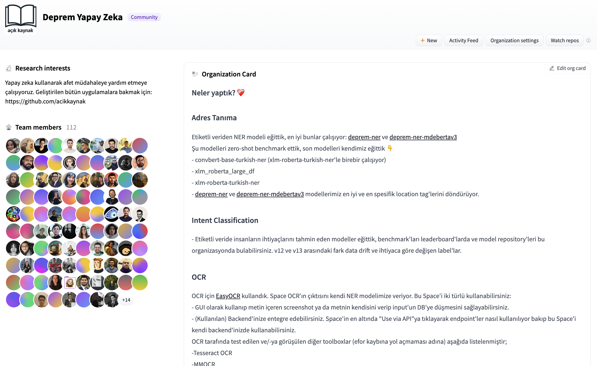

On the first day, people need an application to post screenshots, extract information from these and write the structured information to the database, so we started developing an application that would take a given image, extract a name, telephone number, and address and would write it to a database that would be handed to authorities. After experimenting with various open-source OCR tools, we started using `easyocr` and `Gradio` to develop this application and opened endpoints from the interface so that any team could benefit from OCR as this was the specific need. As of now, the addresses are parsed using transformers-based fine-tuned NER model. 

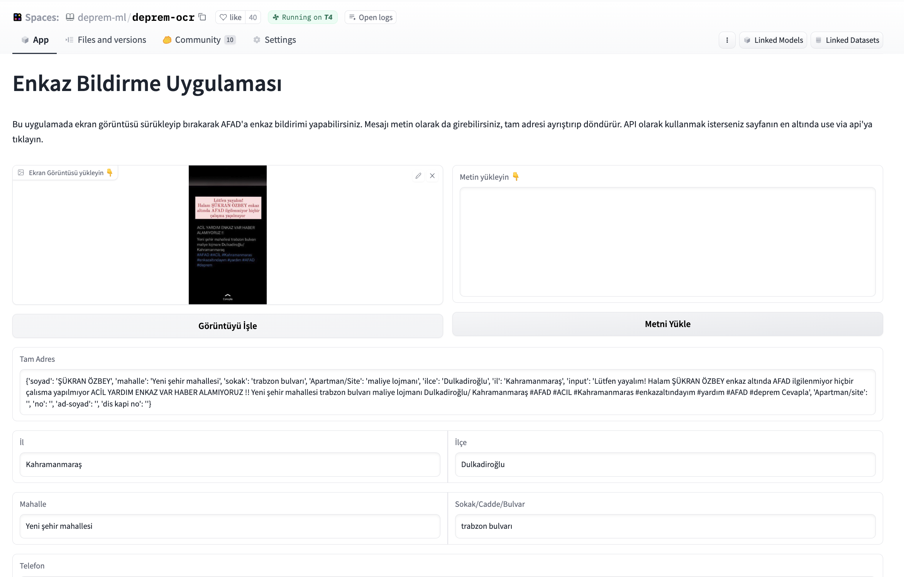

Hugging Face Hub team has set us up a CI bot to have an ephemeral environment to see how a given PR would effect the Space. 

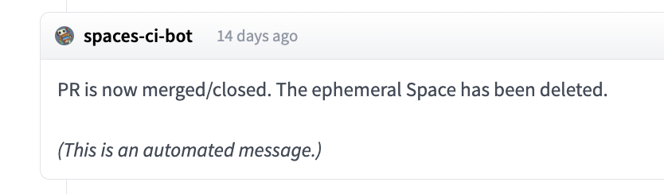

Later on, we were given labelled content from various channels that included addresses and personal information (which is later anonymized) of people who would ask for help. We started experimenting both with few-shot prompting of closed source models and training our own token classification model from transformers. We’ve used `dbmdz/bert-base-turkish-cased` as a base model for token classification and came up with the first address extraction model. 

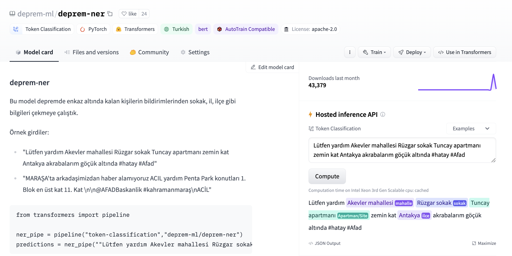

The model was later used in `afetharita` to parse the addresses. The parsed addresses would be sent to the geocoding API to parse the longitude and latitude, and the parsed geolocation would then be displayed on the front-end map. Using Inference API for this has saved us from pulling the model, writing an app, building a docker image, setting up CI/CD, and deploying the model to a cloud instance, where it would be extra overhead work for the DevOps and cloud teams as well. Hugging Face teams have provided us with more replicas so that there would be no downtime and the application would be robust against a lot of traffic.

Later on, we were asked to create an intent classification model to extract needs of the survivors, or rescue them. We were given data with multiple labels for multiple needs in a given tweet, and these needs could be shelter, food or logistics, as it was freezing cold over there. We’ve started experimenting first with zero-shot experimentations with open-source NLI models on Hugging Face Hub and few-shot experimentations with closed-source generative model endpoints. NLI models were particularly useful as we could directly infer with candidate labels and change the labels as data drift occurs, and we didn’t prefer generative models due to model making up labels which would cause mismatches when giving responses to backend. We initially didn’t have labelled data so anything would work.

In the end, we decided to fine-tune our own model as it would take roughly three minutes to fine-tune BERT’s text classification head on GPU. We had a separate labelling effort to develop our own model. We noted down our experiments in model card’s metadata so we could later come up with a leaderboard to keep track of which model should be deployed to production. 

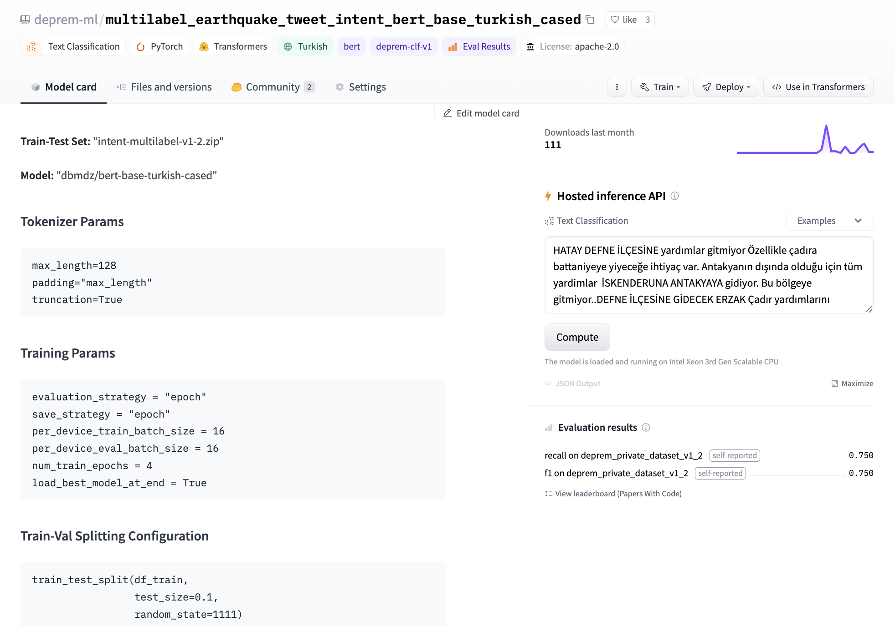

We cared a lot about not having false negatives and our classes were imbalanced so we had a benchmark over recall and F1-score hosted in a Space. We were setting metadata tags to be `deprem-clf-v1` and write down F1 and recalls so that Space would automatically retrieve and rank them. We had a separate benchmark set to avoid leakage to train set and consistently benchmark our models. We’ve done benchmarking for every model’s best threshold to take a label into account, and this threshold would later be used in production.

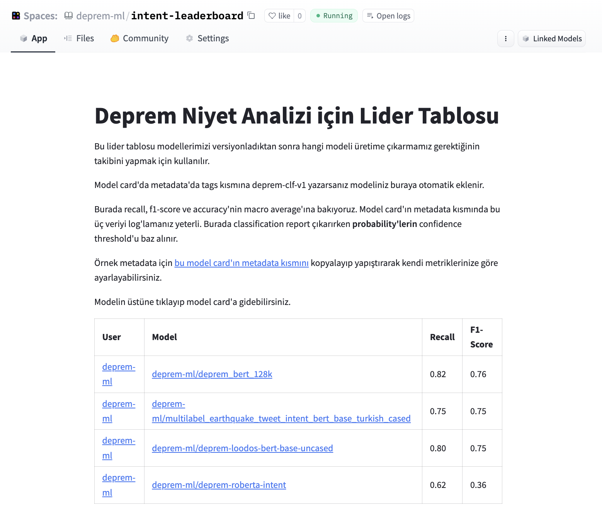

We wanted our NER model to be evaluated and crowd-source the effort because the data labelers were working to give us better and updated intent datasets. To evaluate the NER model, we’ve setup a labelling interface using `Argilla` and `Gradio`, where people could input a tweet and flag the output as correct/incorrect/ambiguous.

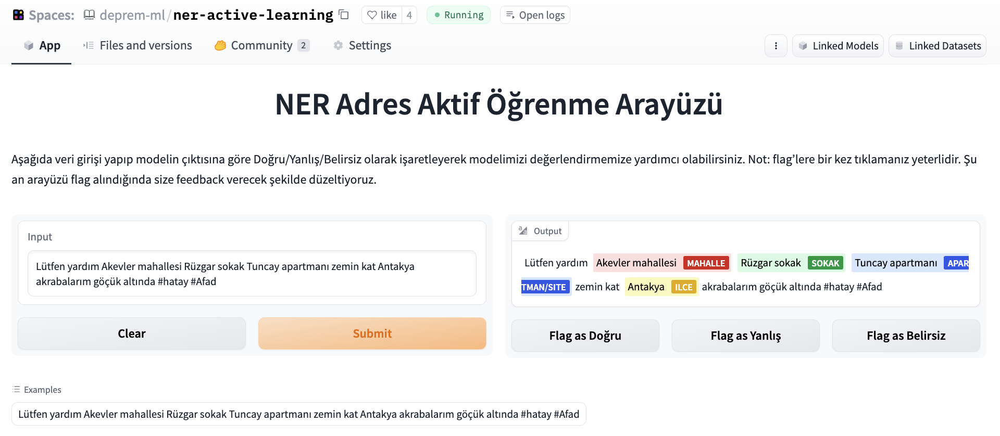

Later, the dataset were deduplicated and we decided to use the dataset to benchmark our further experiments. 

Another team under machine learning has worked with generative models (behind a gated API) to get the specific needs (as labels were too broad) as free text and pass the text as an additional context to each posting. For this, they’ve done prompt engineering and wrapped the API endpoints as a separate API and deployed on cloud. Using few-shot prompting with LLMs help adjust in fine-grained needs to prevent fast developing data drift, as the only thing we need to adjust is to adjust the prompt and we do not need any labelled data for this.

These models are currently being used in production to create the points in below heat map so that volunteers and search and rescue teams can bring the needs to survivors. 

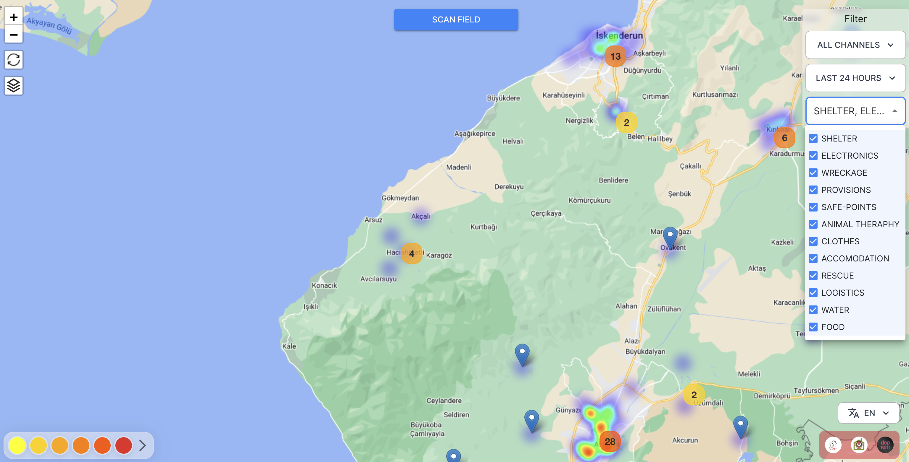

We’ve realized that if it wasn’t for Hugging Face Hub and the ecosystem, we wouldn’t be able to collaborate, prototype and deploy this fast. Below is our MLOps pipeline for address recognition and intent classification models. 

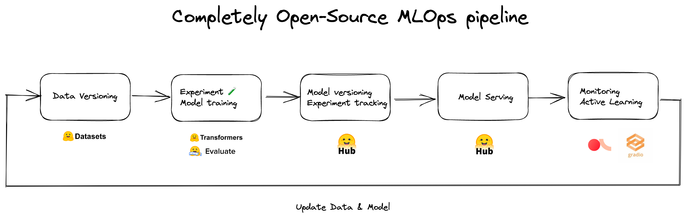

There’s tens of people behind this application and its individual components, who worked with no sleep to get these out in short time. 

## Remote Sensing Applications

Other teams worked on remote sensing applications to assess the damage to buildings and infrastructure in an effort to direct search and rescue operations. The lack of electricity and stabile mobile networks during the first 48 hours of the earthquake, combined with collapsed roads, made it extremely difficult to assess the extent of the damage and where help was needed. The search and rescue operations were also heavily effected by false reports of collapsed and damaged buildings due to the difficulties in communication and transportation.

In an effort to address these issues and create open source tools that can be leveraged in the future, we started by collecting pre and post-earthquake satellite images of the affected zones from Planet Labs, Maxar and Copernicus Open Access Hub. 

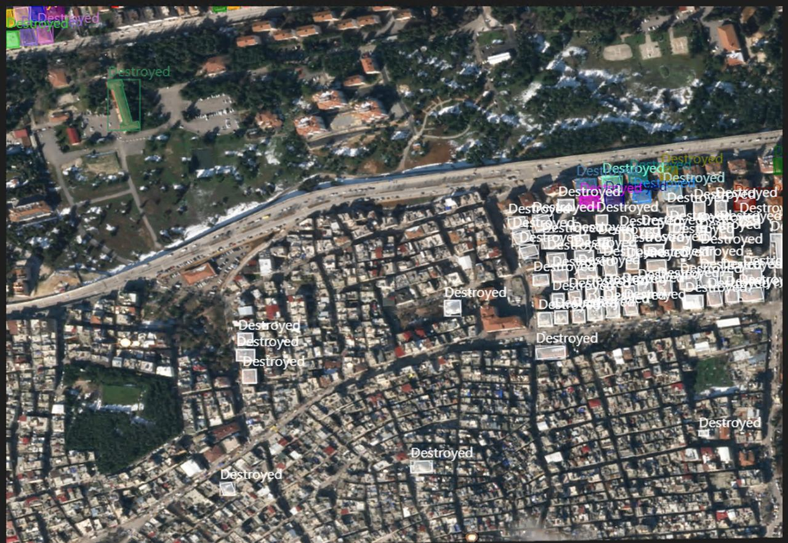

Our initial approach was to rapidly label satellite images for object detection and instance segmentation, with a single category for "buildings". The aim was to evaluate the extent of damage by comparing the number of surviving buildings in pre- and post-earthquake images collected from the same area. In order to make it easier to train models, we started by cropping 1080x1080 satellite images into smaller 640x640 chunks. Next, we fine-tuned  [YOLOv5](https://huggingface.co/spaces/deprem-ml/deprem_satellite_test), YOLOv8 and EfficientNet models for building detection and a [SegFormer](https://huggingface.co/spaces/deprem-ml/deprem_satellite_semantic_whu) model for semantic segmentation of buildings, and deployed these apps as Hugging Face Spaces. 

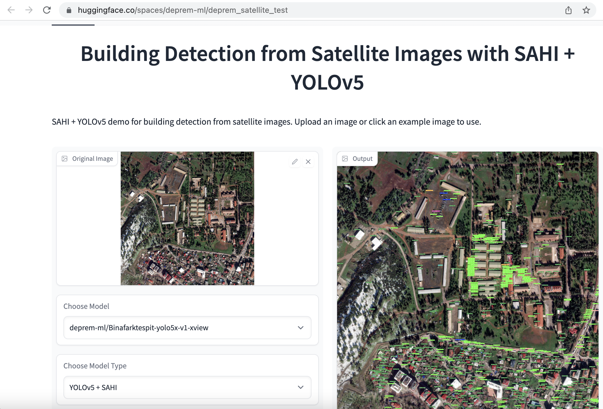

Once again, dozens of people worked on labeling, preparing data and training models. In addition to individual volunteers, companies like [Co-One](https://co-one.co/) volunteered to label satellite data with more detailed annotations for buildings and infrastructure, including *no damage, destroyed, damaged, damaged facility,* and *undamaged facility* labels*.* Our current objective is to release an extensive open-source dataset that can expedite search and rescue operations worldwide in the future.

