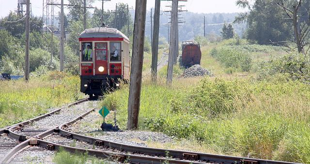

# Direct Preference Optimization for Visual Language Models

## Dataset

Preference optimisation requires data that captures user preferences. For example, you need



**❔ Question**: _What is the setting or environment in which the image takes place?_

- **❌ Rejected:** _The image is set in an open area with train tracks, grassy fields, and trees in the background._
- **✅ Chosen:** _The image depicts a train traveling on a track through a countryside setting with tall grass, trees, and power lines in the background._

For this article, we'll use the openbmb/RLAIF-V-Dataset, which contains 33k+ rows annotated in this way. Let's have a look at what this dataset looks like:

```python
>>> from datasets import load_dataset
>> load_dataset("openbmb/RLAIF-V-Dataset")
```

As this is an interaction, we need to format the entire dataset in the form of a chat. To do this, we use the following template:

```python
prompt = [{ 
  "role": "user",
  "content": [
    {"type": "image"},
    {"type": "text", "text": "What is the setting or environment in which the image takes place?"},
  ]
}]

rejected = [{ 
  "role": "assistant",
  "content": [
    { "type": "text", "text": "The image is set in an open area with train tracks, grassy fields, and trees in the background."},
  ]
}]

chosen = [{ 
  "role": "assistant",
  "content": [
    { "type": "text", "text": "The image depicts a train traveling on a track through a countryside setting with tall grass, trees, and power lines in the background."},
  ]
}]

```

```python
from datasets import load_dataset, features

def format(example):
    images = [example["image"]]
    prompt = [{
        "role": "user",
        "content": [{"type": "image"}, {"type": "text", "text": example["question"]}]
    }]
    chosen = [{
        "role": "assistant",
        "content": [{"type": "text", "text": example["chosen"]}]
    }]
    rejected = [{
      "role": "assistant",
      "content": [{"type": "text", "text": example["rejected"]}]
    }]
    return {
        "images": ,
        "prompt": prompt,
        "chosen": chosen,
        "rejected": rejected,
      }

dataset = load_dataset("openbmb/RLAIF-V-Dataset", split="train")
column_names = dataset.column_names
dataset = dataset.map(format, writer_batch_size=4, batch_size=4, remove_columns=column_names)

# Make sure that the images are decoded, it prevent from storing bytes
f = dataset.features
f["images"] = features.Sequence(features.Image(decode=True))  # to avoid bytes
dataset = dataset.cast(f)

# Split and push the formated dataset
dataset = dataset.train_test_split(test_size=0.05)
dataset.push_to_hub("HuggingFaceH4/rlaif-v_formatted")
```

## Comparing models