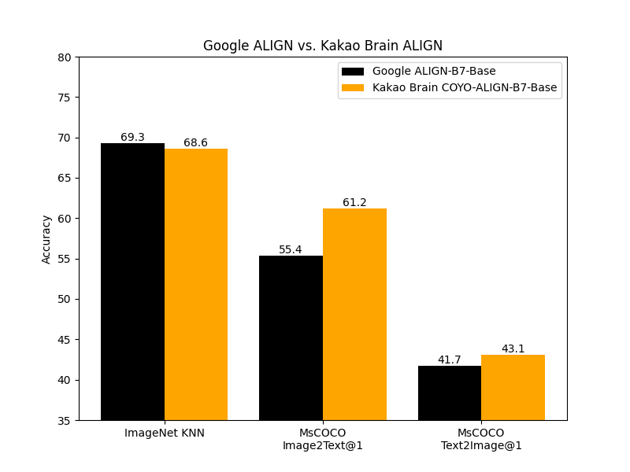
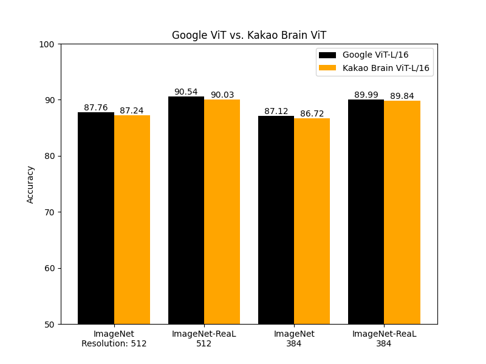
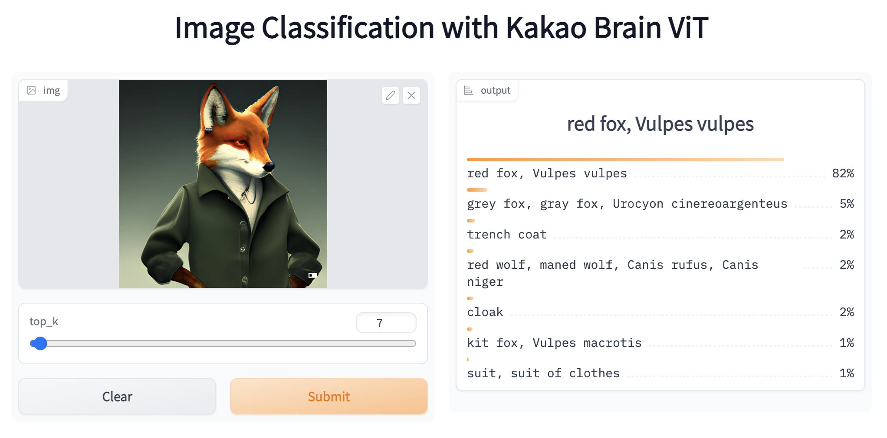

# New and Open-Source ViT and ALIGN from Kakao Brain

    <small>Published Dec 05, 2022.</small>
    <a target="_blank" class="btn no-underline text-sm mb-5 font-sans" href="https://github.com/huggingface/blog/blob/main/vit-align.md">
        Update on GitHub
    </a>

    <a href="https://huggingface.co/Unso"> 
        
        

            <code>unso</code>
            Unso Jo
        

    </a>
    <a href="https://huggingface.co/dylan-m">
        
        

            <code>dylan-m</code>
            Minwoo Byeon
        

    </a>
    <a href="https://huggingface.co/jun-untitled">
        
        

            <code>jun-untitled</code>
            Sungjun Lee
        

    </a>

# Kakao Brain’s Open Source ViT, ALIGN, and the new COYO text-image dataset

Kakao Brain and Hugging Face are excited to release a new open-source image-text dataset [`COYO`](https://github.com/kakaobrain/coyo-dataset) of 700 million pairs and two new visual language models trained on it, [ViT](https://github.com/kakaobrain/coyo-vit) and [ALIGN](https://github.com/kakaobrain/coyo-align). Kakao brain’s initiative sets itself apart from Google's ViT and ALIGN releases for its dedication to open-sourcing the dataset along with the models. 

This is the first time ever the ALIGN model is made public for free and open-source use. Google’s [ViT](https://ai.googleblog.com/2020/12/transformers-for-image-recognition-at.html) and [ALIGN](https://ai.googleblog.com/2021/05/align-scaling-up-visual-and-vision.html) models, while trained on huge datasets (ViT trained on 300 million images and ALIGN trained on 1.8 billion image-text pairs respectively), cannot be replicated because the datasets are not public. Kakao Brain’s ViT and ALIGN models follow the same architecture and hyperparamters as provided in the original [papers](google papers) respective Google models but are trained on the open source `COYO` dataset. This contribution is particularly valuable to researchers who want to reproduce visual language modeling with access to the data as well. More detailed information on the Kakao ViT and ALIGN models can be found [here](https://huggingface.co/kakaobrain).  

This blog will introduce the new `COYO` dataset, Kakao Brain's ViT and ALIGN models, and how to use them! Here are the main takeaways:

* First open-source ALIGN model ever 
* First open ViT and ALIGN models that have been trained on an open-source dataset `COYO`
* Kakao Brain's ViT and ALIGN models perform on-par with the Google versions
* ViT demo is available on HF! You can play with the ViT demo online with image samples of your own choice!
* 

## Performance Comparison

Kakao Brain's released ViT and ALIGN models perform on par and sometimes better than what Google has reported. 
Kakao Brain's `ALIGN-B7-Base` model, while trained on a much fewer pairs (700 million pairs vs 1.8 billion), performs on par with Google's `ALIGN-B7-Base` on the Image KNN classification task and better on MsCOCO retrieval image-to-text, text-to-image tasks. Kakao Brain's `ViT-L/16` performs similarly to Google's `ViT-L/16` when evaluated on ImageNet and ImageNet-ReaL at model resolution 384 and 512. This means the community can use Kakao Brain's ViT and ALIGN models to replicate Google's ViT and ALIGN releases especially when users require access to the training data.

## COYO DATASET

[COYO](https://github.com/kakaobrain/coyo-dataset#dataset-preview) is an image-text dataset of 700 million pairs similar to Google's `ALIGN 1.8B` image-text dataset which is a collection of "noisy" alt-text and image pairs from webpages, but open-source. `COYO` and `ALIGN 1.8B` are "noisy" because minimal filtering was applied. `COYO` is similar to the other open-source image-text dataset, `LAION` but with the following differences. While `LAION` 2B is a much larger dataset of 2 billion English pairs, compared to `COYO`’s 700 million pairs, `COYO` pairs come with more metadata that give users more flexibility and finer-grained control over usage. The following table shows the differences: `COYO` comes equipped with aesthetic scores for all pairs, more robust watermark scores, and face count data. 

| COYO | LAION 2B| ALIGN 1.8B |
| :----: | :----: | :----: |
| Image-text similarity score calculated with CLIP ViT-B/32 and ViT-L/14 models, they are provided as metadata but nothing is filtered out so as to avoid possible elimination bias | Image-text similarity score provided with CLIP (ViT-B/32) - only examples above threshold 0.28 | Minimal, Frequency based filtering | 
| NSFW filtering on images and text | NSFW filtering on images | [Google Cloud API](https://cloud.google.com/vision) |
| Face recognition (face count) data provided as meta-data | No face recognition data | NA | 
| 700 million pairs all English | 2 billion English| 1.8 billion | 
| From CC 2020 Oct - 2021 Aug| From CC 2014-2020|  NA |
|Aesthetic Score | Aesthetic Score Partial | NA| 
|More robust Watermark score | Watermark Score |  NA| 
|Hugging Face Hub | Hugging Face Hub | Not made public |  
| English | English | English? | 
                                                                                                  

## How ViT and ALIGN work

ViT -- Vision Transformer -- is a vision model [proposed by Google in 2020](link) that resembles the text Transformer architecture. 
It is a new approach to vision, distinct from convolutional neural nets (CNNs) that have dominated vision tasks since 2012's AlexNet. It is upto four times more computationally efficient than similarly performing CNNs and domain agnostic. ViT takes as input an image which is broken up into a sequence of image patches - just as the text Transformer takes as input a sequence of text -  and given position embeddings to each patch to learn the image structure. ViT performance is notable in particular for having an excellent performance-compute trade-off. While some of Google's ViT models are open-source, the JFT300 million image-label pair dataset they were trained on has not been released publicly. While Kakao Brain's trained and released ViT model performs similarly on various tasks, its code, model, and training data are made entirely public for reproducibility and open science.

 [Google then introduced ALIGN](https://ai.googleblog.com/2021/05/align-scaling-up-visual-and-vision.html) -- a Large-scale Image and Noisy Text Embedding model in 2021 -- a visual-language model trained on "noisy" text-image data for various vision and cross-modal tasks such as text-image retrieval. ALIGN has a simple dual-encoder architecture trained on image and text pairs, learned via a contrastive loss function. ALIGN's "noisy" training corpus is notable for balancing scale and robustness. Previously, visual language representational learning had been trained on large-scale datasets with manual labels, which require extensive preprocessing. ALIGN's corpus uses the image alt-text data, text that appears when the image fails to load, as the caption to the image -- resulting in an inevitably noisy, but much larger (1.8 billion pair) dataset that allows ALIGN to perform at SoTA levels on various tasks. Kakao Brain's ALIGN is the first open-source version of this model, trained on the `COYO` dataset and performs better than Google's reported results.

## How to use the COYO dataset
To use the `COYO` dataset, refer to the [`COYO` github page](https://github.com/kakaobrain/coyo-dataset/tree/main/download).

## How to use ViT and ALIGN from the Hub

