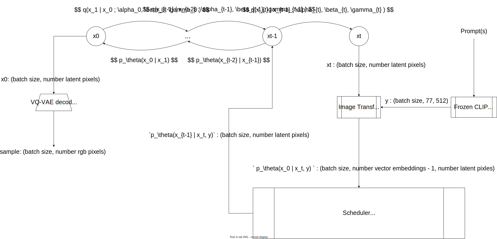

# VQ-Diffusion

{blog_metadata}
{authors}

Vector Quantized Diffusion (VQ-Diffusion) is a conditional latent diffusion model developed by the University of Science and Technology of China and Microsoft. Unlike most commonly studied diffusion models, VQ-Diffusion's noising and denoising processes operate on a quantized latent space, i.e., the latent space is composed of a discrete set of vectors. Discrete diffusion models are less explored than their continuous counterparts and offer an interesting point of comparison with autoregressive (AR) models.

- [Hugging Face model card](https://huggingface.co/microsoft/vq-diffusion-ithq)
- [Hugging Face Spaces](https://huggingface.co/spaces/patrickvonplaten/vq-vs-stable-diffusion)
- [Original Implementation](https://github.com/microsoft/VQ-Diffusion)
- [Paper](https://arxiv.org/abs/2111.14822)

### Demo

🧨 Diffusers lets you run VQ-Diffusion with just a few lines of code.

Install dependencies
```bash
pip install 'diffusers[torch]' transformers ftfy
```

Load the pipeline
```python
from diffusers import VQDiffusionPipeline

pipe = VQDiffusionPipeline.from_pretrained("microsoft/vq-diffusion-ithq")
```

If you want to use FP16 weights
```python
from diffusers import VQDiffusionPipeline
import torch

pipe = VQDiffusionPipeline.from_pretrained("microsoft/vq-diffusion-ithq", torch_dtype=torch.float16, revision="fp16")
```

Move to GPU
```python
pipe.to("cuda")
```

Run the pipeline!

```python
prompt = "A teddy bear playing in the pool."

image = pipe(prompt).images[0]
```


### Architecture



#### VQ-VAE

Images are encoded into a set of discrete "tokens" or embedding vectors using a VQ-VAE encoder. To do so, images are split in patches, and then each patch is replaced by the closest entry from a codebook with a fixed-size vocabulary. This reduces the dimensionality of the input pixel space. VQ-Diffusion uses the VQGAN variant from [Taming Transformers](https://arxiv.org/abs/2012.09841). This [blog post](https://ml.berkeley.edu/blog/posts/vq-vae/) is a good resource for better understanding VQ-VAEs.

VQ-Diffusion uses a pre-trained VQ-VAE which was frozen during the diffusion training process.

#### Forward process

In the forward diffusion process, each latent token can stay the same, be resampled to a different latent vector (each with equal probability), or be masked. Once a latent token is masked, it will stay masked. \\( \alpha_t \\), \\( \beta_t \\), and \\( \gamma_t \\) are hyperparameters that control the forward diffusion process from step \\( t-1 \\) to step \\( t \\). \\( \gamma_t \\) is the probability an unmasked token becomes masked. \\( \alpha_t + \beta_t \\) is the probability an unmasked token stays the same. The token can transition to any individual non-masked latent vector with a probability of \\( \beta_t \\). In other words, \\( \alpha_t + K \beta_t + \gamma_t = 1 \\) where \\( K \\) is the number of non-masked latent vectors. See section 4.1 of the paper for more details.

#### Approximating the reverse process

An encoder-decoder transformer approximates the classes of the un-noised latents, \\( x_0 \\), conditioned on the prompt, \\( y \\). The encoder is a CLIP text encoder with frozen weights. The decoder transformer provides unmasked global attention to all latent pixels and outputs the log probabilities of the categorical distribution over vector embeddings. The decoder transformer predicts the entire distribution of un-noised latents in one forward pass, providing global self-attention over \\( x_t \\). Framing the problem as conditional sequence to sequence over discrete values provides some intuition for why the encoder-decoder transformer is a good fit. 

The AR models section provides additional context on VQ-Diffusion's architecture in comparison to AR transformer based models.

[Taming Transformers](https://arxiv.org/abs/2012.09841) provides a good discussion on converting raw pixels to discrete tokens in a compressed latent space so that transformers become computationally feasible for image data.

### VQ-Diffusion in Context

#### Diffusion Models

Contemporary diffusion models are mostly continuous. In the forward process, continuous diffusion models iteratively add Gaussian noise. The reverse process is approximated via \\( p_{\theta}(x_{t-1} | x_t) = N(x_{t-1}; \mu_{\theta}(x_t, t), \Sigma_{\theta}(x_t, t)) \\). In the simpler case of [DDPM](https://arxiv.org/abs/2006.11239), the covariance matrix is fixed, a U-Net is trained to predict the noise in \\( x_t \\), and \\( x_{t-1} \\) is derived from the noise. 

The approximate reverse process is structurally similar to the discrete reverse process. However in the discrete case, there is no clear analog for predicting the noise in \\( x_t \\), and directly predicting the distribution for \\( x_0 \\) is a more clear objective. 

There is a smaller amount of literature covering discrete diffusion models than continuous diffusion models. [Deep Unsupervised Learning using Nonequilibrium Thermodynamics](https://arxiv.org/abs/1503.03585) introduces a diffusion model over a binomial distribution. [Argmax Flows and Multinomial Diffusion](https://arxiv.org/abs/2102.05379) extends discrete diffusion to multinomial distributions and trains a transformer for predicting the unnoised distribution for a language modeling task. [Structured Denoising Diffusion Models in Discrete State-Spaces](https://arxiv.org/abs/2107.03006) generalizes multinomial diffusion with alternative noising processes -- uniform, absorbing, discretized Gaussian, and token embedding distance. Alternative noising processes are also possible in continuous diffusion models, but as noted in the paper, only additive Gaussian noise has received significant attention.

#### Autoregressive Models

It's perhaps more interesting to compare VQ-Diffusion to AR models as they more frequently feature transformers making predictions over discrete distributions. While transformers have demonstrated success in AR modeling, they still suffer from linear decreases in inference speed for increased image resolution, error accumulation, and directional bias. VQ-Diffusion improves on all three pain points.

AR image generative models are characterized by factoring the image probability such that each pixel is conditioned on the previous pixels in a raster scan order (left to right, top to bottom) i.e. 
\\( p(x) = \prod_i p(x_i | x_{i-1}, x_{i-2}, ... x_{2}, x_{1}) \\). As a result, the models can be trained by directly maximizing the log-likelihood. Additionally, AR models which operate on actual pixel (non-latent) values, predict channel values from a discrete multinomial distribution i.e. first the red channel value is sampled from a 256 way softmax, and then the green channel prediction is conditioned on the red channel value.

AR image generative models have evolved architecturally with much work towards making transformers computationally feasible. Prior to transformer based models, [PixelRNN](https://arxiv.org/abs/1601.06759), [PixelCNN](https://arxiv.org/abs/1606.05328), and [PixelCNN++](https://arxiv.org/abs/1701.05517) were the state of the art. 

[Image Transformer](https://arxiv.org/abs/1802.05751) provides a good discussion on the non-transformer based models and the transition to transformer based models (see paper for omitted citations).

> Training recurrent neural networks to sequentially predict each pixel of even a small image is computationally very challenging. Thus, parallelizable models that use convolutional neural networks such as the PixelCNN have recently received much more attention, and have now surpassed the PixelRNN in quality. 
>
> One disadvantage of CNNs compared to RNNs is their typically fairly limited receptive field. This can adversely affect their ability to model long-range phenomena common in images, such as symmetry and occlusion, especially with a small number of layers. Growing the receptive field has been shown to improve quality significantly (Salimans et al.). Doing so, however, comes at a significant cost in number of parameters and consequently computational performance and can make training such models more challenging. 
>
> ... self-attention can achieve a better balance in the trade-off between the virtually unlimited receptive field of the necessarily sequential PixelRNN and the limited receptive field of the much more parallelizable PixelCNN and its various extensions.

[Image Transformer](https://arxiv.org/abs/1802.05751) uses transformers by restricting self attention over local neighborhoods of pixels.

[Taming Transformers](https://arxiv.org/abs/2012.09841) and [DALL-E 1](https://arxiv.org/abs/2102.12092) combine convolutions and transformers. Both train a VQ-VAE to learn a discrete latent space, and then a transformer is trained in the compressed latent space. The transformer context is global but masked, because attention is provided over all previously predicted latent pixels, but the model is still AR so attention cannot be provided over not yet predicted pixels.

[ImageBART](https://arxiv.org/abs/2108.08827) combines convolutions, transformers, and diffusion processes. It learns a discrete latent space that is further compressed with a short multinomial diffusion process. Separate encoder-decoder transformers are then trained to reverse each step in the diffusion process. The encoder transformer provides global context on \\( x_t \\) while the decoder transformer autoregressively predicts latent pixels in \\( x_{t-1} \\). As a result, each pixel receives global cross attention on the more noised image. Between 2-5 diffusion steps are used with more steps for more complex datasets.

Despite having made tremendous strides, AR models still suffer from linear decreases in inference speed for increased image resolution, error accumulation, and directional bias. For equivalently sized AR transformer models, the big-O of VQ-Diffusion's inference is better so long as the number of diffusion steps is less than the number of latent pixels. For the ITHQ dataset, the latent resolution is 32x32 and the model is trained up to 100 diffusion steps for an ~10x big-O improvement. In practice, VQ-Diffusion "can be 15 times faster than AR methods while achieving a better image quality" (see [paper](https://arxiv.org/abs/2111.14822) for more details). Additionally, VQ-Diffusion does not require teacher-forcing and instead learns to correct incorrectly predicted tokens. During training, noised images are both masked and have latent pixels replaced with random tokens. VQ-Diffusion is also able to provide global context on \\( x_t \\) while predicting \\( x_{t-1} \\).

### Further steps with VQ-Diffusion and 🧨 Diffusers

So far, we've only ported the VQ-Diffusion model trained on the ITHQ dataset. There are also [released VQ-Diffusion models](https://github.com/microsoft/VQ-Diffusion#pretrained-model) trained on CUB-200, Oxford-102, MSCOCO, Conceptual Captions, LAION-400M, and ImageNet.

VQ-Diffusion also supports a faster inference strategy. The network reparameterization relies on the posterior of the diffusion process conditioned on the un-noised image being tractable. A similar formula applies when using a time stride, \\( \Delta t \\), that skips a number of reverse diffusion steps, \\( p_\theta (x_{t - \Delta t } | x_t, y) = \sum_{\tilde{x}_0=1}^{K}{q(x_{t - \Delta t} | x_t, \tilde{x}_0)} p_\theta(\tilde{x}_0 | x_t, y) \\).

[Improved Vector Quantized Diffusion Models](https://arxiv.org/abs/2205.16007) improves upon VQ-Diffusion's sample quality with discrete classifier-free guidance and an alternative inference strategy to address the "joint distribution issue" -- see section 3.2 for more details. Discrete classifier-free guidance is merged into diffusers but the alternative inference strategy has not been added yet.

Contributions are welcome!
