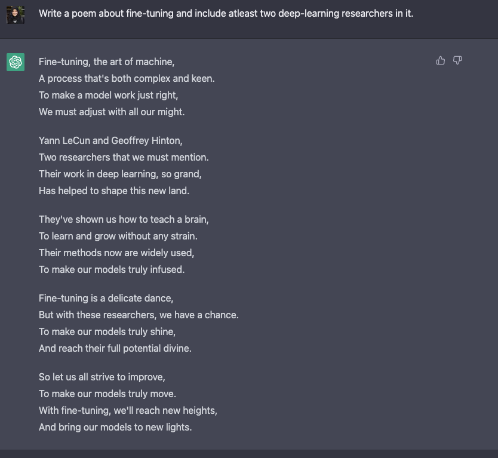

# 是什么让对话代理有用？
## ChatGPT 背后的技术：RLHF、IFT、CoT、红蓝对抗等


近段时间，ChatGPT 横空出世并获得巨大成功，使得 RLHF、SFT、IFT、CoT 等这些晦涩的缩写开始出现在普罗大众的讨论中。这些晦涩的首字母缩略词究竟是什么意思？为什么它们如此重要？我们调查了相关的所有重要论文，以对这些工作进行分类，总结迄今为止的工作，并对后续工作进行展望。

我们先来看看基于语言模型的会话代理的全景。ChatGPT 并非首创，事实上很多组织在 OpenAI 之前就发布了自己的语言模型对话代理 (dialog agents)，包括 Meta 的 [BlenderBot](https://arxiv.org/abs/2208.03188)，Google 的 [LaMDA](https://arxiv.org/abs/2201.08239)，DeepMind 的 [Sparrow](https://arxiv.org/abs/2209.14375)，以及 Anthropic 的 [Assistant](https://arxiv.org/abs/2204.05862) (*Anthropic 的 Claude 就是部分基于 Assistant 继续开发而得的*)。其中一些团队还公布了他们构建开源聊天机器人的计划，并公开分享了路线图 (比如 LAION 团队的 [Open Assistant](https://github.com/LAION-AI/Open-Assistant))，其他团队肯定也有类似的内容，但尚未宣布。

下表根据是否能公开访问、训练数据、模型架构和评估方向的详细信息对这些 AI 聊天机器人进行了比较。ChatGPT 没有这些信息的记录，因此我们改为使用 InstructGPT 的详细信息，这是一个来自 OpenAI 的指令微调模型，据信它是 ChatGPT 的基础。

| &nbsp;| LaMDA | BlenderBot 3 |Sparrow | ChatGPT/ InstructGPT | Assistant|
| --- | --- | --- | --- | --- | --- |
| **组织** | Google | Meta | DeepMind | OpenAI | Anthropic |
| **能否公开访问**  | 否 | 能 | 否 | 有限 | 否 |
| **大小** | 137B | 175B | 70B | 175B | 52B |
| **预训练<br>基础模型** | 未知 | OPT | Chinchilla | GPT-3.5 | 未知 |
| **预训练语料库大小** (词数) | 2.81T | 180B | 1.4T | 未知 | 400B |
| **模型是否可以<br>访问网络** | ✔ | ✔ | ✔ | ✖️ | ✖️ |
| **有监督<br>微调** | ✔ | ✔ | ✔ | ✔ | ✔ |
| **微调<br>数据大小** | 质量：6.4K<br>安全性：8K<br>真实性：4K<br>IR：49K | 大小从 18K 到 1.2M 不等的 20 个 NLP 数据集 | 未知 | 12.7K (此为 InstructGPT，ChatGPT 可能更多) | 150K+ LM 生成的数据 |
| **RLHF** | ✖️ | ✖️ | ✔ | ✔ | ✔ |
| **人为制定的安全规则** | ✔ | ✖️ | ✔ | ✖️ | ✔ |
| **评价标准** | 1、质量 (合情性、具体性、趣味性)<br>2、安全性 (偏见)<br>3、真实性 |1、质量 (参与度、知识运用)<br>2、安全性 (毒性、偏见) | 1、校直 (有帮助，无害，正确)<br>2、证据 (来自网络)<br>3、是否违反规则<br>4、偏见和刻板印象<br>5、诚信度 | 1、 校直 (有帮助、无害、真实)<br>2、偏见 | 1、校直 (有帮助、无害、诚实)<br>2、偏见 |
| **用于数据标注的众包平台**| 美国供应商 | 亚马逊 MTurk | 未知 | Upwork 和 Scale AI | Surge AI、Amazon MTurk 和 Upwork |

我们观察到，尽管在训练数据、模型和微调方面存在许多差异，但也存在一些共性。上述所有聊天机器人的一个共同目标是 **指令依从 (instruction following)**，即遵循用户指定的指令。例如，要求 ChatGPT 写一首关于微调的诗。



### 从预测文本到遵循指令

通常，基础模型的语言建模目标不足以让模型学会以有用的方式遵循用户的指令。模型创建者使用 **指令微调 (Instruction Fine-Tuning，IFT)** 方法来达到该目的，该方法除了使用情感分析、文本分类、摘要等经典 NLP 任务来微调模型外，还在非常多样化的任务集上向基础模型示范各种书面指令及其输出，从而实现对基础模型的微调。这些指令示范由三个主要部分组成 —— 指令、输入和输出。输入是可选的，一些任务只需要指令，如上文使用 ChatGPT 做开放式文本生成的示例。当存在输入时，输入和输出组成一个**实例 (instance)**。给定指令可以有多个输入和输出实例。如下例 (摘自 [Wang 等, '22])：


IFT 的训练数据通常是人工编写的指令及用语言模型自举 (bootstrap) 生成的实例的集合。在自举时，先使用少样本技术输入一些样本给 LM 用于提示它 (如上图所示)，随后要求 LM 生成新的指令、输入和输出。每一轮都会从人工编写的样本和模型生成的样本中各选择一些送给模型。人类和模型对创建数据集的贡献构成了一个谱图，见下图：


谱图的一端是纯模型生成的 IFT 数据集，例如 Unnatural Instructions ([Honovich 等，'22](https://arxiv.org/abs/2212.09689))；另一端是经由社区的大量努力精心制作的指令如 Super-natural instructions ([Wang 等，'22](https://arxiv.org/abs/2204.07705))。在这两者之间的工作是使用一小组高质量的种子数据集，然后进行自举生成最终数据集，如 Self-Instruct ([Wang 等，'22](https://arxiv.org/pdf/2212.10560.pdf))。为 IFT 整理数据集的另一种方法是将现有的用于各种任务 (包括提示)的高质量众包 NLP 数据集使用统一模式或不同模板转换为指令。这一系列工作包括 T0 ([Sanh 等，'22](https://arxiv.org/pdf/2110.08207.pdf))、Natural instructions 数据集 ([Mishra 等，'22](https://arxiv.org/pdf/2104.08773.pdf))、FLAN LM ([Wei 等，'22](https://arxiv.org/pdf/2109.01652.pdf)) 和 OPT-IML ([Iyer 等，'22](https://arxiv.org/pdf/2212.12017.pdf))。

### 安全地遵循指令

然而，经过指令微调的 LM 并不总是能生成 **有帮助的** 和 **安全的** 响应。这种行为的例子包括通过总是给出无益的回应来逃避，例如 “对不起，我不明白。” 或对敏感话题的用户输入生成不安全的响应。为了减轻这种行为，模型开发人员使用 **有监督微调 (Supervised Fine-tuning, SFT)**，在高质量的人类标注数据上微调基础语言模型，以提高有用性和无害性。例如，请参阅下面的表格（摘自 Sparrow 论文的附录 F)。

SFT 和 IFT 联系非常紧密。指令微调可以看作是有监督微调的一个子集。在最近的文献中，SFT 阶段经常被用于提高响应的安全性，而不是接在 IFT 后面提高指令相应的具体性。将来，这种分类和划分应该日臻成熟，形成更清晰的使用场景和方法论。


谷歌的 LaMDA 也根据一组规则 (论文附录 A) 在带有安全标注的对话数据集上进行微调。这些规则通常由模型创建者预先定义和开发，涵盖广泛的主题，包括伤害、歧视、错误信息。

### 微调模型

同时，OpenAI 的 InstructGPT、DeepMind 的 Sparrow 和 Anthropic 的 Constitutional AI 使用 **人类反馈强化学习 (Reinforcement Learning From Human Feedback，RLHF)** 来微调模型，该方法使用基于人类偏好的标注数据。在 RLHF 中，根据人类反馈来对模型的响应进行排序标注 (如，根据人类偏好选择文本简介)。然后，用这些带标注的响应来训练偏好模型，该模型用于返回 RL 优化器的标量奖励。最后，通过强化学习训练对话代理来模拟偏好模型。有关更多详细信息，请参阅我们之前关于 RLHF 的文章: [ChatGPT 背后的“功臣”——RLHF 技术详解](https://huggingface.co/blog/zh/rlhf)。

思维链 **(Chain-of-thought，CoT)** 提示 ([Wei 等，'22](https://arxiv.org/abs/2201.11903) 是指令示范的一种特殊情况，它通过引发对话代理的逐步推理来生成输出。使用 CoT 微调的模型使用带有逐步推理的人工标注的指令数据集。这是 **[Let’s think step by step](https://arxiv.org/abs/2205.11916)** 这一著名提示的由来。下面的示例取自 [Chung 等，'22](https://arxiv.org/pdf/2210.11416.pdf)，橙色高亮的部分是指令，粉色是输入和输出，蓝色是 CoT 推理。


如 [Chung 等，'22](https://arxiv.org/pdf/2210.11416.pdf) 中所述，使用 CoT 微调的模型在涉及常识、算术和符号推理的任务上表现得更好。

如 [Bai 等，'22](https://www.anthropic.com/constitutional.pdf) 的工作所示，CoT 微调也显示出对无害性非常有效 (有时比 RLHF 做得更好)，而且对敏感提示，模型不会回避并生成 “抱歉，我无法回答这个问题” 这样的回答。更多示例，请参见其论文的附录 D。


## 要点

1. 与预训练数据相比，您只需要非常小的一部分数据来进行指令微调 (几百个数量级)；
2. 使用人工标注的有监督微调使模型输出更安全和有用；
3. CoT 微调提高了模型在需要逐步思考的任务上的性能，并使它们在敏感话题上不那么回避。

## 对话代理的进一步工作

这个博客总结了许多关于使对话代理有用的现有工作。但仍有许多悬而未决的问题有待探索。我们在这里列出了其中的一些。

1. RL 在从人类反馈中学习有多重要？我们能否通过在 IFT 或 SFT 中使用更高质量的数据进行训练来获得 RLHF 的性能？
2. 为了安全的角度看，Sparrow 中的 SFT+RLHF 与 LaMDA 中仅使用 SFT 相比如何？
3. 鉴于我们有 IFT、SFT、CoT 和 RLHF，预训练有多大的必要性？如何折衷？人们应该使用的最佳基础模型是什么 (公开的和非公开的)？
4. 本文中引用的许多模型都经过 [红蓝对抗 (red-teaming)](https://arxiv.org/abs/2209.07858) 的精心设计，工程师特地搜寻故障模式并基于已被揭示的问题改进后续的训练 (提示和方法)。我们如何系统地记录这些方法的效果并重现它们？

P.s. 如果您发现本博客中的任何信息缺失或不正确，请告知我们。

****************引用****************

`Rajani et al., "What Makes a Dialog Agent Useful?", Hugging Face Blog, 2023.`

BibTeX 引用:

```
@article{rajani2023ift,
  author = {Rajani, Nazneen and Lambert, Nathan and Sanh, Victor and Wolf, Thomas},
  title = {What Makes a Dialog Agent Useful?},
  journal = {Hugging Face Blog},
  year = {2023},
  note = {https://huggingface.co/blog/dialog-agents},
}
```
