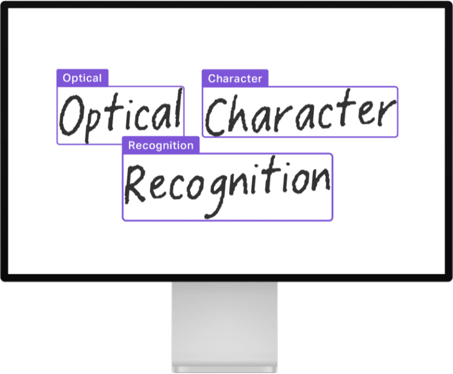
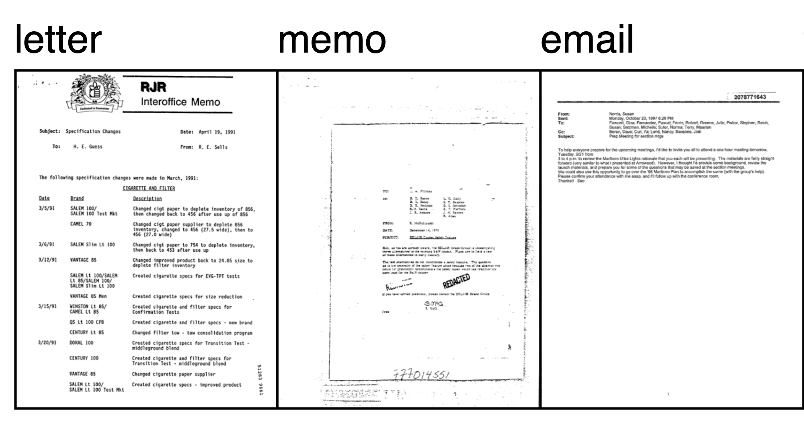
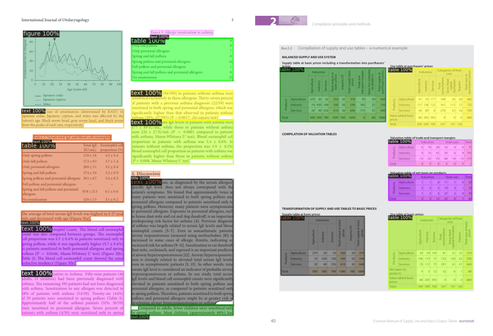
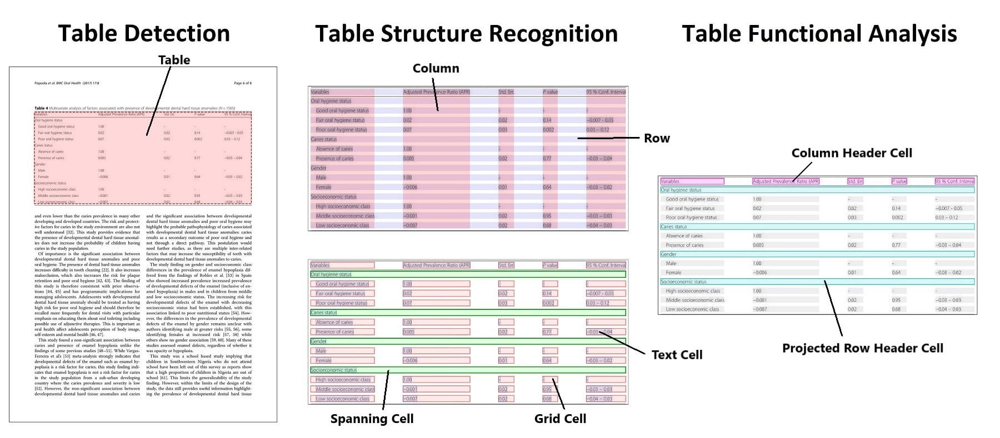

# 加速 Document AI (文档智能) 发展

在企业的数字工作流中充满了各种文档，包括信件、发票、表格、报告、收据等，我们无法自动提取它们的知识。如今随着文本、视觉和多模态人工智能的进步，我们有可能解锁这些知识，这篇文章向你展示了你的团队该如何使用开源模型来构建免费的定制化解决方案。

Document AI 包括了许多数据科学的任务，包括 [图像分类](https://huggingface.co/tasks/image-classification)、[图像转文本](https://huggingface.co/tasks/image-to-text) (image to text)、[文档回答](https://huggingface.co/tasks/document-question-answering) (document question answering) 、[表格回答](https://huggingface.co/tasks/table-question-answering) (table question answering) 以及 [视觉回答](https://huggingface.co/tasks/visual-question-answering) (visual question answering) 。

本文将向大家介绍 Document AI 中的六种不同使用场景，以及它们的最佳开源模型，之后重点分三个方面介绍了许可、数据准备和建模问题，在文章中，有一些 Web 演示、文档和模型的链接。

## 六大使用场景

构建 Document AI 解决方案至少有六个使用场景，这些使用场景在文档输入和输出的数据结构上有所不同，在解决具体的企业 Document AI 问题时，往往需要综合各种方法。

### 1. 光学字符识别 (OCR)

将打字、手写或打印的文本变成机器编码的文本，这一过程被称为光学字符识别 (OCR)。这是一个被广泛研究的问题，有许多成熟的开源和商业产品，图中展示了一个将手写文字转换为文本的案例：

OCR 是 Document AI 使用场景的支柱，它对于将文本转化为计算机可读的东西至关重要，一些广泛使用的模型是 [EasyOCR](https://huggingface.co/spaces/tomofi/EasyOCR) 或 [PaddleOCR](https://huggingface.co/spaces/PaddlePaddle/PaddleOCR) ，它们在文档层面上运行。还有一些模型在单行文本图像上运行，比如 [TrOCR：基于转化器的光学字符识别与预训练模型](https://huggingface.co/docs/transformers/model_doc/trocr)，这个模型与 CRAFT 这样的文本检测模型一起工作，它首先以边界框的形式识别文档中的单个文本「片断」。

OCR 的相关指标是字符错误率 ( CER ) 和 word-level 精度、召回率和 F1。在 [这个空间](https://huggingface.co/spaces/tomofi/CRAFT-TrOCR) 可以看到 CRAFT 和 TrOCR 的演示。       
 
### 2. 文档图像分类

将文档归入适当的类别，如表格、发票或信件，被称为文档图像分类。

分类的对象可以选择文档的图像和文本中的一种或两种，最近，出现了一些更为先进的采用视觉结构和底层文本的多模态模型，它们的加入极大地提高了分类器的性能。

一个基本的方法是在文档图像上应用 OCR，然后使用类似 BERT 的模型进行分类，然而，[BERT](https://huggingface.co/docs/transformers/model_doc/bert) 模型并不能考虑到任何布局或视觉信息，同时参考 [RVL-CDIP](https://huggingface.co/datasets/rvl_cdip) 数据集的图，我们可以看到不同文档类型的视觉结构是不同的：

这就是 [LayoutLM](https://huggingface.co/docs/transformers/model_doc/layoutlmv3) 和 [Donut](https://huggingface.co/docs/transformers/model_doc/donut) 等多模态模型发挥作用的地方，由于同时纳入了文本和视觉信息，这些模型可以极大地提高准确性，在 [RVL-CDIP](https://huggingface.co/datasets/rvl_cdip) (文档图像分类的一个重要基准数据集) 上：

* 基于 BERT 的模型仅使用文本，实现了 89% 的准确率；
* [DiT](https://huggingface.co/docs/transformers/main/en/model_doc/dit) (Document image Transformer) 仅使用视觉，可以达到 92% 的准确率；
* 而像 LayoutLMv3 和 Donut 这样使用多模态 Transformer 将文本和视觉信息结合起来的模型，可以达到 95% 的准确率，它们正在改变从业者解决 Document AI 问题的方法。

### 3. 文档布局分析 (Document layout analysis)    

文档布局分析是确定文档物理结构的任务，即确定构成文档的各个组成部分，如文本段落、标题和表格

这项任务通常是通过将其作为一个图像分割 (image segmentation) 、物体检测 (object detection)  问题来解决，该模型的输出为一组分割掩码 / 边界框，以及类别名称。

目前最先进的文档布局分析模型是 [LayoutLMv3](https://huggingface.co/docs/transformers/model_doc/layoutlmv3) 和 [DiT](https://huggingface.co/docs/transformers/model_doc/dit) (Document image Transformer) 。这两种模型都使用经典的 [Mask R-CNN](https://arxiv.org/abs/1703.06870) 框架作为对象检测的骨架。这个 [文档布局分析](https://huggingface.co/spaces/nielsr/dit-document-layout-analysis) 空间说明了 [DiT](https://github.com/microsoft/unilm/tree/master/dit) 模型如何被用来识别文档中的文本段、标题和表格。这里展示了一个使用 DiT 检测文档不同部分的例子：

文档布局分析通常使用 mAP (平均精度) 指标来评估对象检测模型，使用 [PubLayNet](https://github.com/ibm-aur-nlp/PubLayNet) 数据集作为重要基准，截至本文写作，最先进的模型是 [LayoutLMv3](https://huggingface.co/docs/transformers/main/en/model_doc/layoutlmv3)，其总体 mAP 得分为 0.951 ([点击](https://paperswithcode.com/sota/document-layout-analysis-on-publaynet-val) 查看各模型精度对比) 。

### 4. 文档解析

比布局分析更进一步的是文档解析，文档解析的目标是识别和提取文档中的关键信息，比如识别发票表格中的名称、项目和总数，点击 [LayoutLMv2 Space](https://huggingface.co/spaces/nielsr/LayoutLMv2-FUNSD) Space 可以了解如何解析文档，识别问题、答案和标题。

LayoutLM 的第一个版本 (现在称为 LayoutLMv1) 于 2020 年发布，显著提高了当时存在的基准，如今它仍然是 Hugging Face Hub 上最受欢迎的模型之一，用于 Document AI。[LayoutLMv2](https://huggingface.co/docs/transformers/main/en/model_doc/layoutlmv2) 和 [LayoutLMv3](https://huggingface.co/docs/transformers/main/en/model_doc/layoutlmv3) 在预训练期间纳入了视觉特征，相比于第一代提供了一个改进。LayoutLM 系列让 Document AI 的性能方面产生了阶梯式的变化。例如，在 [FUNSD](https://guillaumejaume.github.io/FUNSD/) 基准数据集上，BERT 模型的 F1 指标层面得分是 60%，但使用 LayoutLM，就有可能达到 90%!

LayoutLMv1 现在有许多继承者：

* Donut 建立在 LayoutLM 的基础上，但可以把图像作为输入，所以它不需要一个单独的 OCR 引擎；
* [ERNIE-Layout](https://arxiv.org/abs/2210.06155) 最近被发布了，并取得了令人鼓舞的成果，请看 [Space](https://huggingface.co/spaces/PaddlePaddle/ERNIE-Layout)

对于多语言的使用情况，LayoutLM 有一些多语言的变种，比如 [LayoutXLM](https://huggingface.co/docs/transformers/model_doc/layoutxlm) 和 [LiLT](https://huggingface.co/docs/transformers/main/en/model_doc/lilt)，这张来自 LayoutLM 论文的图展示了 LayoutLM 对一些不同文档的分析：

虽然数据科学家发现文档布局分析和提取是企业的关键使用场景，但由于大多数企业数据在内容和结构上的多样性，现有的通用商业解决方案通常无法处理。因此，数据科学团队通常可以微调自己的模型来超越现有的商业工具。

### 5. 表格检测、内容提取和结构识别

文档通常包含表格，而大多数 OCR 工具在表格数据上的工作效果并不十分理想，无法做到开箱即用，这就需要表格的检测，内容提取和结构识别工作。

检测的任务是识别表格的位置，提取则是对该信息进行结构化表示，结构识别是识别构成表格的各个部分的任务，如行、列和单元。更进一步表格功能分析 (Functional Analysis) 是识别表的键 (key) 和值 (value) 的任务，下图 [Table transformer](https://github.com/microsoft/table-transformer) 的图说明了各个子任务之间的区别。

表格检测和结构识别的方法与文档布局分析类似，使用对象检测模型，输出为一组边界框和相应的类。最新的方法，如 Table Transformer ，可以用同一个模型实现表的检测和表的结构识别。

[Table Transformer](https://huggingface.co/docs/transformers/main/en/model_doc/table-transformer) 是一个类似 [DETR](https://huggingface.co/docs/transformers/model_doc/detr) 的对象检测模型，在 PubTables-1M  (由一百万张表组成的数据集) 上进行训练。表的检测和识别的评估通常采用平均精度 (AP) 指标。据报告，在 [PubTables-1M](https://arxiv.org/abs/2110.00061) 数据集上， Table Transformer 的性能在表检测方面的 AP 为 0.966，在表结构识别 + 功能分析方面的 AP 为 0.912。

虽然表格检测和提取有了一个令人兴奋的方法，但在你的数据上，结果可能是不同的，根据我们的经验，不同表格的质量和格式差别很大，这会影响模型的表现，所以在一些自定义的数据上进行额外的微调将大大改善性能。

### 6. 文档回答 (DocVQA)

文档上的问题回答 ( Question Answering) 已经极大地改变了人们与人工智能的交互方式，最近的进展使得要求模型回答关于图像的问题成为可能 —— 这被称为文档视觉回答，或简称 [DocVQA dataset](https://rrc.cvc.uab.es/?ch=17) 。

在得到一个问题后，模型会分析图像，并回答一个答案，下图是 DocVQA 数据集 的一个例子：

* 用户问道："提到写的邮政编码吗？"
* 模型回答说：" 是的。

在过去，建立一个 DocVQA 系统往往需要多个模型一起工作，比如用单独的模型来分析文档布局、执行 OCR 、提取实体，然后再使用一个模型回答问题。而最新的 DocVQA 模型能够以端到端的方式进行问题回答，只需要一个 (多模态) 模型。

DocVQA 通常使用平均归一化列文斯坦相似度 ( ANLS ) 指标进行评估，关于这个指标的更多细节，我们可以参考 [这个指南](https://rrc.cvc.uab.es/?ch=11&com=tasks)。

在 DocVQA 基准上，目前最先进的是 [LayoutLMv3](https://huggingface.co/docs/transformers/model_doc/layoutlmv3)，这个模型由 OCR + 多模态 Transformer 组成，它的 ANLS 得分达到了 83.37；
而使用单一的编码器 - 解码器 Transformer 以端到端的方式解决任务的 [Donut](https://huggingface.co/docs/transformers/model_doc/donut) 模型没有提供最先进的准确性，只是展示了使用类似 T5 的生成模型的端到端方法的巨大潜力；

Impira 开发了一个令人兴奋的 [space](https://huggingface.co/spaces/impira/docquery)，说明了 DocVQA 的 LayoutLM 和 Donut。

虽然视觉回答是是可信的，但若要成功地使用它，有许多注意事项，需要团队拥有准确的训练数据、评估指标和后处理过程。

还要注意 DocVQA 的正常工作也可能出问题：在某些情况下，回答可能是不可预测的，模型可能会出现 "幻觉"，给出一个不在文档中出现的答案，以及视觉回答模型可以继承数据中的偏见，从而引发道德问题，所以要建立一个成功的 DocVQA 解决方案，确保正确的模型设置和后处理十分必要。

## Document AI 中的许可 (License) 问题          

工业界和学术界为推进 Document AI 做出了巨大贡献，有各种各样的模型和数据集可供数据科学家使用。然而，对于建立一个企业解决方案来说，许可证可能是一个不小的问题，一些著名的模型会有限制性许可，它们无法商用，比如最值得警惕的：微软的 [LayoutLMv2](https://huggingface.co/docs/transformers/main/en/model_doc/layoutlmv2) 和 [LayoutLMv3](https://huggingface.co/docs/transformers/main/en/model_doc/layoutlmv3)  的 checkpoints。

当你开始一个项目时，应该仔细评估潜在的模型的许可证情况，在一开始就知道你想使用哪些模型，因为这会影响数据的收集和注释，本文末尾有一个流行模型的表格，其中有它们的许可授权相关信息。

## Document AI 中的数据准备问题    

Document AI 的数据准备很关键，并具有一定挑战性，需要有正确注释的数据，以下是我们在数据准备方面学到的一些经验和方法：

1. 机器学习取决于你的数据规模和质量，如果你文档里面的图像质量很差，你不能指望人工智能能够神奇地阅读这些文档，同样地，如果你的训练数据很小，且有很多不同数据类型，模型的表现可能会很差，Document AI 就像机器学习中的其他问题一样，数据越大，性能越好。
2. 在方法上要灵活，你可能需要测试几种不同的方法来找到最佳解决方案。一个很好的例子是 OCR ，你可以使用像 Tesseract 这样的开源产品、像 Cloud Vision API 这样的商业解决方案，或者像 [Donut](https://huggingface.co/docs/transformers/model_doc/donut) 这样的开源多模态模型内部的 OCR 能力。
3. 从小处开始，仔细评估你的表现。根据我们的经验，你可以通过几百个文档获得良好的结果，所以先注释少量数据 (annotating data) ，并明智地选择模型工具。缩小了整体方法，就可以开始扩大数据的规模，最大限度地提高你的预测准确性。在注释时，记住一些任务，如布局识别和文档提取，需要识别文档中的特定区域，要确保注释工具支持它的边界框 (bounding boxes) 。

## Document AI 中的模型构建   

构建模型的灵活性为数据科学家带来了许多选择，我们强烈建议团队从预训练的开源模型开始，根据你的具体文档微调模型，这通常是获得好模型的最快途径。对于考虑建立自己的预训练模型的团队，请注意这可能涉及到数百万的文档，并且很容易耗费几周的时间来训练一个模型。建立一个预训练的模型需要很大的努力，不建议大多数数据科学团队使用。

如果选择从微调一个模型开始，首先要问自己这些问题：

1. 你想让模型来处理 OCR 吗？例如，Donut 不需要对文档进行 OCR 处理，直接在全分辨率的图像上工作，所以在建模之前不需要 OCR 。当然，根据你的问题设置，单独获取 OCR 可能更简单。
2. 你应该使用更高分辨率的图像吗？当使用 [LayoutLMv2](https://huggingface.co/docs/transformers/main/en/model_doc/layoutlmv2) 的图像时，它将图像缩减为 224 乘 224，而 [Donut]() 则使用完整的高分辨率图像。然而，使用完整的高分辨率图像会极大地增加训练和推理所需的内存。
3. 你是如何评估这个模型的？注意错位的边界框，确保 OCR 引擎提供的边界框与模型处理器相一致。其次，让你的项目要求指导你的评估指标。例如，在一些任务中，如标记分类或问题回答，100% 的匹配可能不是最好的衡量标准，像部分匹配这样的指标可以让更多的潜在标记得到考虑，比如 "Acme" 和 "internal Acme" 可以作为匹配。最后，在评估过程中要考虑道德问题，因为这些模型可能是在使用有偏见的数据，或提供不稳定的结果，可能对某些人群有偏见。

### 接下来的步骤

你是否看到了 Document AI 的无限可能性？我们每天都在利用最先进的视觉和语言模型释放有价值的数据帮助企业，我们在这篇文章中包含了各种 demo 的链接，所以可以把它们作为一个起点。这篇文章的最后一节包含了开始编写你自己的模型的资源，例如视觉回答模型，一旦你准备好开始建立你的解决方案，[Hugging Face 模型中心](https://huggingface.co/models) 是一个不错的起点，它托管了大量的 Document AI 模型。

如果你想加速 Document AI 工作，Hugging Face 可以帮助你：通过我们的 [企业加速计划](https://huggingface.co/support)，我们与企业合作，为人工智能使用场景提供指导，对于 Document AI ，我们会帮助您建立一个预训练模型，提高微调任务的准确性，或为你的第一个 Document AI 案例提供总体指导。我们还可以提供计算积分，以便您大规模地使用我们的训练 (AutoTrain) 或推理 (Spaces 或 Inference Endpoints) 产品。

### 资源

许多 Document AI 模型的笔记本和教程可以在以下网站找到。

- Niels' [Transformers-Tutorials](https://github.com/NielsRogge/Transformers-Tutorials)
- Philipp's [Document AI with Hugging Face Transformers](https://github.com/philschmid/document-ai-transformers) 

我们还整理了 Document AI 最流行的开源模型以及其指标：

| model | paper | license | checkpoints |
| --- | --- | --- | --- |
| [Donut](https://huggingface.co/docs/transformers/main/en/model_doc/donut#overview) | [arxiv](https://arxiv.org/abs/2111.15664) | [MIT](https://github.com/clovaai/donut#license) | [huggingface](https://huggingface.co/models?other=donut) |
| [LayoutLM](https://huggingface.co/docs/transformers/model_doc/layoutlm) | [arxiv](https://arxiv.org/abs/1912.13318) | [MIT](https://github.com/microsoft/unilm/blob/master/LICENSE) | [huggingface](https://huggingface.co/models?other=layoutlm) |
| [LayoutXLM](https://huggingface.co/docs/transformers/model_doc/layoutxlm) | [arxiv](https://arxiv.org/abs/2104.08836) | [CC BY-NC-SA 4.0](https://github.com/microsoft/unilm/tree/master/layoutxlm) | [huggingface](https://huggingface.co/microsoft/layoutxlm-base) |
| [LayoutLMv2](https://huggingface.co/docs/transformers/main/en/model_doc/layoutlmv2) | [arxiv](https://arxiv.org/abs/2012.14740) | [CC BY-NC-SA 4.0](https://github.com/microsoft/unilm/tree/master/layoutlmv2) | [huggingface](https://huggingface.co/models?other=layoutlmv2) |
| [LayoutLMv3](https://huggingface.co/docs/transformers/main/en/model_doc/layoutlmv3) | [arxiv](https://arxiv.org/abs/2204.08387) | [CC BY-NC-SA 4.0](https://github.com/microsoft/unilm/tree/master/layoutlmv3) | [huggingface](https://huggingface.co/models?other=layoutlmv3) |
| [DiT](https://huggingface.co/docs/transformers/model_doc/dit) | [arxiv](https://arxiv.org/abs/2203.02378) | [CC BY-NC-SA 4.0](https://github.com/microsoft/unilm/tree/master/dit) | [huggingface](https://huggingface.co/models?other=dit) |
| [TrOCR](https://huggingface.co/docs/transformers/main/en/model_doc/trocr) | [arxiv](https://arxiv.org/abs/2109.10282) | [MIT](https://github.com/microsoft/unilm/blob/master/LICENSE) | [huggingface](https://huggingface.co/models?search=trocr) |
| [Table Transformer](https://huggingface.co/docs/transformers/main/en/model_doc/table-transformer) | [arxiv](https://arxiv.org/abs/2110.00061) | [MIT](https://github.com/microsoft/table-transformer/blob/main/LICENSE) | [huggingface](https://huggingface.co/models?other=table-transformer) |
| [LiLT](https://huggingface.co/docs/transformers/main/en/model_doc/lilt) | [arxiv](https://arxiv.org/abs/2202.13669) | [MIT](https://github.com/jpWang/LiLT/blob/main/LICENSE) | [huggingface](https://huggingface.co/models?other=lilt) |

以及基准数据集：

| task | typical metrics | benchmark datasets |
| --- | --- | --- |
| Optical Character Recognition | Character Error Rate (CER) |  |
| Document Image Classification | Accuracy, F1 | [RVL-CDIP](https://huggingface.co/datasets/rvl_cdip) |
| Document layout analysis | mAP (mean average precision) | [PubLayNet](https://github.com/ibm-aur-nlp/PubLayNet), [XFUND](https://github.com/doc-analysis/XFUND)(Forms) |
| Document parsing | Accuracy, F1 | [FUNSD](https://guillaumejaume.github.io/FUNSD/), [SROIE](https://huggingface.co/datasets/darentang/sroie/), [CORD](https://github.com/clovaai/cord) |
| Table Detection and Extraction | mAP (mean average precision) | [PubTables-1M](https://arxiv.org/abs/2110.00061) |
| Document visual question answering | Average Normalized Levenshtein Similarity (ANLS) | [DocVQA](https://rrc.cvc.uab.es/?ch=17) |
