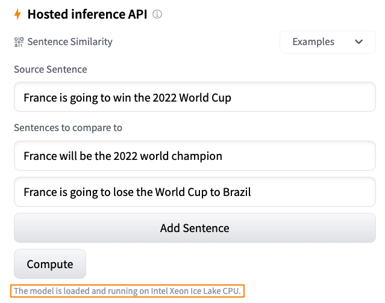
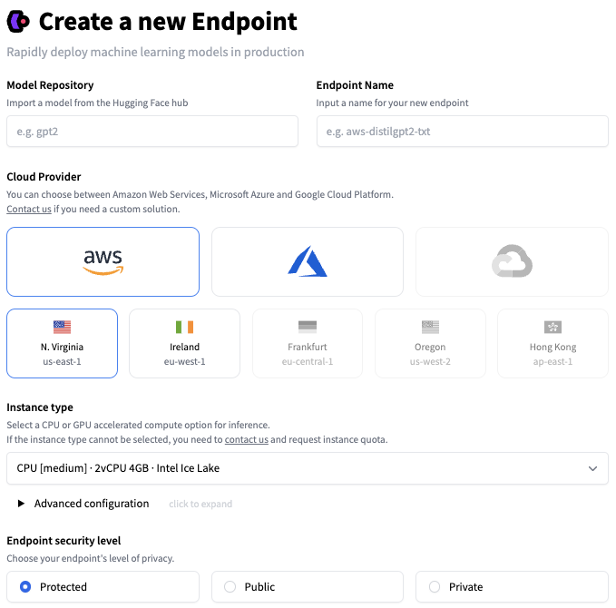

# Hugging Face 提供的推理（Inference）解决方案


每天，开发人员和组织都在使用 [Hugging Face 平台上托管的模型](https://huggingface.co/models)，将想法变成用作概念验证（proof-of-concept）的 demo，再将 demo 变成生产级的应用。Transformer 模型已成为广泛的机器学习（ML）应用的流行模型结构，包括自然语言处理、计算机视觉、语音等；扩散模型（Diffusers）也已成为 text-to-image、image-to-image 类生成模型的流行模型结构；其他模型结构在其他任务中也很受欢迎，而我们在 Hugging Face Hub 上提供了这些模型结构的所有信息。

在 Hugging Face，我们致力于在保障质量的前提下，尽可能简化 ML 的相关开发和运营。让开发者在一个 ML 项目的整个生命周期中，可以丝滑地测试和部署最新模型。并保持最极致的优化性价比，所以我们要感谢 [英特尔](https://huggingface.co/intel) 的朋友，他们向我们赞助了免费的基于 CPU 的推理解决方案，这不仅是我们的 [合作关系](https://huggingface.co/blog/intel) 中的另一个重要步骤，而且是我们的用户社区的一个「福利」，大家现在可以零成本享受英特尔 [Xeon Ice Lake 模型结构](https://www.intel.com/content/www/us/en/products/docs/processors/xeon/3rd-gen-xeon-scalable-processors-brief.html) 带来的速度提升。

现在，让我们介绍一下你可以选择的 "Hugging Face" 的推理相关解决方案：

## 推理组件（免费）

在 HuggingFace Hub，我最喜欢的功能之一是 [推理组件](https://huggingface.co/docs/hub/models-widgets).，轻轻点击一下位于模型页面上的推理组件，便可以自动上传样本数据并使用模型进行预测。

比如这里有一个句子相似性的例子，我们采用了 `sentence-transformers/all-MiniLM-L6-v2` [模型](https://huggingface.co/sentence-transformers/all-MiniLM-L6-v2):

<kbd>
  
</kbd>

如果想快速了解一个模型的作用、它的输出，以及它在你数据集的几个样本上的表现，这是一个非常好的方法。当收到 request 时，模型会免费从我们的服务器上自动加载，结束后自动释放，这个过程中无需任何代码。
 
## 推理 API（免费版）

[推理 API](https://huggingface.co/docs/api-inference/) 是为推理组件提供动力的引擎。通过一个简单的 HTTP 请求，你可以加载 hub 上的任何模型，并在几秒钟内用它预测你的数据，只需要你提供模型的 URL 和一个有效的 hub token。

下面的例子中，我们用一行代码加载 `xlm-roberta-base` [模型](https://huggingface.co/xlm-roberta-base) 并进行数据预测的案例：

```
curl https://api-inference.huggingface.co/models/xlm-roberta-base \
	-X POST \
	-d '{"inputs": "The answer to the universe is <mask>."}' \
	-H "Authorization: Bearer HF_TOKEN"
```

推理 API 是建立预测服务的最简单方法，你可以在开发和测试期间实时地在应用程序中调用，不需要一个定制的 API ，也不需要一个模型服务器。你也可以立即从一个模型切换到另一个，并在你的应用程序中比较它们的性能。

但由于速率限制，我们不建议在实际生产中使用推理API，你应该考虑推理 Endpoints。

## 在生产环境中使用推理 Endpoints

一旦你对你的 ML 模型的性能感到满意，就该把它部署到生产环境中了。但问题是：离开沙盒，安全、扩展、监控等等都变成了问题。
所以我们建立了 [推理 Endpoints](https://huggingface.co/inference-endpoints) 来解决这些挑战。

只需点击几下，推理 Endpoints 就可以让你将 Hub 上的任何模型部署在安全和可扩展的基础设施上，将它托管在你选择的地区的 AWS 或 Azure 云服务器上。CPU 和 GPU 托管，内置自动扩展等其他设置，使我们拥有更好的性价比，[定价](https://huggingface.co/pricing#endpoints) 低至 0.06 美元每小时。

推理 Endpoints 支持三个安全级别：

Inference Endpoints support three security levels:

* Pubulic: Endpoints 运行在公共的 Hugging Face 子网中，互联网上的任何人都可以访问，无需任何认证。
* Protected: Endpoints 运行在公共的 Hugging Face 子网，互联网上任何拥有合适 Hugging Face Token 的人都可以访问它。
* Private: Endpoints 运行在私有的 Hugging Face 子网，不能通过互联网访问，只能通过你的 AWS 或 Azure 账户中的一个私有连接来使用，可以满足最严格的合规要求。

<kbd>
  
</kbd>

要了解更多关于推理 Endpoints 的信息，请阅读 [本教程](https://huggingface.co/blog/inference-endpoints) 和 [文档](https://huggingface.co/docs/inference-endpoints/)。

## 推理 Spaces

最后，如果你期待部署模型用于生产，推理 Spaces 是另一个很好的选项，你可以将你的模型部署在一个简单的 UI 框架（例如Gradio）之上进行 推理 ，而且我们还支持 [硬件的升级](/docs/hub/spaces-gpus)，比如让你采用更先进的英特尔 CPU 和英伟达 GPU ，没有比这更好的方式来展示你的模型 demo 了!

<kbd>
  
</kbd>

要了解更多关于 Spaces 的信息，请阅读 [这个文档](https://huggingface.co/docs/hub/spaces)，或者在我们的 [论坛](https://discuss.huggingface.co/c/spaces/24) 上浏览帖子或提出问题。


## 上手尝试

登录到 [Hugging Face Hub](https://huggingface.co/)，浏览我们的 [模型](https://huggingface.co/models)，一旦找到一个你喜欢的，你可以直接在页面上尝试推理 小组件。点击 "Deploy" 按钮，你可以拿到自动生成的代码，然后将模型部署在免费的推理 API 上进行评估，以及一个直接链接，你可以将模型部署到生产中的推理 Endpoints 或 Spaces。

快试一试，让我们知道你的想法，我们很期待在 [Hugging Face 论坛](https://discuss.huggingface.co/) 上看到你的反馈。

谢谢你的阅读！
