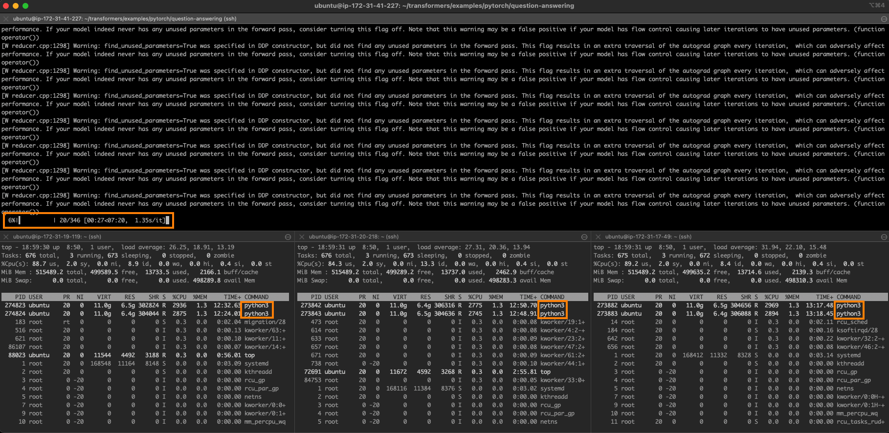

# 使用英特尔 Sapphire Rapids 加速 PyTorch Transformers 模型（第一部分）


大约一年以前，我们 [展示](https://huggingface.co/blog/accelerating-pytorch) 了如何在第三代 [英特尔至强可扩展](https://www.intel.com/content/www/us/en/products/details/processors/xeon/scalable.html) CPU（即 Ice Lake）集群上分布式训练 Hugging Face transformers 模型。最近，英特尔发布了代号为 Sapphire Rapids 的第四代至强可扩展 CPU，该 CPU 包含了令人兴奋的深度学习加速新指令。

通过本文，你将会学到如何在一个 AWS Sapphire Rapids 集群上加速一个 PyTorch 训练任务。我们会使用 [英特尔 oneAPI 集合通信库](https://www.intel.com/content/www/us/en/developer/tools/oneapi/oneccl.html)（oneAPI Collective Communications Library, oneCCL）来分布式化训练任务，并使用 [英特尔 PyTorch 扩展库](https://github.com/intel/intel-extension-for-pytorch)（Intel Extension for PyTorch，IPEX）来自动使用新指令进行性能优化。因为这两个库均已集成入 Hugging Face transformers 库，我们能够做到在不修改一行代码的前提下开箱即用地运行我们的示例代码。

在随后的另一篇文章里，我们还会探讨如何使用 Sapphire Rapids CPU 进行推理及其性能提升。

## 为何你应该考虑在 CPU 上训练

在英特尔至强 CPU 上训练一个深度学习模型是一个性价比高且可扩展的方案，在使用分布式训练或者在小数据集或中等数据集上微调模型时尤其如此。

至强 CPU 支持一些先进的特性，如 512 位先进矢量扩展（Advanced Vector Extensions，[AVX-512](https://en.wikipedia.org/wiki/AVX-512)）以及超线程（Hyper-Threading），这些特性提高了深度学习模型的并行性和效率，使得我们可以在得到更好的硬件资源使用率的同时训练得更快。

另外，一般而言，相比用于训练大型深度学习模型的专门硬件如 GPU 等而言，至强 CPU 更便宜和易得。至强 CPU 还更容易用于其他生产任务，从网络服务到数据库不一而足，这使得它们成为 IT 基础设施的一个万用且灵活的选择。

最后，云用户还可以通过使用 spot 实例的方式进一步降低在至强 CPU 上的训练成本。Spot 实例使用空闲计算资源，因此以折扣价售卖。与按需实例相比，spot 实例提供了高至 90% 的显著的成本节约。最后同样重要的是，CPU spot 实例一般来讲比 GPU 实例更容易获得。

现在，让我们看一下 Sapphire Rapids 架构引入的新指令。

## 先进矩阵扩展 (AMX)：深度学习新指令

Sapphire Rapids 架构引入了英特尔先进矩阵扩展（Advanced Matrix Extensions, [AMX](https://en.wikipedia.org/wiki/Advanced_Matrix_Extensions)）用于加速深度学习工作负载。用户只需安装最新版本的 IPEX 即可受益于新指令，无需更改任何 Hugging Face 代码。

AMX 指令用于加速矩阵乘法，该操作是深度学习批量训练的核心操作。AMX 指令支持 Brain 浮点（[BF16](https://en.wikipedia.org/wiki/Bfloat16_floating-point_format)）和 8 比特整型（INT8）数据类型，覆盖不同训练场景的加速需求。

AMX 指令引入了新的 2 维 CPU 寄存器，称作 tile 寄存器。因为这些寄存器在上下文切换时需要保存和恢复，所以需要内核相关支持。在 Linux 上，内核版本需要在 [v5.16](https://discourse.ubuntu.com/t/kinetic-kudu-release-notes/27976) 及以上方可支持。

现在，让我们看看怎样构建一个 Sapphire Rapids CPU 集群用于分布式训练。

## 构建一个 Sapphire Rapids CPU 集群

截至本文撰写之时，使用 Sapphire Rapids 服务器的最简单的方式是使用新的亚马逊 EC2 [R7iz](https://aws.amazon.com/ec2/instance-types/r7iz/) 实例家族。由于它尚在预览期，你必须 [登记注册](https://pages.awscloud.com/R7iz-Preview.html) 以获得访问权限。另外，虚拟机尚未支持 AMX，因此，我们将使用裸金属实例（`r7iz.metal-16xl`, 64 vCPU, 512GB RAM）。

为避免手动设置集群中的每个节点，我们首先建立一个主节点并依此创建一个新的亚马逊机器镜像（Amazon Machine Image，[AMI](https://docs.aws.amazon.com/AWSEC2/latest/UserGuide/AMIs.html)）。然后，我们用这个 AMI 启动其他节点。

从网络的角度，我们需要如下设置：

* 打开 22 端口，用于所有实例上的 ssh 访问创建和调试
* 配置从主实例（你启动训练的那个实例）到所有其他实例（包含主实例本身）的 [免密 ssh 访问](https://www.redhat.com/sysadmin/passwordless-ssh)。换句话说，主节点的 ssh 公钥必须在所有阶段上被授权
* 允许集群内的所有网络通信，使得分布式训练可以不受阻碍地运行。AWS 提供了 [安全组](https://docs.aws.amazon.com/vpc/latest/userguide/VPC_SecurityGroups.html) 这一安全便捷的方式支持这个功能。我们只需创建一个安全组，确保所有集群内的实例属于同一安全组，并允许同一安全组内的所有网络通信即可，以下是我使用的设置:

<kbd>
  
</kbd>

让我们开始创建集群的主节点。

## 设置主节点

我们首先启动一个安装了 Ubuntu 20.04 AMI（`ami-07cd3e6c4915b2d18`）并加入了我们之前创建的安全组的 `r7iz.metal-16xl` 实例，用于创建主节点。该 AMI 虽然只包含了 Linux v5.15.0，但是幸运的是英特尔和 AWS 已经为这个内核版本打上了 AMX 支持的补丁。因此，我们不需要升级内核至 v5.16。

一旦实例运行起来后，我们 ssh 登录上它并通过 `lscpu` 命令检查 AMX 是否确实已被支持。你应该会在 flags 部分看到如下内容：
```
amx_bf16 amx_tile amx_int8
```

然后，我们开始安装本地依赖以及 Python 依赖。

```
sudo apt-get update 

# Install tcmalloc for extra performance (https://github.com/google/tcmalloc)
sudo apt install libgoogle-perftools-dev -y

# Create a virtual environment
sudo apt-get install python3-pip -y
pip install pip --upgrade
export PATH=/home/ubuntu/.local/bin:$PATH
pip install virtualenv

# Activate the virtual environment
virtualenv cluster_env
source cluster_env/bin/activate

# Install PyTorch, IPEX, CCL and Transformers
pip3 install torch==1.13.0 -f https://download.pytorch.org/whl/cpu
pip3 install intel_extension_for_pytorch==1.13.0 -f https://developer.intel.com/ipex-whl-stable-cpu
pip3 install oneccl_bind_pt==1.13 -f https://developer.intel.com/ipex-whl-stable-cpu
pip3 install transformers==4.24.0

# Clone the transformers repository for its example scripts
git clone https://github.com/huggingface/transformers.git
cd transformers
git checkout v4.24.0
```

接着，我们使用 `ssh-keygen` 创建一个新的 ssh 密钥对，命名为 `cluster`，并保存在缺省位置（`~/.ssh`)。

最后，我们用该实例创建一个 [新的 AMI](https://docs.aws.amazon.com/AWSEC2/latest/UserGuide/creating-an-ami-ebs.html)。

## 设置集群

一旦 AMI 准备就绪，我们用它启动另外 3 个 `r7iz.16xlarge-metal` 实例，不要忘了把他们加入之前创建的安全组中。

当这些实例启动的时候，我们 ssh 登录进主节点并完成网络设置。首先，我们编辑位于 `~/.ssh/config` 的 ssh 配置文件，使其支持从主节点到其他节点的免密连接，这里我们只需使用它们各自的私有 IP 及之前创建的密钥对即可。以下是我的配置文件。
```
Host 172.31.*.*
   StrictHostKeyChecking no

Host node1
    HostName 172.31.10.251
    User ubuntu
    IdentityFile ~/.ssh/cluster

Host node2
    HostName 172.31.10.189
    User ubuntu
    IdentityFile ~/.ssh/cluster

Host node3
    HostName 172.31.6.15
    User ubuntu
    IdentityFile ~/.ssh/cluster
```

到此为止，我们可以使用 `ssh node [1-3]` 去免密连接任何节点。

在主节点侧，我们创建一个 `~/hosts` 文件，并填入集群中所有节点的名称，这些名称已在上面的 ssh 配置文件中定义。我们用 `localhost` 代表主节点，因为我们会在该节点启动训练脚本。我的文件如下所示。

```
localhost
node1
node2
node3
```

集群现已准备就绪。让我们开始训练吧！

## 启动一个分布式训练任务

在本例中，我们将在 [SQUAD](https://huggingface.co/datasets/squad) 数据集上微调一个用于问答的 [DistilBERT](https://huggingface.co/distilbert-base-uncased) 模型。如果你想试试别的示例的话，尽管去做吧。

```
source ~/cluster_env/bin/activate
cd ~/transformers/examples/pytorch/question-answering
pip3 install -r requirements.txt
```

我们首先冒个烟，启动一个单实例训练任务。请注意如下几个重要的标志变量：

* `no_cuda` 确保使用 CPU 进行训练，忽略 GPU
* `use_ipex` 使能 IPEX 库，确保 AMX 和 AVX 指令的使用
* `bf16` 使能 BF16 训练

```
export LD_PRELOAD="/usr/lib/x86_64-linux-gnu/libtcmalloc.so"
python run_qa.py --model_name_or_path distilbert-base-uncased \
--dataset_name squad --do_train --do_eval --per_device_train_batch_size 32 \
--num_train_epochs 1  --output_dir /tmp/debug_squad/ \
--use_ipex --bf16 --no_cuda
```

不必等到任务完成，我们只运行 1 分钟用于确保所有的依赖已被正常安装。同时，这也给了我们一个单实例训练的基线性能：1 个 epoch 花费大约 **26 分钟**。供参考，我们测量了同样的任务在一个相当的 Ice Lake 实例（`c6i.16xlarge`）上的性能，基于相同的软件设置，每个 epoch 需要 **3 小时 30 分钟**。加速比达到 **8 倍**。我们已经能看到新指令带来的好处！

现在，让我们把训练任务分布式部署到 4 个实例上。一个 `r7iz.16xlarge` 实例有 32 个物理 CPU 核，我们倾向于直接使用物理核而不是虚拟核（vCPUs）(`KMP_HW_SUBSET=1T`)。我们决定分配 24 个核用于训练（`OMP_NUM_THREADS`），2 个核用于集合通信（`CCL_WORKER_COUNT`），剩下的 6 个核给内核和其他进程使用。这 24 个训练线程分配给 2 个 Python 进程使用（`NUM_PROCESSES_PER_NODE`）。因此，一个 4 节点的集群上共有 8（`NUM_PROCESSES`）个 Python 进程。

```
# Set up environment variables for CCL
oneccl_bindings_for_pytorch_path=$(python -c "from oneccl_bindings_for_pytorch import cwd; print(cwd)")
source $oneccl_bindings_for_pytorch_path/env/setvars.sh

export MASTER_ADDR=172.31.3.190
export NUM_PROCESSES=8
export NUM_PROCESSES_PER_NODE=2
export CCL_WORKER_COUNT=2
export CCL_WORKER_AFFINITY=auto
export KMP_HW_SUBSET=1T
```

现在，我们启动分布式训练任务。

```
# Launch distributed training
mpirun -f ~/hosts \
 -n $NUM_PROCESSES -ppn $NUM_PROCESSES_PER_NODE  \
 -genv OMP_NUM_THREADS=24 \
 -genv LD_PRELOAD="/usr/lib/x86_64-linux-gnu/libtcmalloc.so" \
 python3 run_qa.py \
 --model_name_or_path distilbert-base-uncased \
 --dataset_name squad \
 --do_train \
 --do_eval \
 --per_device_train_batch_size 32  \
 --num_train_epochs 1  \
 --output_dir /tmp/debug_squad/ \
 --overwrite_output_dir \
 --no_cuda \
 --xpu_backend ccl \
 --bf16
```

现在，一个 epoch 仅需 **7 分 30 秒**。

任务如下图所示。图的上半部分是主节点，同时你也可以看到其他 3 个节点每个均有 2 个训练进程在运行。

<kbd>
  
</kbd>

4 节点的完美线性扩展需要 6 分 30 秒的训练时间（26 分钟除以 4）。我们非常接近于这个理想值，这充分展现了该方法很高的扩展性。

## 结论
如你所见，在一个英特尔至强集群上训练 Hugging Face transformers 模型是一个灵活，可扩展且性价比高的解决方案，特别是在你的数据集和模型是小尺寸或者中等尺寸情况下。


以下列出了一些其他可帮助你起步的资源：

* [Intel IPEX](https://github.com/intel/intel-extension-for-pytorch) GitHub
* Hugging Face 文档: "[Efficient training on CPU](https://huggingface.co/docs/transformers/perf_train_cpu)" 及 "[Efficient training on many CPUs](https://huggingface.co/docs/transformers/perf_train_cpu_many)"

如你有任何问题或反馈，请通过 Hugging Face 论坛告诉我们。

感谢阅读！
