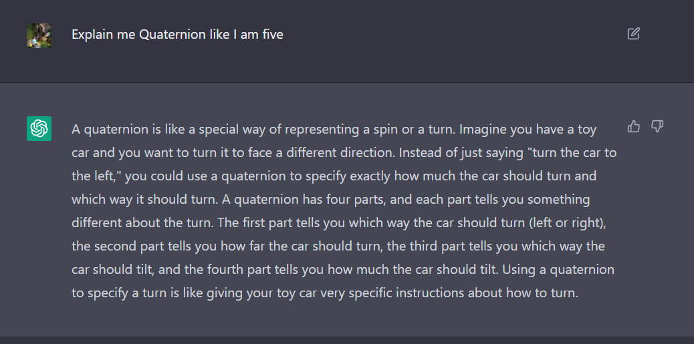

# 使用 ChatGPT 启发游戏创意｜基于 AI 5 天创建一个农场游戏，第 2 天

**欢迎使用 AI 进行游戏开发！** 在本系列中，我们将使用 AI 工具在 5 天内创建一个功能完备的农场游戏。到本系列结束时，您将了解到如何将多种 AI 工具整合到游戏开发流程中。本文将向您展示如何将 AI 工具用于:

1. 美术风格
2. 游戏设计
3. 3D 素材
4. 2D 素材
5. 剧情

想要观看视频快速了解？请点击 [此处](https://www.tiktok.com/@individualkex/video/7186551685035085098)。如果您想要掌握更多技术细节，请继续阅读！

**注意：** 本教程面向熟悉 Unity 开发和 C# 语言的读者。如果您不熟悉这些技术，请先查看 [Unity for Beginners](https://www.tiktok.com/@individualkex/video/7086863567412038954) 系列后再继续阅读。

## 第 2 天：游戏设计

在本系列教程的 [第 1 部分](https://huggingface.co/blog/zh/ml-for-games-1) 中，我们使用 **AI 帮助确定美术风格**。更确切地说，我们使用了一项名为 Stable Diffiusion 的技术，实现了生成概念艺术图片，并将其应用到游戏的视觉美术风格中。

在这一部分中，我们将使用 AI 进行游戏设计。在下文的[缩略版](#缩略版) 中，我会简要介绍如何使用 ChatGPT 工具帮助启发游戏创意。但对 AI 相关的读者来说，更值得关注的是 ChatGPT 的工作原理。你也可以在下文的 [语言模型](#语言模型) 部分了解更多关于语言模型的背景知识，以及更多 [在游戏开发中的应用](#在游戏开发中的应用)，请继续往下阅读。

### 缩略版

使用 AI 进行游戏设计的缩略版：向 [ChatGPT](https://chat.openai.com/chat) 提问寻求建议，然后自行决定是否遵循建议。以本系列的农场游戏为例，我这样提问 ChatGPT:

> 你是一名专业游戏设计师，正负责一款简易农场游戏的设计工作。为使该农场游戏好玩有趣且引人入胜，哪些功能应最优先考虑？

得到的回答（总结）如下：

1. 多样性的农作物
2. 具有挑战性和奖励机制的进阶系统
3. 动态、可交互的环境
4. 社交性质、多人玩法
5. 精妙绝伦的剧情

鉴于此系列只有 5 天时间，我仅实现了前两点的游戏功能，并完成了 [灰盒测试](https://en.wikipedia.org/wiki/Gray-box_testing)。您可以 [试玩游戏](https://individualkex.itch.io/ml-for-game-dev-2) 或者 [查看源码](https://github.com/dylanebert/FarmingGame)。

本文不会详细说明实现这些游戏机制的具体细节，因为本系列的重点是如何使用 AI 工具帮助农场游戏开发，而不是如何实现。相反，本文将介绍 ChatGPT 是什么 (语言模型)、它的工作原理是什么、以及怎样影响着游戏开发过程。

### 语言模型

ChatGPT 尽管在回答采纳率方面取得了重大突破，但实际上它是现有技术的迭代产物，这项技术就是 **语言模型**。

语言模型是 AI 的其中一种，经训练可用于预测单词序列的概率。例如一个序列「猫捉__」，我们期望语言模型经训练可以预测的单词为「老鼠」。这类训练过程可以应用于多种类型的任务，例如翻译任务：「猫的法语单词是___」。这种训练设置虽然在早期的一些自然语言处理任务上取得很好的效果，但对比当下的模型水平仍相差甚远，而差距悬殊的原因就是 **transformers** 这项技术。

**Transformers** 是 [2017 年被提出](https://proceedings.neurips.cc/paper/2017/file/3f5ee243547dee91fbd053c1c4a845aa-Paper.pdf)的一种神经网络架构，它使用自注意力机制单步完成整个序列的预测，是 ChatGPT 等现代语言模型背后的重要技术。想深入了解其工作原理？访问 Hugging Face 查看 [Transformer 入门课程](https://huggingface.co/course/chapter1/1)！

相比于早期的语言模型，为什么 ChatGPT 如此成功？全面地回答这个问题是不可能的，因为 ChatGPT 并未开源。不过可回答的其中一个方面是 RLHF（Reinforcement Learning from Human Feedback），即以强化学习的方式依据人类反馈优化语言模型。可以点击这篇博客文章: [ChatGPT 背后的「功臣」——RLHF 技术详解](https://huggingface.co/blog/zh/rlhf)，查看更多关于 RLHF 的信息，包括它的工作原理、实现它的开源工具及其前景展望等等。

AI 领域在持续变革。随着 AI 成为开源社区的一部分，可以预见在激发创造力方面将出现爆炸式增长，当然也包括在游戏开发中的应用。如果您正在阅读本文，您可能已经走在变革前列。

### 在游戏开发中的应用

在 [缩略版](#缩略版) 中，我介绍了如何使用 ChatGPT 来帮助启发游戏创意。不仅如此，您还可以用它来 [编写完整游戏代码](https://www.youtube.com/watch?v=YDWvAqKLTLg&ab_channel=AAlex)，以及用于几乎任何您能想到的事情。反而了解它的 **局限性** 可能更有意义。

#### 局限性

ChatGPT 的有些回答通常听起来可信度很高，但实际上是错误的。这里有一份 [ChatGPT 错误回答合集](https://github.com/giuven95/chatgpt-failures)，造成这些的原因是 ChatGPT 不能 **理解** 人类讲话的方式。ChatGPT 仅仅是一个非常大的 [语言模型](#语言模型)，对于一个问题它可以预测可能的回答，但并不能真正理解自己在说什么。我个人非常喜欢的错误回答（尤其是与游戏开发相关的）之一是从 [Reddit](https://www.reddit.com/r/Unity3D/comments/zcps1f/eli5_quaternion_by_chatgpt/) 摘录的一篇 ChatGPT 对四元数的解释:

<figure class="image text-center">
  
</figure>

> 内容翻译:
>
> 向一位小朋友解释一下四元数是什么
>
>
> 四元数是表示旋转的一种特殊方式。想象一下你有一辆玩具车，你想把它转到另一个方向。仅说 “把车向左转” 这样的模糊词不够，这时候可以使用四元数来精确地表示玩具车的转弯角度以及转弯方向。四元数有四个组成部分，每一部分都表示转弯的不同信息。第一部分表示玩具车的转弯方式（左转或右转）；第二部分表示玩具车的具体转弯角度；第三部分表示玩具车的倾斜方式；第四部分表示玩具车的具体倾斜程度。使用四元数可以精确地表示你对玩具车如何转弯这一指令。 

这个解释听起来不错，但却是完全错误的。这个错误回答的例子很好地说明了为什么 ChatGPT 虽然非常有用，但不应该用作权威的知识库。

#### 一些建议

如果 ChatGPT 的回答错误很多，还应该使用它吗？我认为不能依赖它代替你完成任务，但将它作为一种工具仍然是非常有用的。本文游戏设计的例子中，在 ChatGPT 回答了游戏所需功能之后，我本可以继续提问 ChatGPT 并要求它为我实现所有功能，事实上已经有 [其他人这样做过了](https://www.youtube.com/watch?v=YDWvAqKLTLg&ab_channel=AAlex)，而且有点奏效。不过，我的建议更倾向于将 ChatGPT 作为头脑风暴和加速开发的工具，而不是完全替代开发过程中的某些环节。

欢迎继续阅读 [第三部分](https://huggingface.co/blog/zh/ml-for-games-3)，我们一起 **使用 AI 制作 3D 素材**！
