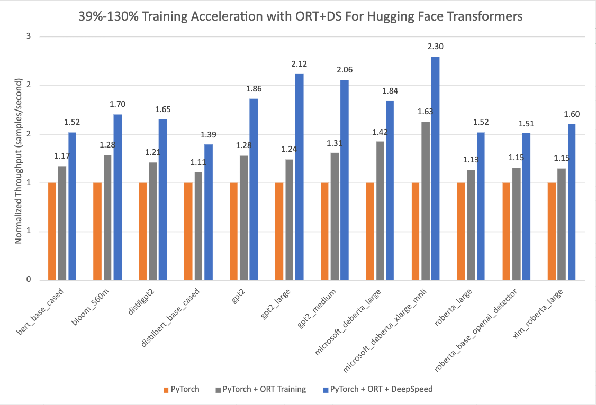

# Optimum + ONNX Runtime: 更容易、更快地训练你的 Hugging Face 模型


## 介绍

基于语言、视觉和语音的 Transformer 模型越来越大，以支持终端用户复杂的多模态用例。增加模型大小直接影响训练这些模型所需的资源，并随着模型大小的增加而扩展它们。Hugging Face 和微软的 ONNX Runtime 团队正在一起努力，在微调大型语言、语音和视觉模型方面取得进步。Hugging Face 的 [🤗 Optimum 库](https://huggingface.co/docs/optimum/index)，通过和 ONNX Runtime 的集成进行训练，为许多流行的 Hugging Face 模型提供了一个开放的解决方案，可以将**训练时间缩短 35% 或更多**。我们展现了 Hugging Face Optimum 和 ONNX Runtime Training 生态系统的细节，性能数据突出了使用 Optimum 库的好处。

## 性能测试结果

下面的图表表明，当**使用 ONNX Runtime 和 DeepSpeed ZeRO Stage 1**进行训练时，用 Optimum 的 Hugging Face 模型的加速**从 39% 提高到 130%**。性能测试的基准运行是在选定的 Hugging Face PyTorch 模型上进行的，第二次运行是只用 ONNX Runtime 训练，最后一次运行是 ONNX Runtime + DeepSpeed ZeRO Stage 1，图中显示了最大的收益。基线 PyTorch 运行所用的优化器是 AdamW Optimizer，ORT 训练用的优化器是 Fused Adam Optimizer。这些运行是在带有 8 个 GPU 的单个 NVIDIA A100 节点上执行的。

<figure class="image table text-center m-0 w-full">
  
</figure>

更多关于开启 🤗 Optimum 进行训练加速的配置细节可以在[指南](https://huggingface.co/docs/optimum/onnxruntime/usage_guides/trainer)中找到。用于这些运行的版本信息如下:

```
PyTorch: 1.14.0.dev20221103+cu116; ORT: 1.14.0.dev20221103001+cu116; DeepSpeed: 0.6.6; HuggingFace: 4.24.0.dev0; Optimum: 1.4.1.dev0; Cuda: 11.6.2
```

## Optimum 库

Hugging Face 是一个快速发展的开放社区和平台，旨在将优秀的机器学习大众化。随着 [🤗 Transformers 库](https://huggingface.co/docs/transformers/index) 的成功，我们将模态从 NLP 扩展到音频和视觉，现在涵盖了跨机器学习的用例，以满足我们社区的需求。现在在 [Hugging Face Hub](https://huggingface.co/models) 上，有超过 12 万个免费和可访问的模型 checkpoints 用于各种机器学习任务，1.8 万个数据集和 2 万个机器学习演示应用。然而，将 Transformer 模型扩展到生产中仍然是工业界的一个挑战。尽管准确性很高，但基于 Transformer 的模型的训练和推理可能耗时且昂贵。

为了满足这些需求，Hugging Face 构建了两个开源库: **🤗 Accelerate** 和 **🤗 Optimum**。[🤗 Accelerate](https://huggingface.co/docs/accelerate/index) 专注于开箱即用的分布式训练，而 [🤗 Optimum](https://huggingface.co/docs/optimum/index) 作为 Transformer 的扩展，通过利用用户目标硬件的最大效率来加速模型训练和推理。Optimum 集成了机器学习加速器如 ONNX Runtime，和专业的硬件如英特尔的 [Habana Gaudi](https://huggingface.co/blog/habana-gaudi-2-benchmark)，因此用户可以从训练和推理的显著加速中受益。此外，🤗 Optimum 无缝集成了其他 Hugging Face 的工具，同时继承了 Transformer 的易用性。开发人员可以轻松地调整他们的工作，以更少的计算能力实现更低的延迟。

## ONNX Runtime 训练

[ONNX Runtime](https://onnxruntime.ai/) 加速[大型模型训练](https://onnxruntime.ai/docs/get-started/training-pytorch.html)，单独使用时将吞吐量提高40%，与 [DeepSpeed](https://www.deepspeed.ai/tutorials/zero/) 组合后将吞吐量提高130%，用于流行的基于 Hugging Face Transformer 的模型。ONNX Runtime 已经集成为 🤗 Optimum 的一部分，并通过 Hugging Face 的 🤗 Optimum 训练框架实现更快的训练。

ONNX Runtime Training 通过一些内存和计算优化实现了这样的吞吐量改进。内存优化使 ONNX Runtime 能够最大化批大小并有效利用可用的内存，而计算优化则加快了训练时间。这些优化包括但不限于，高效的内存规划，内核优化，适用于 Adam 优化器的多张量应用 (将应用于所有模型参数的按元素更新分批到一个或几个内核启动中)，FP16 优化器 (消除了大量用于主机内存拷贝的设备)，混合精度训练和图优化，如节点融合和节点消除。ONNX Runtime Training 支持 [NVIDIA](https://techcommunity.microsoft.com/t5/ai-machine-learning-blog/accelerate-pytorch-transformer-model-training-with-onnx-runtime/ba-p/2540471) 和 [AMD GPU](https://cloudblogs.microsoft.com/opensource/2021/07/13/onnx-runtime-release-1-8-1-previews-support-for-accelerated-training-on-amd-gpus-with-the-amd-rocm-open-software-platform/)，并提供自定义操作的可扩展性。

简而言之，它使 AI 开发人员能够充分利用他们熟悉的生态系统，如 PyTorch 和 Hugging Face，并在他们选择的目标设备上使用 ONNX Runtime 进行加速，以节省时间和资源。

## Optimum 中的 ONNX Runtime Training

Optimum 提供了一个 `ORTTrainer` API，它扩展了 Transformer 中的 `Trainer`，以使用 ONNX Runtime 作为后端进行加速。`ORTTrainer` 是一个易于使用的 API，包含完整的训练循环和评估循环。它支持像超参数搜索、混合精度训练和多 GPU 分布式训练等功能。`ORTTrainer` 使 AI 开发人员在训练 Transformer 模型时能够组合 ONNX Runtime 和其他第三方加速技术，这有助于进一步加速训练，并充分发挥硬件的作用。例如，开发人员可以将 ONNX Runtime Training 与 Transformer 训练器中集成的分布式数据并行和混合精度训练相结合。此外，`ORTTrainer` 使你可以轻松地将 DeepSpeed ZeRO-1 和 ONNX Runtime Training 组合，通过对优化器状态进行分区来节省内存。在完成预训练或微调后，开发人员可以保存已训练的 PyTorch 模型，或使用 🤗 Optimum 实现的 API 将其转为 ONNX 格式，以简化推理的部署。和 `Trainer` 一样，`ORTTrainer` 与 Hugging Face Hub 完全集成: 训练结束后，用户可以将他们的模型 checkpoints 上传到 Hugging Face Hub 账户。

因此具体来说，用户应该如何利用 ONNX Runtime 加速进行训练？如果你已经在使用 `Trainer`，你只需要修改几行代码就可以从上面提到的所有改进中受益。主要有两个替换需要应用。首先，将 `Trainer` 替换为 `ORTTrainer``，然后将 `TrainingArguments` 替换为 `ORTTrainingArguments`，其中包含训练器将用于训练和评估的所有超参数。`ORTTrainingArguments` 扩展了 `TrainingArguments`，以应用 ONNX Runtime 授权的一些额外参数。例如，用户可以使用 Fused Adam 优化器来获得额外的性能收益。下面是一个例子:

```diff
-from transformers import Trainer, TrainingArguments
+from optimum.onnxruntime import ORTTrainer, ORTTrainingArguments

# Step 1: Define training arguments
-training_args = TrainingArguments(
+training_args = ORTTrainingArguments(
    output_dir="path/to/save/folder/",
-   optim = "adamw_hf",
+   optim = "adamw_ort_fused",
    ...
)

# Step 2: Create your ONNX Runtime Trainer
-trainer = Trainer(
+trainer = ORTTrainer(
    model=model,
    args=training_args,
    train_dataset=train_dataset,
+   feature="sequence-classification",
    ...
)

# Step 3: Use ONNX Runtime for training!🤗
trainer.train()
```

## 展望未来

Hugging Face 团队正在开源更多的大型模型，并通过训练和推理的加速工具以降低用户从模型中获益的门槛。我们正在与 ONNX Runtime Training 团队合作，为更新和更大的模型架构带来更多的训练优化，包括 Whisper 和 Stable Diffusion。微软还将其最先进的训练加速技术打包在 [PyTorch 的 Azure 容器](https://techcommunity.microsoft.com/t5/ai-machine-learning-blog/enabling-deep-learning-with-azure-container-for-pytorch-in-azure/ba-p/3650489)中。这是一个轻量级的精心营造的环境，包括 DeepSpeed 和 ONNX Runtime，以提高 AI 开发者使用 PyTorch 训练的生产力。除了大型模型训练外，ONNX Runtime Training 团队还在为边缘学习构建新的解决方案——在内存和电源受限的设备上进行训练。

## 准备开始

我们邀请你查看下面的链接，以了解更多关于 Hugging Face 模型的 Optimum ONNX Runtime Training，并开始使用。

* [Optimum ONNX Runtime Training 文档](https://huggingface.co/docs/optimum/onnxruntime/usage_guides/trainer)
* [Optimum ONNX Runtime Training 示例](https://github.com/huggingface/optimum/tree/main/examples/onnxruntime/training)
* [Optimum Github 仓库](https://github.com/huggingface/optimum/tree/main)
* [ONNX Runtime Training 示例](https://github.com/microsoft/onnxruntime-training-examples/)
* [ONNX Runtime Training Github 仓库](https://github.com/microsoft/onnxruntime/tree/main/orttraining)
* [ONNX Runtime](https://onnxruntime.ai/)
* [DeepSpeed](https://www.deepspeed.ai/) 和 [ZeRO](https://www.deepspeed.ai/tutorials/zero/) 教程
* [PyTorch 的 Azure 容器](https://techcommunity.microsoft.com/t5/ai-machine-learning-blog/enabling-deep-learning-with-azure-container-for-pytorch-in-azure/ba-p/3650489)

🏎感谢阅读！如果你有任何问题，请通过 [Github](https://github.com/huggingface/optimum/issues) 或[论坛](https://discuss.huggingface.co/c/optimum/)随时联系我们。你也可以在 [Twitter](https://twitter.com/Jhuaplin) 或 [LinkedIn](https://www.linkedin.com/in/jingya-huang-96158b15b/) 上联系我。
